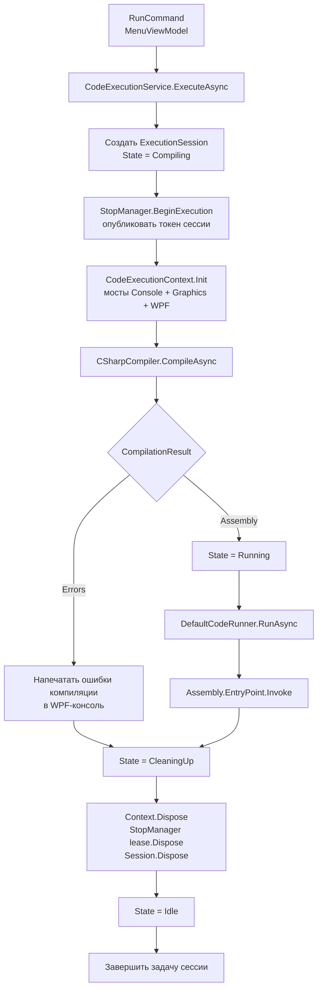
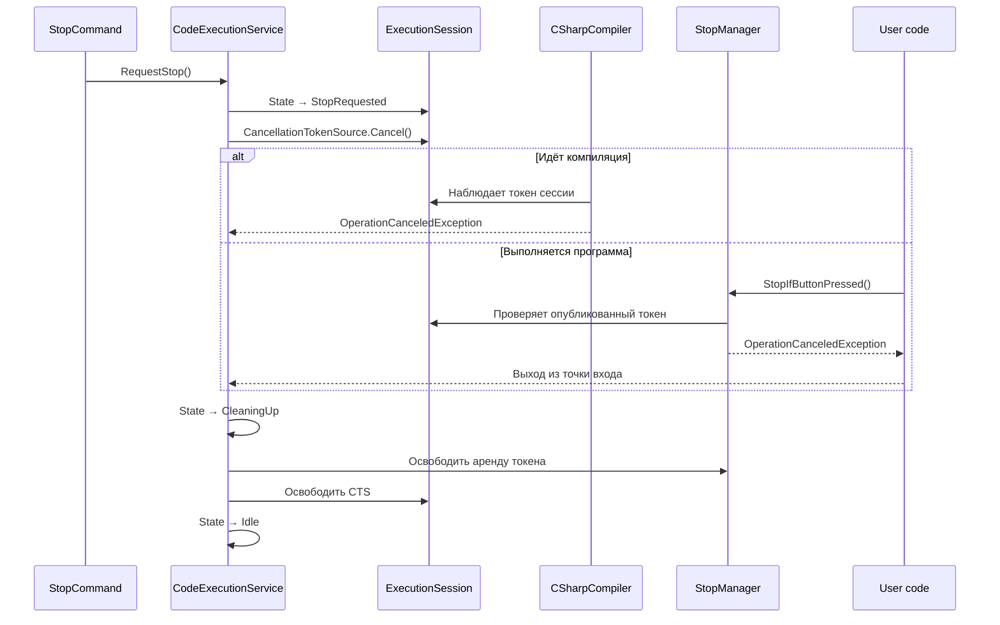

На текущем `37aba92` компиляция KID — это **двухпроходный семантический конвейер Roslyn**,
встроенный в жизненный цикл одной `ExecutionSession`.

Главное изменение: теперь компилятор не просто делает `Parse → Emit → Assembly.Load`, а сначала
автоматически внедряет в пользовательский код точки Stop и заменяет поддержанные блокирующие
вызовы на варианты с отменой через `CancellationToken`.

## 🧭 Общая схема Run



Начальная точка — [MenuViewModel.cs](</D:/Visual Studio Projects/KID/KID.WPF.IDE/ViewModels/MenuViewModel.cs:283>), координатор — [CodeExecutionService.cs](</D:/Visual Studio Projects/KID/KID.WPF.IDE/Services/CodeExecution/CodeExecutionService.cs:368>).

Важный порядок:

1. Сначала создаётся сессия и единый токен.
2. Затем инициализируются мосты Console и Graphics.
3. Только после этого запускается компиляция.
4. Новый Run разрешается не после выхода программы, а только после очистки ресурсов
   и возврата в `Idle`.

## 🧱 Основные компоненты

| Компонент | Ответственность |
|---|---|
| `CodeExecutionService` | Координирует всю последовательность и состояния |
| `ExecutionSession` | Владеет `ExecutionId`, CTS, состоянием и задачей жизненного цикла |
| `CSharpCompiler` | Синтаксический разбор, семантическое преобразование, Emit и загрузка сборки |
| `CancellationInstrumentationRewriter` | Вставляет контрольные точки Stop и переписывает ожидания |
| `ConsoleClearRewriter` | Перенаправляет BCL `Console.Clear()` в WPF-консоль |
| `RuntimeTypeSymbolResolver` | Проверяет, какой сборке принадлежит BCL-тип |
| `StopManager` | Публикует токен выполнения пользовательскому коду |
| `DefaultCodeRunner` | Находит и вызывает `Assembly.EntryPoint` |

Контракты пока остаются простыми:

```csharp
Task<CompilationResult> CompileAsync(
    string code,
    CancellationToken cancellationToken);

Task RunAsync(
    Assembly assembly,
    CancellationToken cancellationToken);
```

`CompilationResult` сейчас содержит либо `Assembly`, либо список ошибок: [CompilationResult.cs](</D:/Visual Studio Projects/KID/KID.WPF.IDE/Models/CompilationResult.cs:6>).

## ⚙️ Внутренний конвейер компилятора

```mermaid
flowchart LR
    SRC["Исходный C#"] --> PARSE["ParseText<br/>SyntaxTree 0"]
    PARSE --> REFS["Ссылки на метаданные"]
    REFS --> C0["CSharpCompilation 0"]
    C0 --> SM0["SemanticModel 0"]

    SM0 --> CANCEL["CancellationInstrumentationRewriter"]
    CANCEL --> T1["SyntaxTree 1"]
    T1 --> C1["ReplaceSyntaxTree"]

    C1 --> SM1["Новый SemanticModel 1"]
    SM1 --> CLEAR["ConsoleClearRewriter"]
    CLEAR --> T2["SyntaxTree 2"]
    T2 --> C2["ReplaceSyntaxTree"]

    C2 --> EMIT["Emit в MemoryStream"]
    EMIT --> OK{"Emit успешен?"}
    OK -->|Нет| ERR["Локализованные ошибки"]
    OK -->|Да| LOAD["Assembly.Load(byte[])"]
    LOAD --> ASM["Assembly"]
```



Реализация находится в [CSharpCompiler.cs](</D:/Visual Studio Projects/KID/KID.WPF.IDE/Services/CodeExecution/CSharpCompiler.cs:47>).

Коротко ядро выглядит так:

```csharp
var syntaxTree = CSharpSyntaxTree.ParseText(
    code,
    cancellationToken: cancellationToken);

var compilation = CSharpCompilation.Create(
    "UserProgram",
    [syntaxTree],
    references,
    new CSharpCompilationOptions(OutputKind.ConsoleApplication));
```

Затем первый семантический проход:

```csharp
var semanticModel = compilation.GetSemanticModel(syntaxTree);

var cancellationRoot =
    new CancellationInstrumentationRewriter(
        semanticModel,
        cancellationToken)
    .Visit(originalRoot);

compilation = compilation.ReplaceSyntaxTree(
    syntaxTree,
    cancellationTree);
```

После замены дерева обязательно создаётся новая семантическая модель:

```csharp
var consoleSemanticModel =
    compilation.GetSemanticModel(cancellationTree);

var rewrittenRoot =
    new ConsoleClearRewriter(
        consoleSemanticModel,
        cancellationToken)
    .Visit(consoleRoot);
```

Это важно: `SemanticModel` Roslyn привязана к конкретному `SyntaxTree`. Использовать старую модель для уже изменённого дерева нельзя.

## 📚 Откуда берутся ссылки

Каждый запуск собирает ссылки на метаданные из загруженных сборок:

```csharp
foreach (var assembly in AppDomain.CurrentDomain.GetAssemblies())
{
    if (!assembly.IsDynamic &&
        !string.IsNullOrEmpty(assembly.Location))
    {
        references.Add(
            MetadataReference.CreateFromFile(assembly.Location));
    }
}
```

Дополнительно явно подключаются:

- `KID.Library` — нужен `StopManager`;
- `KID.WPF.IDE` — нужен мост `TextBoxConsole.StaticConsole`;
- `NAudio` — нужен публичным музыкальным API.

Это даёт пользовательской программе широкий набор API, но одновременно означает, что компиляция пока не создаёт изолированной среды.

## 🛑 Что делает CancellationInstrumentationRewriter

Главная точка отмены:

```csharp
global::KID.StopManager.StopIfButtonPressed();
```

Она проверяет токен текущей сессии и бросает `OperationCanceledException`, если пользователь нажал Stop.

### Циклы

Было:

```csharp
while (true)
    Work();
```

Становится логически эквивалентно:

```csharp
while (true)
{
    global::KID.StopManager.StopIfButtonPressed();
    Work();
}
```

Поддержаны:

- `while`;
- `do/while`;
- `for`;
- `foreach`;
- `await foreach`;
- тела без фигурных скобок;
- пустые и вложенные циклы.

### Вход в методы

Было:

```csharp
static void Draw()
{
    Graphics.Circle(10, 10, 5);
}
```

Становится:

```csharp
static void Draw()
{
    global::KID.StopManager.StopIfButtonPressed();
    Graphics.Circle(10, 10, 5);
}
```

Проверки добавляются в поддержанные:

- методы и локальные функции;
- конструкторы;
- операторы;
- методы доступа;
- анонимные методы;
- лямбды с телом-блоком;
- программы верхнего уровня.

Методы с телом-выражением преобразуются в блок только тогда, когда Roslyn
позволяет сохранить семантику `void`, return и async.

### `Thread.Sleep`

```csharp
Thread.Sleep(1000);
```

переписывается в:

```csharp
global::KID.StopManager.Sleep(1000);
```

`StopManager.Sleep` ждёт либо таймаут, либо отмену токена, поэтому Stop немедленно пробуждает ожидание.

### `Task.Delay`

```csharp
await Task.Delay(1000);
```

становится:

```csharp
global::KID.StopManager.StopIfButtonPressed();

await Task.Delay(
    1000,
    cancellationToken: global::KID.StopManager.CurrentToken);
```

Изменяется только настоящая одноаргументная перегрузка BCL с `int` или `TimeSpan`.

### `Console.Clear`

```csharp
Console.Clear();
```

переписывается в:

```csharp
global::KID.Services.CodeExecution
    .TextBoxConsole.StaticConsole.Clear();
```

Таким образом очищается WPF `TextBox`, а не системная терминальная консоль.

Основные преобразования находятся в [CancellationInstrumentationRewriter.cs](</D:/Visual Studio Projects/KID/KID.WPF.IDE/Services/CodeExecution/Rewriters/CancellationInstrumentationRewriter.cs:39>) и [ConsoleClearRewriter.cs](</D:/Visual Studio Projects/KID/KID.WPF.IDE/Services/CodeExecution/Rewriters/ConsoleClearRewriter.cs:30>).

## 🧠 Почему используется SemanticModel

Компилятор не переписывает код только по текстовому имени.

Например, пользователь может объявить:

```csharp
class Thread
{
    public static void Sleep(int value) { }
}
```

Такой `Thread.Sleep()` изменять нельзя.

`RuntimeTypeSymbolResolver` проверяет:

- имя сборки типа среды выполнения;
- имя в метаданных;
- конкретный `IAssemblySymbol`;
- равенство через `SymbolEqualityComparer`.

Поэтому преобразуются настоящие:

```csharp
System.Threading.Thread.Sleep(...)
System.Threading.Tasks.Task.Delay(...)
System.Console.Clear()
```

а пользовательские одноимённые типы и методы остаются без изменений: [RuntimeTypeSymbolResolver.cs](</D:/Visual Studio Projects/KID/KID.WPF.IDE/Services/CodeExecution/Rewriters/RuntimeTypeSymbolResolver.cs:27>).

## 🧹 Что намеренно не инструментируется

Преобразователь не входит внутрь:

```csharp
finally
{
    Cleanup();
}
```

и финализаторов.

Причина: отмена внутри `finally` могла бы прервать освобождение пользовательских ресурсов.

Также произвольные нативные вызовы, COM, `Monitor`, `WaitHandle` и сторонние блокирующие API
автоматически не переписываются.

## 🛑 Как Stop проходит через систему



Во время компиляции токен проверяется:

- перед началом `Task.Run`;
- в `ParseText`;
- при обходе ссылок на метаданные;
- на каждом посещаемом Roslyn-узле;
- между двумя проходами преобразования;
- внутри `Emit`;
- до и после `Assembly.Load`.

После успешной компиляции сервис ещё раз проверяет токен перед переходом в `Running`. Поэтому Stop на границе `CompileAsync → RunAsync` не позволит случайно запустить уже скомпилированную программу.

## ⚠️ Где текущая архитектура пока заканчивается

Текущий хвост компилятора всё ещё выглядит так:

```csharp
using var assemblyStream = new MemoryStream();

var emitResult = compilation.Emit(
    assemblyStream,
    cancellationToken: cancellationToken);

var assembly = Assembly.Load(
    assemblyStream.ToArray());
```

Отсюда четыре главных ограничения:

1. `CSharpCompiler` одновременно компилирует и загружает сборку.
2. `CompilationResult` возвращает `Assembly`, а не артефакт PE/PDB.
3. `Assembly.Load(byte[])` загружает программу в контекст по умолчанию —
   выгрузить её нельзя.
4. [DefaultCodeRunner.cs](</D:/Visual Studio Projects/KID/KID.WPF.IDE/Services/CodeExecution/DefaultCodeRunner.cs:18>) вызывает `EntryPoint.Invoke()`, но пока не ожидает возвращённый `Task`/`Task<int>`.

Именно это меняет следующий этап:

```text
CSharpCompiler
    → CompilationArtifact { PE, PDB }
    → отдельный выгружаемый AssemblyLoadContext для каждого запуска
    → LoadedProgram
    → ожидать точку входа void/int/Task/Task<int>
    → очистить ссылки
    → AssemblyLoadContext.Unload()
```

То есть новая Stop-инструментация уже работает, но **новая архитектура загрузки и асинхронной
точки входа ещё не реализована**.

🔜 Возможные продолжения:

1. 📦 Подробно спроектировать `CompilationArtifact` и новые интерфейсы этапа 3.
2. 🧬 Разобрать `CancellationInstrumentationRewriter` по методам и типам Roslyn-узлов.
3. 🗑️ Нарисовать жизненный цикл выгружаемого `AssemblyLoadContext` и условия успешной выгрузки.
4. 🧪 Составить матрицу тестов для `void`, `int`, `Task` и `Task<int> Main`.

<oai-mem-citation>
<citation_entries>
MEMORY.md:438-438|note=[used prior execution chain for orientation and verified it against current source]
</citation_entries>
<rollout_ids>
019fae34-7fbc-75e2-afd6-2ab7d0707fab
</rollout_ids>
</oai-mem-citation>
