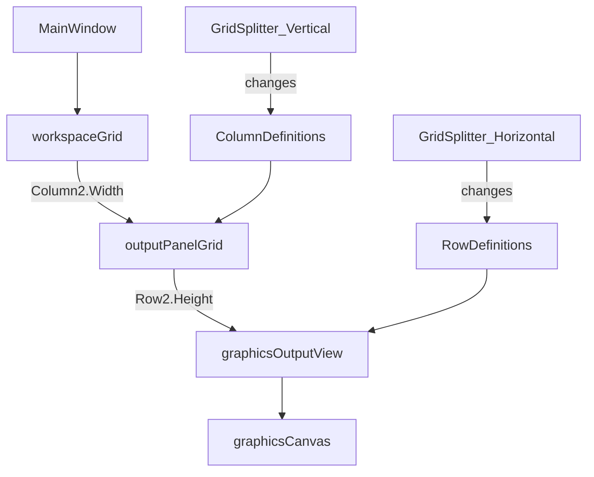

# План: размеры Canvas и управление через GridSplitter

## 1. Анализ требований

1.1. **Цель**

- Понять, как сейчас вычисляется реальный размер области рисования (`Canvas`) и как на него влияет положение `GridSplitter`.
- Добавить в `KID.Library/Graphics` методы:
  - `(double width, double height) Graphics.GetCanvasSize()` — быстро получить текущий реальный размер холста.
  - `Graphics.SetCanvasSize(double width, double height)` — изменить **реальный размер области вывода графики в UI** (эквивалентно программному «сдвигу» сплиттеров/их `Row/ColumnDefinition`).

1.2. **Сценарии использования**

- Игровые/анимационные шаблоны подстраиваются под окно: вместо `Graphics.Canvas.ActualWidth/ActualHeight` используют `Graphics.GetCanvasSize()`.
- Пользовательский код (шаблоны/уроки) может зафиксировать удобный размер области графики (например, 800×600) — это изменит размер правой панели и/или нижней области графики.

1.3. **Вход/выход**

- Вход:
  - `GetCanvasSize()` без параметров.
  - `SetCanvasSize(width,height)` в DIP (device-independent pixels), как и `ActualWidth/ActualHeight`.
- Выход:
  - Для `GetCanvasSize()` — кортеж (width,height) текущих `Canvas.ActualWidth/ActualHeight`.
  - Для `SetCanvasSize()` — изменение размеров области графики на экране (в рамках ограничений окна и `MinWidth/MinHeight`).

1.4. **Ограничения/требования**

- Не ломать текущую компоновку XAML: сохранить поведение растяжения, не фиксировать `Canvas.Width/Height` как основной механизм.
- Учитывать существующие ограничения:
  - В `MainWindow.xaml` у правой панели `MinWidth="310"`.
  - У строки графики `MinHeight="300"`.
- Работать в UI-потоке (как и прочие методы `Graphics`) через `DispatcherManager.InvokeOnUI(...)`.
- SOLID: не размазывать логику по ViewModel’ям без необходимости; изменения — локальные и понятные.

## 2. Архитектурный анализ

2.1. **Как сейчас вычисляется размер Canvas (факт по коду)**

- `Canvas` находится в `[d:\Visual Studio Projects\KID\KID.WPF.IDE\Views\GraphicsOutputView.xaml](d:\Visual Studio Projects\KID\KID.WPF.IDE\Views\GraphicsOutputView.xaml)`:
```12:14:d:\Visual Studio Projects\KID\KID.WPF.IDE\Views\GraphicsOutputView.xaml
    <Canvas Name="GraphicsCanvasControl"
            Background="{DynamicResource CanvasBrush}" />
```

- В `MainWindow` область вывода (включая графику) — правая колонка `Grid` c `GridSplitter`:
```75:111:d:\Visual Studio Projects\KID\KID.WPF.IDE\MainWindow.xaml
        <Grid Grid.Row="2">
            <Grid.ColumnDefinitions>
                <ColumnDefinition Width="*" />
                <ColumnDefinition Width="5" />
                <ColumnDefinition Width="310" MinWidth="310" />
            </Grid.ColumnDefinitions>
            <!-- ... -->
            <GridSplitter Grid.Column="1" Width="5" ... />
            <Grid Grid.Column="2" Margin="5">
                <Grid.RowDefinitions>
                    <RowDefinition Height="*" />
                    <RowDefinition Height="5" />
                    <RowDefinition MinHeight="300" />
                </Grid.RowDefinitions>
                <GridSplitter Grid.Row="1" Height="5" ... />
                <views:GraphicsOutputView x:Name="GraphicsOutputView" Grid.Row="2" />
            </Grid>
        </Grid>
```

- **Вывод**:
  - По умолчанию `Canvas` растягивается (`Stretch`) до доступной области в `Grid.Row=2` правой панели.
  - Вертикальный `GridSplitter` меняет `ColumnDefinition.Width` соседних колонок → меняется ширина правой панели → меняется ширина `Canvas`.
  - Горизонтальный `GridSplitter` меняет `RowDefinition.Height` соседних строк → меняется высота строки с графикой → меняется высота `Canvas`.

2.2. **Где хранится ссылка на Canvas и как инициализируется Graphics API**

- `Canvas` передаётся во VM в `[d:\Visual Studio Projects\KID\KID.WPF.IDE\Views\GraphicsOutputView.xaml.cs](d:\Visual Studio Projects\KID\KID.WPF.IDE\Views\GraphicsOutputView.xaml.cs)`:
```24:32:d:\Visual Studio Projects\KID\KID.WPF.IDE\Views\GraphicsOutputView.xaml.cs
            if (DataContext is IGraphicsOutputViewModel vm)
            {
                vm.Initialize(GraphicsCanvasControl);
            }
```

- При запуске пользовательского кода `Graphics.Init(canvas)` вызывается из `[d:\Visual Studio Projects\KID\KID.WPF.IDE\Services\CodeExecution\Contexts\CanvasGraphicsContext.cs](d:\Visual Studio Projects\KID\KID.WPF.IDE\Services\CodeExecution\Contexts\CanvasGraphicsContext.cs)`.
- `Graphics` хранит `public static Canvas Canvas { get; private set; }` в `[d:\Visual Studio Projects\KID\KID.Library\Graphics\Graphics.System.cs](d:\Visual Studio Projects\KID\KID.Library\Graphics\Graphics.System.cs)`.

2.3. **Почему взаимодействовать нужно не с GridSplitter, а с Row/ColumnDefinition**

- `GridSplitter` — только UI-«ручка». Реальное состояние раскладки хранится в `RowDefinition.Height` / `ColumnDefinition.Width`.
- Программно «переставить сплиттер» корректнее всего через установку этих `GridLength` (это то же самое, что делает `GridSplitter`).

2.4. **Предлагаемая архитектура для SetCanvasSize (эффективно и надёжно)**

- Добавить **имена (`x:Name`)** ключевым `Grid` и `Row/ColumnDefinition` в `MainWindow.xaml`, чтобы `SetCanvasSize` мог за O(1) находить нужные элементы через `Window.GetWindow(Graphics.Canvas).FindName(...)`.
- Реализация `SetCanvasSize` будет:
  - получать `Window` от текущего `Canvas` (`Window.GetWindow(Canvas)`),
  - находить `ColumnDefinition` правой панели и `RowDefinition` строки графики,
  - выставлять их размеры в пикселях (DIP), оставляя альтернативные области `*` (чтобы UI «дышал»).

2.5. **Схема зависимости размеров**



## 3. Список задач

3.1. **Анализ и фиксация текущего поведения**

- Проверить в коде/шаблонах, как сейчас получают размер: уже есть прямые обращения `Graphics.Canvas.ActualWidth/ActualHeight` в `ProjectTemplates/*`.
- Зафиксировать правила пересчёта: `Canvas.Actual*` меняется при перетаскивании обоих `GridSplitter`.

3.2. **Новые методы в Graphics API**

- Добавить `(double width, double height) Graphics.GetCanvasSize()` (UI-thread safe).
  - Файл: `[d:\Visual Studio Projects\KID\KID.Library\Graphics\Graphics.System.cs](d:\Visual Studio Projects\KID\KID.Library\Graphics\Graphics.System.cs) `или новый partial `Graphics.CanvasSize.cs` в той же папке.
- Добавить `Graphics.SetCanvasSize(double width, double height)`:
  - В UI-потоке получить `Window`, найти `ColumnDefinition` и `RowDefinition` по имени, выставить `GridLength`.
  - Учесть ограничения:
    - ширина ≥ 310 (и дополнительно учесть `Margin="5"` у правой панели, чтобы итоговый `Canvas.ActualWidth` совпадал ожиданию),
    - высота ≥ 300.

3.3. **Минимальные правки XAML для надёжных ссылок**

- Обновить `[d:\Visual Studio Projects\KID\KID.WPF.IDE\MainWindow.xaml](d:\Visual Studio Projects\KID\KID.WPF.IDE\MainWindow.xaml)`:
  - дать `x:Name` внешнему `Grid` рабочей зоны (в `Grid.Row=2`),
  - дать `x:Name` `ColumnDefinition` правой панели (и при необходимости — левой),
  - дать `x:Name` внутреннему `Grid` вывода (в `Grid.Column=2`),
  - дать `x:Name` `RowDefinition` строки графики (и при необходимости — консоли).

3.4. **Документация**

- Обновить `[d:\Visual Studio Projects\KID\docs\Graphics-API.md](d:\Visual Studio Projects\KID\docs\Graphics-API.md)`:
  - добавить раздел про `GetCanvasSize/SetCanvasSize`,
  - явно указать, что `SetCanvasSize` меняет раскладку UI (как сплиттеры), а единицы — DIP.

3.5. **Обновление примеров/шаблонов (по желанию, но полезно)**

- Заменить в шаблонах прямое использование `Graphics.Canvas.ActualWidth/ActualHeight` на `Graphics.GetCanvasSize()`.
  - Файлы: `KID.WPF.IDE/ProjectTemplates/*/*/*.cs` (как минимум те, где уже встречается `ActualWidth/ActualHeight`).

3.6. **Тестирование**

- Ручной тест в UI:
  - перетащить оба `GridSplitter` и убедиться, что `GetCanvasSize()` отражает изменения,
  - вызвать `SetCanvasSize(...)` из пользовательского кода и убедиться, что:
    - правая панель меняется по ширине,
    - нижняя область графики меняется по высоте,
    - ограничения `MinWidth/MinHeight` соблюдаются,
    - разметка не «ломается» (нет неожиданных пустых областей/перекрытий).

## 4. Порядок выполнения

1. Найти/зафиксировать места использования `Graphics.Canvas.ActualWidth/ActualHeight` (шаблоны) и текущие ожидания.
2. Добавить именование нужных `Grid`/`RowDefinition`/`ColumnDefinition` в `MainWindow.xaml`.
3. Реализовать `Graphics.GetCanvasSize()`.
4. Реализовать `Graphics.SetCanvasSize(width,height)` через изменение `GridLength` найденных по имени `Row/ColumnDefinition`.
5. Обновить документацию `Graphics-API.md`.
6. (Опционально) Обновить шаблоны, чтобы использовали новый метод.
7. Прогнать ручные проверки поведения в UI.

## 5. Оценка сложности

- **Задача 3.1 (анализ шаблонов/ожиданий)**: низкая, 15–30 мин
  - Риск: минимальный.
- **Задача 3.3 (XAML имена для grid/defs)**: низкая–средняя, 20–40 мин
  - Риск: опечатка в имени → `FindName` вернёт `null` (нужно предусмотреть fail-safe).
- **Задача 3.2 (GetCanvasSize)**: низкая, 10–20 мин
  - Риск: почти отсутствует.
- **Задача 3.2 (SetCanvasSize через GridLength)**: средняя, 45–90 мин
  - Риски:
    - корректно учесть `Margin` правой панели (чтобы размер именно `Canvas`, а не колонки),
    - поведение при маленьком окне (когда запрошенный размер не помещается),
    - совместимость с уже «перетянутыми» сплиттерами (когда размеры стали пиксельными).
- **Задача 3.4 (документация)**: низкая, 15–30 мин
  - Риск: минимальный.
- **Задача 3.5 (шаблоны)**: средняя, 30–60 мин
  - Риск: случайно пропустить/не тот шаблон; функционально некритично.
- **Задача 3.6 (ручные тесты)**: средняя, 20–45 мин
  - Риск: выявит пограничные случаи, потребует небольшой итерации.