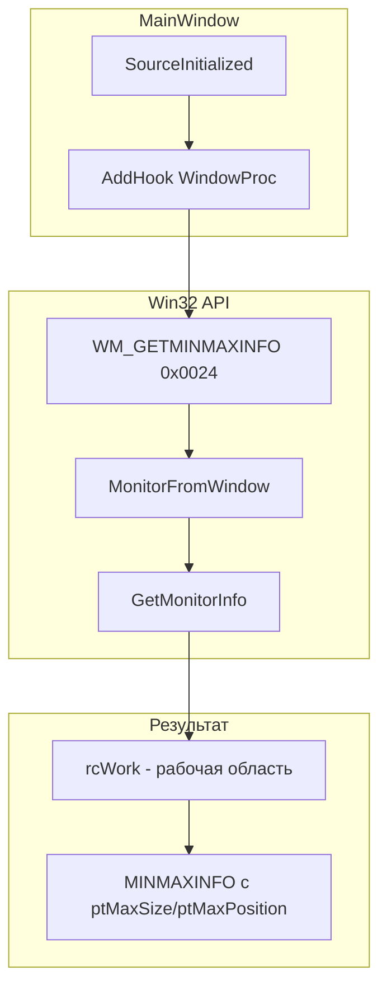

# Исправление максимизации окна: учёт панели задач

## 1. Анализ проблемы

### Причина

При использовании `WindowStyle="None"` WPF не учитывает рабочую область Windows (Work Area) при максимизации. Окно занимает весь экран (`rcMonitor`), а не область без панели задач (`rcWork`).

Ключевые факторы в [MainWindow.xaml](KID.WPF.IDE/MainWindow.xaml):

- `WindowStyle="None"` (строка 14)
- `WindowState="{Binding WindowState, Mode=TwoWay}"` — стандартная максимизация через ViewModel

### Поведение Windows

- **Рабочая область (Work Area)** — пространство экрана без панели задач
- **Монитор (Monitor)** — полная область экрана
- Стандартные окна с `WindowStyle="SingleBorderWindow"` автоматически максимизируются в Work Area
- Окна с `WindowStyle="None"` используют полную область монитора

---

## 2. Варианты решения

### Вариант A: WM_GETMINMAXINFO (рекомендуемый)

**Суть:** Перехват Win32-сообщения `WM_GETMINMAXINFO` (0x0024) и подмена `ptMaxSize`/`ptMaxPosition` на границы рабочей области.

**Плюсы:**

- Корректная работа с мультимониторными конфигурациями
- Поддержка панели задач на любой стороне (низ, верх, лево, право)
- Поддержка автоскрытия панели задач
- Без дополнительных зависимостей (только P/Invoke)
- Решение на уровне системы — работает при любом способе максимизации

**Минусы:**

- Необходим P/Invoke и Win32-структуры
- Требуется доступ к handle окна (после `SourceInitialized`)

### Вариант B: SystemParameters

**Суть:** Установка `MaxHeight = SystemParameters.MaximizedPrimaryScreenHeight` и `MaxWidth = SystemParameters.MaximizedPrimaryScreenWidth` в конструкторе окна.

**Плюсы:** Минимальный код, без P/Invoke.  
**Минусы:** Только для основного монитора, возможны артефакты на мультимониторах; в комментариях Stack Overflow сообщают о перекрытии нижней части окна.

### Вариант C: Программная максимизация без WindowState

**Суть:** Не использовать `WindowState.Maximized`, а вручную выставлять `Top`, `Left`, `Width`, `Height` по `SystemParameters.WorkArea`.

**Плюсы:** Полный контроль над логикой.  
**Минусы:** Потеря стандартного поведения (двойной клик, кнопка в панели задач), требуется переработка MainViewModel.

---

## 3. Рекомендуемая реализация (Вариант A)

### Архитектура

### Затрагиваемые компоненты

| Компонент                                            | Действие                                                                                |
| ---------------------------------------------------- | --------------------------------------------------------------------------------------- |
| [MainWindow.xaml.cs](KID.WPF.IDE/MainWindow.xaml.cs) | Добавить подписку на `SourceInitialized`, обработчик `WindowProc`, структуры и P/Invoke |
| [MainWindow.xaml](KID.WPF.IDE/MainWindow.xaml)       | Без изменений                                                                           |

### Новые элементы в MainWindow.xaml.cs

1. **P/Invoke и структуры:**
  - `MonitorFromWindow`, `GetMonitorInfo` (user32.dll)
  - `MONITORINFO`, `RECT`, `MINMAXINFO`, `POINT`
2. **Обработчик:**
  - `WindowProc` — проверка `msg == 0x0024`, вызов `WmGetMinMaxInfo`
  - `WmGetMinMaxInfo` — получение `rcWork` для текущего монитора, заполнение `ptMaxSize`, `ptMaxPosition`
3. **Инициализация:**
  - В конструкторе: `SourceInitialized += OnSourceInitialized`
  - `OnSourceInitialized`: `HwndSource.FromHwnd(handle).AddHook(WindowProc)`

### Важные детали реализации

- Использовать `MonitorFromWindow(hwnd, MONITOR_DEFAULTTONEAREST)` для определения монитора
- Учитывать `rcWork` из `MONITORINFO` (область без панели задач)
- `ptMaxPosition` = смещение от `rcMonitor` до `rcWork`
- `ptMaxTrackSize` можно задать для корректного поведения при разном разрешении мониторов

---

## 4. Список задач

### Задача 1: Добавить Win32-структуры и P/Invoke

- **Файл:** [MainWindow.xaml.cs](KID.WPF.IDE/MainWindow.xaml.cs) или отдельный `Win32\WindowMaximizeHelper.cs`
- **Сложность:** Низкая
- **Действия:** Определить `POINT`, `RECT`, `MINMAXINFO`, `MONITORINFO`; `DllImport` для `MonitorFromWindow`, `GetMonitorInfo`

### Задача 2: Реализовать обработчик WM_GETMINMAXINFO

- **Файл:** [MainWindow.xaml.cs](KID.WPF.IDE/MainWindow.xaml.cs)
- **Сложность:** Средняя
- **Действия:** Реализовать `WmGetMinMaxInfo(hwnd, lParam)` с расчётом границ по `rcWork`

### Задача 3: Подключить hook в MainWindow

- **Файл:** [MainWindow.xaml.cs](KID.WPF.IDE/MainWindow.xaml.cs)
- **Сложность:** Низкая
- **Действия:** Подписаться на `SourceInitialized`, передать `WindowProc` в `HwndSource.AddHook`

### Задача 4: Проверка

- **Сложность:** Низкая
- **Проверить:** Максимизация на основном мониторе, на втором мониторе, панель задач снизу/сверху/сбоку

---

## 5. Альтернатива: вынести в отдельный сервис

Для соблюдения Single Responsibility можно вынести логику в `IWindowMaximizeBehaviorService` и вызывать его из `WindowInitializationService.Initialize()` или из конструктора MainWindow. Это потребует передачи ссылки на окно и усложнит связность, поэтому для одного окна допустима реализация непосредственно в `MainWindow.xaml.cs`.

---

## 6. Порядок выполнения

1. Добавить Win32-структуры и P/Invoke
2. Реализовать `WmGetMinMaxInfo` и `WindowProc`
3. Подключить hook в конструкторе MainWindow
4. Проверить на разных конфигурациях экранов

---

## 7. Оценка

| Задача                      | Время      | Риски                        |
| --------------------------- | ---------- | ---------------------------- |
| Win32-структуры и P/Invoke  | 15 мин     | Нет                          |
| Обработчик WM_GETMINMAXINFO | 20 мин     | Ошибки при расчёте координат |
| Подключение hook            | 5 мин      | Нет                          |
| Тестирование                | 15 мин     | Нет                          |
| **Итого**                   | **~1 час** |                              |

