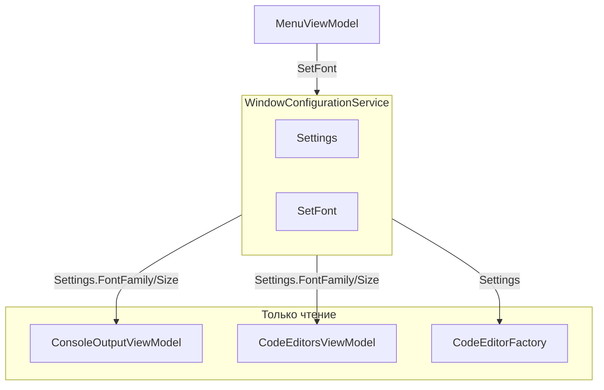

# Рефакторинг системы настроек шрифта

## 1. Анализ требований

### 1.1 Описание функции и цели

Рефакторинг подсистемы настроек шрифта (FontFamily, FontSize) в приложении KID IDE. Цель — устранить дублирование данных и логики между `WindowConfigurationService`, `WindowInitializationService`, `ConsoleOutputViewModel` и `CodeEditorsViewModel`, сделав `WindowConfigurationService` единственным источником истины.

### 1.2 Целевая аудитория и сценарии использования

- **Разработчик приложения:** упрощение поддержки, единая точка изменения логики шрифтов.
- **Пользователь IDE:** смена шрифта в меню → обновление консоли и редактора кода; сохранение настроек между сессиями.

### 1.3 Входные и выходные данные


| Тип      | Данные                                                                                                             |
| -------- | ------------------------------------------------------------------------------------------------------------------ |
| Вход     | Выбор шрифта/размера в меню → `MenuViewModel.ChangeFont` / `ChangeFontSize` → `WindowConfigurationService.SetFont` |
| Хранение | `WindowConfigurationData.FontFamily` (string), `FontSize` (double) в `settings.json`                               |
| Выход    | Привязка `ConsoleOutputView` и обновление `CodeEditor` через pass-through свойства ViewModel                       |


### 1.4 Ограничения и требования

- Сохранить MVVM, DI, привязки WPF.
- Не добавлять зависимость от `System.Windows.Media` в сервисный слой.
- Локализация не затрагивается (строки меню уже локализованы).

---

## 2. Архитектурный анализ

### 2.1 Затронутые подсистемы

- **Сервисы инициализации:** `WindowConfigurationService`, `WindowInitializationService`
- **ViewModels:** `ConsoleOutputViewModel`, `CodeEditorsViewModel`
- **Интерфейсы:** `IConsoleOutputViewModel`, `ICodeEditorsViewModel`
- **Сервисы редактора:** `CodeEditorFactory`

### 2.2 Новые компоненты

Не требуются.

### 2.3 Изменяемые компоненты


| Файл                                                                                       | Изменения                                                     |
| ------------------------------------------------------------------------------------------ | ------------------------------------------------------------- |
| [IConsoleOutputViewModel.cs](KID.WPF.IDE/ViewModels/Interfaces/IConsoleOutputViewModel.cs) | FontFamily, FontSize: `{ get; set; }` → `{ get; }`            |
| [ConsoleOutputViewModel.cs](KID.WPF.IDE/ViewModels/ConsoleOutputViewModel.cs)              | Удаление полей и ApplyFontFromSettings; pass-through свойства |
| [ICodeEditorsViewModel.cs](KID.WPF.IDE/ViewModels/Interfaces/ICodeEditorsViewModel.cs)     | FontFamily, FontSize: `{ get; set; }` → `{ get; }`            |
| [CodeEditorsViewModel.cs](KID.WPF.IDE/ViewModels/CodeEditorsViewModel.cs)                  | Pass-through свойства; OnFontSettingsChanged без сеттеров     |


### 2.4 Зависимости




---

## 3. Список задач

### 3.1 Изменение существующих файлов

1. **IConsoleOutputViewModel.cs**
  - Изменить `FontFamily FontFamily { get; set; }` на `FontFamily FontFamily { get; }`
  - Изменить `double FontSize { get; set; }` на `double FontSize { get; }`
2. **ConsoleOutputViewModel.cs**
  - Удалить поля `_fontFamily`, `_fontSize`
  - Заменить свойства FontFamily/FontSize на pass-through к `windowConfigurationService.Settings`
  - В `OnFontSettingsChanged` вызывать `OnPropertyChanged` для FontFamily и FontSize
  - В `Initialize` вызывать `OnPropertyChanged` для FontFamily и FontSize
  - Удалить метод `ApplyFontFromSettings`
3. **ICodeEditorsViewModel.cs**
  - Изменить `FontFamily FontFamily { get; set; }` на `FontFamily FontFamily { get; }`
  - Изменить `double FontSize { get; set; }` на `double FontSize { get; }`
4. **CodeEditorsViewModel.cs**
  - Заменить свойства FontFamily/FontSize на pass-through к Settings
  - В `OnFontSettingsChanged` напрямую обновлять все CodeEditor из Settings, затем `OnPropertyChanged`

### 3.2 Локализация

Не требуется.

### 3.3 Документация

Не требуется (внутренний рефакторинг).

### 3.4 Тестирование

Ручная проверка:

- Смена шрифта в меню обновляет консоль и редактор кода
- При первом запуске шрифт применяется из настроек
- Новые вкладки получают шрифт из CodeEditorFactory

---

## 4. Порядок выполнения

1. Обновить `IConsoleOutputViewModel` — убрать set у FontFamily/FontSize
2. Рефакторинг `ConsoleOutputViewModel` — pass-through, удаление дублирования
3. Обновить `ICodeEditorsViewModel` — убрать set у FontFamily/FontSize
4. Рефакторинг `CodeEditorsViewModel` — pass-through, обновление `OnFontSettingsChanged`
5. Ручная проверка сценариев

---

## 5. Оценка сложности


| №   | Задача                  | Сложность | Время  | Риски                                                 |
| --- | ----------------------- | --------- | ------ | ----------------------------------------------------- |
| 1   | IConsoleOutputViewModel | Низкая    | 5 мин  | Нет                                                   |
| 2   | ConsoleOutputViewModel  | Средняя   | 15 мин | Проверить обновление привязки при FontSettingsChanged |
| 3   | ICodeEditorsViewModel   | Низкая    | 5 мин  | Нет                                                   |
| 4   | CodeEditorsViewModel    | Средняя   | 15 мин | Новые вкладки получают шрифт из CodeEditorFactory     |
| 5   | Ручная проверка         | Низкая    | 10 мин | Нет                                                   |


**Итого:** ~50 мин

---

## 6. Детали реализации (для /execute-plan-for-new-feature)

### 6.1 ConsoleOutputViewModel — целевой код

```csharp
public FontFamily FontFamily => new FontFamily(
    windowConfigurationService.Settings.FontFamily ?? "Consolas");
public double FontSize => windowConfigurationService.Settings.FontSize > 0
    ? windowConfigurationService.Settings.FontSize : 14;
```

### 6.2 CodeEditorsViewModel — OnFontSettingsChanged

```csharp
private void OnFontSettingsChanged(object? sender, EventArgs e)
{
    var settings = windowConfigurationService?.Settings;
    if (settings == null) return;

    var fontFamily = new FontFamily(settings.FontFamily ?? "Consolas");
    var fontSize = settings.FontSize > 0 ? settings.FontSize : 14.0;

    foreach (var tab in OpenedFiles)
    {
        if (tab.CodeEditor != null)
        {
            tab.CodeEditor.FontFamily = fontFamily;
            tab.CodeEditor.FontSize = fontSize;
        }
    }
    OnPropertyChanged(nameof(FontFamily));
    OnPropertyChanged(nameof(FontSize));
}
```

