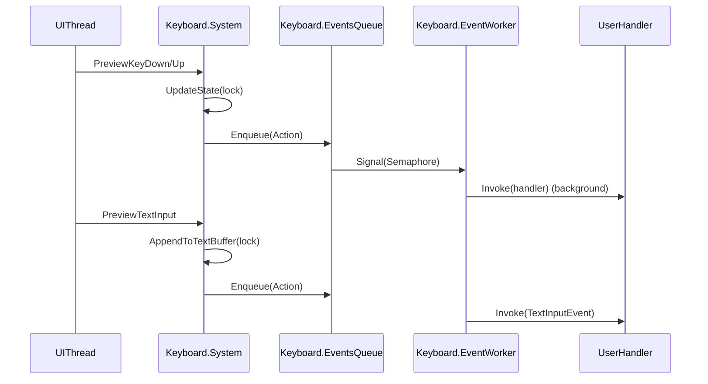

# План: новый модуль Keyboard (WPF, window-level, text+keys)

## 1. Анализ требований

### 1.1. Назначение и цель

- Добавить в `KIDLibrary` новый модуль `Keyboard` для взаимодействия с клавиатурой в пользовательском коде (`using KID;`).
- Сделать API **простым для школьника** (1–2 очевидных способа сделать типовую вещь), но **полнофункциональным** (состояние, события, текст, комбинации/хоткеи, очереди/буферы).
- Стиль и принципы — как у `Mouse`: `public static partial class`, `Init(...)`, **polling + event-driven**, потокобезопасность.

### 1.2. Целевая аудитория и сценарии

- **Самое простое**: “нажата ли клавиша W/Space/стрелка?”, “какая клавиша была последней?”, “кто сейчас зажат — Shift/Ctrl/Alt?”.
- **Игровые/интерактивные**: WASD-движение, прыжок по Space, переключение режима по Tab, удержание с временем, «только что нажали/отпустили».
- **Хоткеи**: Ctrl+S, Ctrl+Z, Shift+стрелка, пользовательские комбинации и последовательности.
- **Текстовый ввод в графических программах**: ввод имени игрока, чат, ввод русских/украинских букв и Unicode.
- **Надёжность**: пользовательский код не должен блокировать UI; исключения в обработчиках не должны ломать систему.

### 1.3. Входы/выходы

- **Вход**: WPF события клавиатуры от `Window` (и её дерева визуальных элементов): `PreviewKeyDown/PreviewKeyUp`, `PreviewTextInput`, при необходимости — `TextInput`.
- **Выход наружу**:
  - polling-состояния (snapshot/структуры)
  - события (KeyDown/KeyUp/KeyPress/Repeat, TextInput, Shortcut)
  - методы проверки состояния (`IsDown`, `WasPressed`, …)
  - API для комбинаций/хоткеев и (опционально) ожидания ввода

### 1.4. Ограничения и требования

- **WPF/.NET 8**, интеграция с текущим `CodeExecutionContext` (см. `[KID.WPF.IDE/Services/CodeExecution/Contexts/CanvasGraphicsContext.cs](d:/Visual Studio Projects/KID/KID.WPF.IDE/Services/CodeExecution/Contexts/CanvasGraphicsContext.cs) `где инициализируются `Graphics/Mouse/Music`).
- **Потоки**: сбор событий в UI потоке, доставка пользовательских обработчиков **в фоне** (как `Mouse`), чтобы не подвешивать интерфейс.
- **Конфликт с консольным вводом**: `TextBoxConsole` активно использует `PreviewKeyDown/PreviewTextInput` и ставит `e.Handled = true` при чтении (см. `[KID.WPF.IDE/Services/CodeExecution/TextBoxConsole.cs](d:/Visual Studio Projects/KID/KID.WPF.IDE/Services/CodeExecution/TextBoxConsole.cs)`).
  - Политика по умолчанию: `Keyboard` **не помечает** события как handled.
  - Ввести понятную опцию/режим, чтобы школьник мог легко избежать “WASD двигает игру, пока я печатаю в консоль”.
- **Локализация**: UI-строки приложения локализуются через `.resx`, но `KIDLibrary` API обычно не требует UI-локализации; документация должна быть обновлена.

## 2. Архитектурный анализ

### 2.1. Какие подсистемы затронуты

- `KIDLibrary`: добавление новой подсистемы `Keyboard`.
- `KID.Services.CodeExecution.Contexts`: подключение `Keyboard.Init(...)` при запуске пользовательского кода (аналогично `Mouse.Init(canvas)`).
- `docs/`: новая документация `Keyboard-API.md` + упоминания в обзорных документах.
- `ProjectTemplates/`: добавить пример/«тест-скрипт» для Keyboard (как `MouseTests.cs`).

### 2.2. Новые компоненты (публичный контракт Keyboard)

#### 2.2.1. Facade

- `public static partial class Keyboard`
- `Keyboard.Init(Window window)` — подключение к WPF window-level событиям (вы выбрали режим `app-window`).
- (Опционально) `Keyboard.Init(Window window, KeyboardOptions options)` для конфигурации.

#### 2.2.2. Простые polling-методы (для школьника)

- `bool Keyboard.IsDown(Key key)`
- `bool Keyboard.IsUp(Key key)`
- `bool Keyboard.WasPressed(Key key)` — edge: “нажали с прошлого снимка/с последнего чтения”.
- `bool Keyboard.WasReleased(Key key)`
- `bool Keyboard.AnyKeyDown` / `bool Keyboard.AnyKeyPressed` (последнее — edge/pulse)
- `Key? Keyboard.LastKeyDown` / `Key? Keyboard.LastKeyUp`
- `KeyPressInfo Keyboard.CurrentKeyPress` (короткий «пульс», по аналогии с `Mouse.CurrentClick`) + `KeyPressInfo Keyboard.LastKeyPress`

#### 2.2.3. Снимки состояния (для более сложных задач)

- `KeyboardState Keyboard.CurrentState` — snapshot-структура/record с:
  - `KeyModifiers Modifiers` (Shift/Ctrl/Alt/Win)
  - `bool CapsLockOn/NumLockOn/ScrollLockOn`
  - `IReadOnlyCollection<Key> DownKeys` (или компактная структура)
  - (Опционально) время/таймстемпы
- `KeyStateInfo Keyboard.GetKeyState(Key key)`:
  - `bool IsDown`
  - `DateTimeOffset? DownSince`
  - `int RepeatCount`
  - `bool IsRepeatLastDown`

#### 2.2.4. Текстовый ввод (Unicode)

- `TextInputInfo Keyboard.CurrentTextInput` (пульс) + `TextInputInfo Keyboard.LastTextInput`
- `string Keyboard.ReadText()` — «потребить» накопленный буфер введённых символов (очистить).
- `char? Keyboard.ReadChar()` — «потребить» 1 символ.
- `KeyboardTextBufferMode`/лимиты буфера (например, максимум N символов, чтобы память не росла).

#### 2.2.5. События (event-driven)

Все обработчики пользователя вызываются **в фоновом потоке**, как в `Mouse`.

- `event Action<KeyPressInfo> KeyDownEvent`
- `event Action<KeyPressInfo> KeyUpEvent`
- `event Action<KeyPressInfo> KeyPressEvent` (если решим отличать “press” от “down”)
- `event Action<TextInputInfo> TextInputEvent`
- `event Action<KeyboardState> StateChangedEvent` (опционально, агрегирующее)

#### 2.2.6. Хоткеи/комбинации (простые + продвинутые)

- Типы:
  - `KeyModifiers` (flags)
  - `KeyChord` (модификаторы + 1..N клавиш)
  - `Shortcut` (либо chord, либо последовательность chord’ов)
- API:
  - `int Keyboard.RegisterShortcut(Shortcut shortcut)` / `bool Keyboard.UnregisterShortcut(int id)`
  - `event Action<ShortcutFiredInfo> ShortcutEvent`
  - (Опционально) `Shortcut Keyboard.ParseShortcut(string text)` для удобства, например `"Ctrl+S"`, `"Shift+Alt+Enter"`.

#### 2.2.7. Режимы захвата (чтобы не мешать консоли)

- `KeyboardCapturePolicy` (enum), например:
  - `CaptureAlways` (по умолчанию)
  - `IgnoreWhenTextInputFocused` (если фокус в `TextBox`/элементе ввода)
  - `IgnoreWhenConsoleIsReading` (позже, при явной интеграции)
- Важно: `Keyboard` не должен ставить `e.Handled = true` по умолчанию.

#### 2.2.8. (Опционально) Блокирующие/ожидающие методы

Для некоторых учебных сценариев полезно, но это повышает риск конфликтов с `Console.ReadLine`:

- `KeyPressInfo Keyboard.ReadKey()` (блокирует поток пользователя)
- `Task<KeyPressInfo> Keyboard.ReadKeyAsync(CancellationToken token = default)`
- Внутри — уважать `StopManager.StopIfButtonPressed()` и/или `StopManager.CurrentToken`.

### 2.3. Внутренняя архитектура (как у Mouse)

- `Keyboard.System.cs`: подписка на WPF window events, обновление состояния, распознавание repeat, сбор `TextInput`.
- `Keyboard.State.cs`: thread-safe геттеры snapshot’ов + методы `IsDown/WasPressed`.
- `Keyboard.Events.cs`: очередь событий + фоновой воркер доставки (копируем паттерн `Mouse.Events.cs`).
- DTO/Enums: компактные структуры и перечисления.

### 2.4. Интеграция в запуск кода

- В `[KID.WPF.IDE/Services/CodeExecution/Contexts/CanvasGraphicsContext.cs](d:/Visual Studio Projects/KID/KID.WPF.IDE/Services/CodeExecution/Contexts/CanvasGraphicsContext.cs)` добавить:
  - получение `Window` через `Window.GetWindow(canvas)`
  - вызов `Keyboard.Init(window)`
- Если `window == null` (редкий случай) — аккуратный no-op или fallback на `canvas` как `IInputElement` (решим в реализации).

### 2.5. Потоки данных (mermaid)

## 3. Список задач

### 3.1. Новые файлы (KIDLibrary)

Создать папку: `[KID.Library/Keyboard/](d:/Visual Studio Projects/KID/KID.Library/Keyboard/)`

- `Keyboard.System.cs`
- `Keyboard.State.cs`
- `Keyboard.Events.cs`
- `KeyboardState.cs`
- `KeyPressInfo.cs`
- `TextInputInfo.cs`
- `KeyModifiers.cs` (flags)
- `KeyboardCapturePolicy.cs`
- `Shortcut.cs` / `KeyChord.cs` / `ShortcutFiredInfo.cs` (минимальный набор, можно нарастить)

### 3.2. Изменение существующих файлов

- `[KID.WPF.IDE/Services/CodeExecution/Contexts/CanvasGraphicsContext.cs](d:/Visual Studio Projects/KID/KID.WPF.IDE/Services/CodeExecution/Contexts/CanvasGraphicsContext.cs) `— добавить `Keyboard.Init(window)`.
- Документация:
  - `[docs/Keyboard-API.md](d:/Visual Studio Projects/KID/docs/Keyboard-API.md)` — новый файл.
  - `[docs/README.md](d:/Visual Studio Projects/KID/docs/README.md)` — добавить ссылку.
  - `[docs/FEATURES.md](d:/Visual Studio Projects/KID/docs/FEATURES.md)` — упомянуть Keyboard.
  - `[docs/SUBSYSTEMS.md](d:/Visual Studio Projects/KID/docs/SUBSYSTEMS.md)` — добавить раздел «Keyboard API» рядом с Mouse.
  - `[docs/ARCHITECTURE.md](d:/Visual Studio Projects/KID/docs/ARCHITECTURE.md)` — добавить в потоки данных/потокобезопасность.

### 3.3. ProjectTemplates (пример для детей)

- Добавить шаблон-скрипт: `[KID.WPF.IDE/ProjectTemplates/KeyboardTests.cs](d:/Visual Studio Projects/KID/KID.WPF.IDE/ProjectTemplates/KeyboardTests.cs)`
  - пример polling (WASD/Space)
  - пример TextInput (накапливаем строку и рисуем её через `Graphics.Text`)
  - пример хоткея (например, Ctrl+R сброс)

### 3.4. Локализация

- Для самого `Keyboard` UI-локализация обычно не нужна.
- Если появятся новые UI-элементы в приложении (например, пункт меню/настройка «Keyboard capture policy») — тогда обновить:
  - `KID/Resources/Strings.*.resx` (ru/en/uk)

### 3.5. Тестирование

- В проекте нет отдельного test-проекта; используем “живые” шаблоны в `ProjectTemplates` (как `MouseTests.cs`).
- Минимальный набор проверок вручную:
  - KeyDown/Up, repeat
  - modifiers
  - ввод кириллицы через `PreviewTextInput`
  - поведение при `Console.ReadLine()` (фокус в TextBox) — убедиться, что `Keyboard` по умолчанию не ломает ввод.

## 4. Порядок выполнения

1. Спроектировать публичные контракты (`KeyboardState`, `KeyPressInfo`, `TextInputInfo`, enums) и список публичных членов `Keyboard`.
2. Спроектировать модель потоков и доставки событий (копия паттерна `Mouse.Events.cs`).
3. Определить политику capture (по умолчанию и опции) с учётом `TextBoxConsole`.
4. Интегрировать `Keyboard.Init(window)` в `CanvasGraphicsContext.Init()`.
5. Добавить `docs/Keyboard-API.md` и обновить индексные docs.
6. Добавить `ProjectTemplates/KeyboardTests.cs` как «интерактивный тест».

## 5. Оценка сложности, времени, рисков

### 5.1. Контракты и интерфейс API

- **Сложность**: средняя
- **Время**: 2–4 часа
- **Риски**:
  - перегрузить школьника лишними сущностями → лечится “простым слоем” (`IsDown/WasPressed/ReadText`) + “advanced слой”.

### 5.2. WPF интеграция и фокус/консоль

- **Сложность**: высокая
- **Время**: 3–6 часов
- **Риски**:
  - `PreviewTextInput`/IME/раскладки: не все символы приходят одинаково.
  - конфликты с `TextBoxConsole` (оно ставит `Handled=true` во время чтения).
  - разный порядок маршрутизации событий (Preview vs Bubble) — важно выбирать Preview на уровне Window.

### 5.3. Доставка событий в фоне + потокобезопасность

- **Сложность**: средняя
- **Время**: 2–4 часа
- **Риски**:
  - рост очереди при тяжёлых обработчиках (как у Mouse) — документируем, можно добавить ограничение/дроп для сверхчастых событий (опционально).

### 5.4. Хоткеи/комбинации

- **Сложность**: средняя/высокая (в зависимости от “последовательности”)
- **Время**: 2–6 часов
- **Риски**:
  - неоднозначности порядка нажатий/отпусканий, repeat
  - нужно чётко задокументировать семантику (что значит chord из N клавиш)

### 5.5. Документация и шаблоны

- **Сложность**: низкая/средняя
- **Время**: 1–3 часа
- **Риски**: минимальные

---

### Итоговое решение по требованиям пользователя

- `Keyboard` слушает **уровень окна** (app-window).
- `Keyboard` поддерживает **и клавиши, и текстовый ввод (Unicode)**.