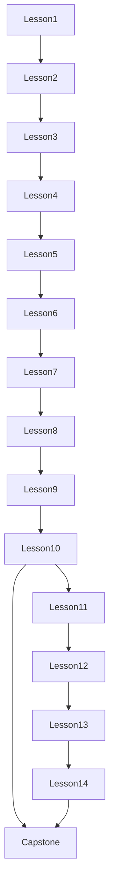

## 1. Анализ требований

1.1. **Описание функции и цель**
- Добавить в поставляемые шаблоны проектов курс обучения ребёнка C# и API `KIDLibrary` (Graphics/Music/Mouse/Keyboard) в виде папок `Lesson1`, `Lesson2`, …
- Цель: дать **пошаговую траекторию** от «Привет, мир» до мини‑игр и более сложных тем, опираясь на существующую структуру шаблонов (`Gold/NextLevel/CheatSheets`) и главы BASIC256.

1.2. **Целевая аудитория и сценарии использования**
- Дети/подростки, начинающие с нуля.
- Учителя/родители, ведущие занятия.
- Сценарии:
  - открыть папку урока в проводнике/диалоге «Файл → Открыть» и запускать примеры;
  - выбрать один из файлов урока как шаблон «Новый файл» через `TemplateName`.

1.3. **Входные/выходные данные**
- Вход:
  - набор возможностей `KIDLibrary` (см. `docs/*-API.md` и `KID.Library/*`), существующие шаблоны (`KID.WPF.IDE/ProjectTemplates/<locale>`).
- Выход:
  - дерево папок `KID.WPF.IDE/ProjectTemplates/en-US/LessonX`, `ru-RU/LessonX`, `uk-UA/LessonX` с `.cs`‑программами;
  - обновлённая документация курса в `docs`.

1.4. **Ограничения и требования**
- **Локализация**: все текстовые строки/комментарии в учебных программах должны быть переведены для `en-US`, `ru-RU`, `uk-UA`.
- **Простота**: 1 файл = 1 идея; минимизировать “магические” конструкции; предпочтение понятным типам и шагам.
- **Безопасность UI**: в уроках, где есть цикл/анимация, использовать существующие подходы (`CheatSheets/GameLoop.Template.cs`) и уважать остановку выполнения (через проверку/шаблон Stop).
- **Совместимость**: не ломать текущие категории (`Gold/NextLevel/CheatSheets`); уроки — отдельные папки.

## 2. Архитектурный анализ

2.1. **Какие подсистемы затронуты**
- `ProjectTemplates`: добавление новых файлов/папок. Проект уже копирует `ProjectTemplates\**\*` в output (см. `[KID.WPF.IDE/KID.WPF.IDE.csproj](KID.WPF.IDE/KID.WPF.IDE.csproj)`), поэтому доп. кода для доставки не нужно.
- `docs`: описание курса и способа использования.

2.2. **Новые компоненты**
- Только контент: новые папки `Lesson*` и новые `.cs` шаблоны.
- Рекомендуемо: отдельный документ курса, например `[docs/COURSE.md](docs/COURSE.md)` с оглавлением и ссылками на уроки.

2.3. **Какие существующие компоненты менять**
- `[docs/README.md](docs/README.md)` — добавить раздел «Курс (Lesson1..LessonN)» и как им пользоваться.
- Опционально: в каждом уроке добавить `README.md` внутри папки урока (но это не обязательно, если придерживаться единого заголовка‑шапки комментариев в каждом `.cs`).

2.4. **Зависимости**
- Уроки используют `KIDLibrary`: `Graphics`, `Music`, `Mouse`, `Keyboard` (см. `[KID.Library](KID.Library)` и API: `[docs/Graphics-API.md](docs/Graphics-API.md)`, `[docs/Music-API.md](docs/Music-API.md)`, `[docs/Mouse-API.md](docs/Mouse-API.md)`, `[docs/Keyboard-API.md](docs/Keyboard-API.md)`).
- Для циклов/анимаций опираться на существующие шпаргалки: `[KID.WPF.IDE/ProjectTemplates/*/CheatSheets/GameLoop.Template.cs](KID.WPF.IDE/ProjectTemplates)` и `SafeInput.Template.cs`.

## 3. План курса (Lesson1..LessonN) + список программ

Ниже — **целевой набор из 14 уроков** (≥10) с программами, ориентированными на главы BASIC256 и на API KID.

### Lesson1 — Привет, .KID! (первый запуск, вывод)
- **Цели**: запуск, `Console.WriteLine`, первая графика через `Graphics.*`.
- **Программы**:
  - `01_HelloWorld.Console.cs` — вывод строк, форматирование.
  - `02_HelloWorld.Graphics.cs` — круг/прямоугольник + текст.
  - `03_Colors.Intro.cs` — цвет как имя/hex/RGB/int.
  - (перенос/адаптация) `HelloWorld.cs` как «готовый пример».

### Lesson2 — Переменные и типы (числа/строки)
- **Цели**: `int/double/string`, присваивание, простая математика.
- **Программы**:
  - `01_VariablesAndMath.cs` — сумма/разность/умножение.
  - `02_StringInterpolation.cs` — `$"..."`, склейка.
  - `03_RandomNumbers.cs` — `Random`, случайные значения для игры/рисунка.

### Lesson3 — Рисуем базовые фигуры
- **Цели**: `Circle/Ellipse/Rectangle/Line`, координаты Canvas.
- **Программы**:
  - `01_Shapes.Gallery.cs` — “галерея” фигур.
  - `02_DrawHouse.cs` — дом из прямоугольников/многоугольника.
  - `03_TextAndFont.cs` — `Graphics.SetFont`, `Graphics.Text`.

### Lesson4 — Музыка и ритм
- **Цели**: `Music.Sound`, `SoundNote`, паузы.
- **Программы**:
  - `01_OneNoteAndPause.cs` — тон/тишина.
  - `02_Melody.Array.cs` — мелодия массивом `SoundNote[]`.
  - `03_Chords.Polyphony.cs` — 2–3 дорожки одновременно.

### Lesson5 — Думаем как программист (алгоритм, декомпозиция)
- **Цели**: шаги решения, “ввод → обработка → вывод”, отладочные принты.
- **Программы**:
  - `01_RecipeAlgorithm.Console.cs` — алгоритм как список шагов.
  - `02_DrawBySteps.cs` — рисунок по шагам (фон/объекты).
  - `03_DebugPrints.cs` — “что происходит” через `Console.WriteLine`.

### Lesson6 — Программа задаёт вопросы (ввод)
- **Цели**: `Console.ReadLine`, парсинг чисел, валидация (через SafeInput шаблон).
- **Программы**:
  - `01_AskName.cs` — диалог.
  - `02_AskNumber.Sum.cs` — ввод чисел.
  - `03_SafeInput.Intro.cs` — адаптация `CheatSheets/SafeInput.Template.cs`.

### Lesson7 — Сравнения и ветвления
- **Цели**: `if/else`, сравнения, логические операторы.
- **Программы**:
  - `01_BiggerOrSmaller.cs` — сравнить два числа.
  - `02_GuessNumber.Console.cs` — игра (можно базироваться на `Gold/GuessNumber.Console.cs`).
  - `03_ColorByCondition.cs` — цвет фигуры в зависимости от значения.

### Lesson8 — Циклы и счётчики
- **Цели**: `for/while`, накопление, повтор.
- **Программы**:
  - `01_Countdown.Console.cs` — обратный отсчёт.
  - `02_RepeatedShapes.cs` — ряд кругов/шахматка.
  - `03_Spiral.Simple.cs` — спираль через цикл (подготовка к Generative).

### Lesson9 — “Графика на заказ”: свои фигуры и композиции
- **Цели**: `Polygon`, кривые Безье, параметры.
- **Программы**:
  - `01_Polygon.Star.cs` — звезда/многоугольник.
  - `02_Bezier.Smile.cs` — улыбка/дуга (как в `Demo1`).
  - `03_ProceduralFlower.cs` — цветок из лепестков (циклы+полигон/эллипсы).

### Lesson10 — Подпрограммы: повторное использование
- **Цели**: методы `static`, параметры, возврат значения.
- **Программы**:
  - `01_Functions.DrawFace.cs` — `DrawFace(x,y,size)`.
  - `02_Functions.MathHelpers.cs` — `Clamp`, `Distance`.
  - `03_Functions.MelodyBuilder.cs` — метод, который строит массив `SoundNote`.

### Lesson11 — Управляем мышью, двигаем объекты
- **Цели**: `Mouse.CurrentCursor`, клики, простая “игра”.
- **Программы**:
  - `01_MouseCoordinates.cs` — вывод координат.
  - `02_ClickToPlaceCircle.cs` — по клику ставим круг.
  - `03_CatchTheCircle.cs` — мини‑игра (база: `Gold/CatchTheCircle.cs`).

### Lesson12 — Используем клавиатуру
- **Цели**: `Keyboard.IsDown/WasPressed`, управление.
- **Программы**:
  - `01_WASD.MoveSquare.cs` — управление квадратом.
  - `02_KeyboardPiano.cs` — “пианино” (база: `Gold/KeyboardPiano.cs`).
  - `03_CapturePolicy.Demo.cs` — демонстрация `Keyboard.CapturePolicy` (когда печатают в консоли).

### Lesson13 — Картинки, музыка и “спрайты” (retained-mode)
- **Цели**: `Graphics.Image`, перемещение/масштаб через extension methods.
- **Программы**:
  - `01_Image.LoadAndMove.cs` — загрузить картинку, двигать.
  - `02_SpriteFollowMouse.cs` — “спрайт” следует за мышью.
  - `03_BackgroundMusic.Async.cs` — `Music.SoundPlay`, loop, volume.

### Lesson14 — Итоговый проект (Capstone)
- **Цели**: собрать всё вместе: цикл, ввод, графика, звук, управление.
- **Программы**:
  - `01_GameLoop.TemplateBased.cs` — на базе `CheatSheets/GameLoop.Template.cs`.
  - `02_MiniGame.DodgeOrCatch.cs` — мини‑игра: движение + столкновения + счёт.
  - `03_ParticlesOrFirework.cs` — по клику “фейерверк” (база: `NextLevel/Particles.Firework.cs`).

Примечание: темы “файлы/коллекции/сортировки/ошибки/сеть/БД” из BASIC256 можно добавить как **Lesson15+ (Advanced)**, когда появится/оформится соответствующий API или когда вы захотите включить стандартные .NET возможности в курс.

## 4. Список задач по внедрению (репозиторий)

4.1. **Создать структуру уроков в шаблонах**
- Новые папки:
  - `[KID.WPF.IDE/ProjectTemplates/en-US/Lesson1..Lesson14](KID.WPF.IDE/ProjectTemplates/en-US)`
  - `[KID.WPF.IDE/ProjectTemplates/ru-RU/Lesson1..Lesson14](KID.WPF.IDE/ProjectTemplates/ru-RU)`
  - `[KID.WPF.IDE/ProjectTemplates/uk-UA/Lesson1..Lesson14](KID.WPF.IDE/ProjectTemplates/uk-UA)`

4.2. **Добавить/адаптировать программы уроков**
- В каждой локали создать одинаковые имена файлов (чтобы было легко сравнивать), но локализовать:
  - строки `Console.WriteLine/ReadLine`;
  - текст в `Graphics.Text`;
  - обучающие комментарии.
- Где возможно — переиспользовать существующие примеры:
  - `HelloWorld.cs`, `Demo1.cs`;
  - `Gold/*` (как “эталон/финал” для соответствующего урока);
  - `CheatSheets/*` как основа для уроков про цикл и ввод.

4.3. **Единый формат “учебной шапки” в каждом файле**
- В начале каждого `.cs` добавить блок комментариев:
  - что изучаем;
  - что изменить ребёнку (мини‑задания);
  - “попробуй сам” (2–3 идеи).

4.4. **Обновить документацию**
- `[docs/README.md](docs/README.md)`:
  - добавить раздел «Курс Lesson1..Lesson14»;
  - описать навигацию: открывать `.cs` из `ProjectTemplates/<locale>/LessonX` или назначать в `TemplateName`.
- Добавить новый файл `[docs/COURSE.md](docs/COURSE.md)`:
  - оглавление уроков;
  - цели уроков и список программ;
  - рекомендации учителю (темп, домашка, расширения).

4.5. **Тестирование/проверки**
- Пробежаться по 1–2 программам из каждого урока (минимум: запуск/остановка, графика/звук/ввод).
- Проверить, что `ProjectTemplates\**\*` копируются в output (уже настроено в `[KID.WPF.IDE/KID.WPF.IDE.csproj](KID.WPF.IDE/KID.WPF.IDE.csproj)`).

## 5. Порядок выполнения

5.1. Спроектировать окончательный список уроков и перечень файлов (единые имена).
5.2. Создать папки `Lesson1..Lesson14` во всех трёх локалях.
5.3. Перенести/адаптировать существующие примеры в соответствующие уроки.
5.4. Написать недостающие маленькие упражнения (1 идея на файл), синхронно для `en-US/ru-RU/uk-UA`.
5.5. Добавить “учебную шапку” в каждый файл.
5.6. Обновить `[docs/README.md](docs/README.md)` и создать `[docs/COURSE.md](docs/COURSE.md)`.
5.7. Быстрый прогон примеров (особенно: циклы/анимации, stop, ввод).

## 6. Оценка сложности (задача → сложность/время/риски)

6.1. Создать структуру папок Lesson1..Lesson14 во всех локалях
- Сложность: низкая
- Время: 30–60 мин
- Риски: минимальны

6.2. Сформировать “скелет” набора уроков (перечень файлов, единые имена)
- Сложность: средняя
- Время: 1–2 ч
- Риски: пересечения тем, слишком резкий рост сложности

6.3. Адаптация существующих шаблонов в уроки (HelloWorld/Demo1/Gold/NextLevel/CheatSheets)
- Сложность: средняя
- Время: 2–4 ч
- Риски: примеры могут быть “слишком продвинуты” без промежуточных упражнений

6.4. Написание новых маленьких упражнений (≈ 30–45 файлов суммарно * 3 локали)
- Сложность: высокая
- Время: 1–3 дня
- Риски:
  - качество педагогики (слишком много нового за раз);
  - расхождение локализаций (содержательно разные версии);
  - ошибки/зависания (вечные циклы без корректного шаблона остановки)

6.5. Документация курса (`docs/COURSE.md` + правки `docs/README.md`)
- Сложность: средняя
- Время: 2–4 ч
- Риски: устаревает при изменении набора уроков — нужно держать в синхроне

6.6. Прогон/проверка примеров
- Сложность: средняя
- Время: 1–2 ч
- Риски: платформенные различия (пути к медиафайлам), блокирующий ввод/звук, отсутствие файлов изображений/аудио (если их добавить)
