# План: Галочка для выбранных настроек UI (Вариант A)

## 1. Анализ требований

### Описание

Отображать галочку (checkmark) рядом с текущим выбором в меню «Вид» для: темы, языка, шрифта и размера шрифта. Используется стандартный WPF-механизм `MenuItem.IsCheckable` + `IsChecked`.

### Сценарии

- Пользователь открывает меню «Вид» и видит, какие параметры выбраны
- После смены параметра галочка переходит на новый пункт
- Соответствует поведению Notepad, VS Code и других приложений

### Входные данные

- Текущие значения из `WindowConfigurationService.Settings` (ColorTheme, UILanguage, FontFamily, FontSize)
- Коллекции элементов меню: AvailableThemes, AvailableLanguages, AvailableFonts, AvailableFontSizes

### Выходные данные

- В каждом подменю пункт, совпадающий с текущим значением, отмечен галочкой (IsChecked=true)

---

## 2. Архитектурный анализ

```mermaid
flowchart LR
    subgraph VM [MenuViewModel]
        SelectedThemeKey
        SelectedCultureCode
        SelectedFontFamily
        SelectedFontSize
    end
    
    subgraph Settings [WindowConfigurationService.Settings]
        ColorTheme
        UILanguage
        FontFamily
        FontSize
    end
    
    subgraph View [MenuView]
        ThemeMI[Theme MenuItem]
        LangMI[Language MenuItem]
        FontMI[Font MenuItem]
        SizeMI[FontSize MenuItem]
    end
    
    Settings -->|"read"| VM
    VM -->|"IsChecked binding"| View
    View -->|"MultiBinding"| EC[EqualityToBoolConverter]
```




### Затронутые файлы

- [MenuViewModel.cs](KID.WPF.IDE/ViewModels/MenuViewModel.cs) — добавить свойства Selected* и вызовы OnPropertyChanged
- [MenuView.xaml](KID.WPF.IDE/Views/MenuView.xaml) — IsCheckable, IsChecked, MultiBinding
- **Новый:** [Converters/EqualityToBoolConverter.cs](KID.WPF.IDE/Converters/EqualityToBoolConverter.cs) — IMultiValueConverter для сравнения

### Зависимости

- `AvailableTheme.ThemeKey` (string)
- `AvailableLanguage.CultureCode` (string)
- `AvailableFonts` — элементы string
- `AvailableFontSizes` — элементы double (сравнение с допуском)

---

## 3. Список задач

### Задача 1: Свойства выбранных значений в MenuViewModel

**Файл:** [MenuViewModel.cs](KID.WPF.IDE/ViewModels/MenuViewModel.cs)

Добавить публичные свойства только для чтения:

- `SelectedThemeKey` — возвращает `windowConfigurationService.Settings?.ColorTheme ?? ""`
- `SelectedCultureCode` — возвращает `windowConfigurationService.Settings?.UILanguage ?? ""`
- `SelectedFontFamily` — возвращает `windowConfigurationService.Settings?.FontFamily ?? ""`
- `SelectedFontSize` — возвращает `windowConfigurationService.Settings?.FontSize ?? 0.0`

В каждом из методов ChangeTheme, ChangeLanguage, ChangeFont, ChangeFontSize после обновления Settings вызывать `OnPropertyChanged` для соответствующего свойства.

**Сложность:** низкая | **Время:** 15 мин

---

### Задача 2: Конвертер EqualityToBoolConverter

**Новый файл:** [Converters/EqualityToBoolConverter.cs](KID.WPF.IDE/Converters/EqualityToBoolConverter.cs)

Реализовать `IMultiValueConverter`:

- Вход: `values[0]` — текущее значение из ViewModel, `values[1]` — значение пункта меню
- Логика: сравнение по Equals для string; для double — сравнение с допуском 0.001
- `ConvertBack` — возвращать `Binding.DoNothing`

**Сложность:** низкая | **Время:** 15 мин

---

### Задача 3: Обновление MenuView.xaml

**Файл:** [MenuView.xaml](KID.WPF.IDE/Views/MenuView.xaml)

1. Добавить в UserControl.Resources: `EqualityToBoolConverter` с ключом `EqualityToBoolConverter`
2. Для каждого из четырёх подменю (Theme, Language, Font, FontSize) в ItemContainerStyle:
  - Добавить `Setter Property="IsCheckable" Value="True"`
  - Добавить Setter для IsChecked с MultiBinding:
    - **Theme:** Binding1 = DataContext.SelectedThemeKey, Binding2 = ThemeKey
    - **Language:** Binding1 = DataContext.SelectedCultureCode, Binding2 = CultureCode
    - **Font:** Binding1 = DataContext.SelectedFontFamily, Binding2 = (сам элемент, string)
    - **FontSize:** Binding1 = DataContext.SelectedFontSize, Binding2 = (сам элемент, double)

**Пример для Theme:**

```xml
<Setter Property="IsCheckable" Value="True"/>
<Setter Property="IsChecked">
    <Setter.Value>
        <MultiBinding Converter="{StaticResource EqualityToBoolConverter}">
            <Binding Path="DataContext.SelectedThemeKey" RelativeSource="{RelativeSource AncestorType=UserControl}"/>
            <Binding Path="ThemeKey"/>
        </MultiBinding>
    </Setter.Value>
</Setter>
```

**Сложность:** средняя | **Время:** 25 мин

---

### Задача 4: Синхронизация при запуске приложения

**Файл:** [MenuViewModel.cs](KID.WPF.IDE/ViewModels/MenuViewModel.cs)

Добавить публичный метод `RefreshSelectedSettings()` (или вызывать его из конструктора после загрузки коллекций), который вызывает `OnPropertyChanged` для SelectedThemeKey, SelectedCultureCode, SelectedFontFamily, SelectedFontSize. Это гарантирует обновление галочек при первом открытии меню после загрузки настроек.

**Альтернатива:** Вызвать `OnPropertyChanged(nameof(SelectedThemeKey))` и т.д. в конце конструктора (Settings уже загружены к моменту создания MenuViewModel).

**Сложность:** низкая | **Время:** 5 мин

---

## 4. Порядок выполнения

1. Задача 1 — свойства Selected* в MenuViewModel
2. Задача 2 — EqualityToBoolConverter
3. Задача 3 — изменения в MenuView.xaml
4. Задача 4 — синхронизация при запуске

---

## 5. Потенциальные риски

- **FontSize:** double может приходить из JSON как 14.0, а элемент коллекции — 14. Конвертер должен корректно сравнивать с допуском
- **Font:** если выбранный шрифт отсутствует в AvailableFonts (например, из старых настроек), галочка не будет ни у одного пункта — приёмлемое поведение

