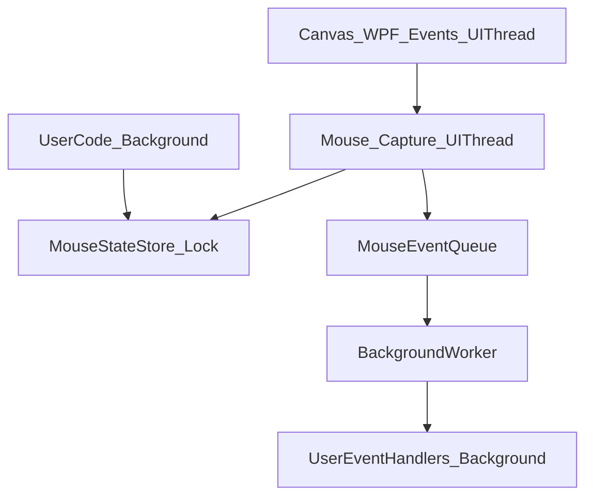

## 1. Анализ требований

1.1. **Описание функции и цель**
- Добавить в `.KID` API для получения информации о мыши **относительно Canvas** (как в BASIC256): позиция курсора, состояние кнопок, клики (single/double), а также события движения/нажатий/кликов.
- API должен быть доступен в пользовательском коде (слой `KIDLibrary`) и работать при выполнении программы.

1.2. **Целевая аудитория и сценарии использования**
- **Пользователь .KID** пишет скрипты:
  - опрашивает `Mouse.CurrentCursor.Position` в цикле для управления объектами;
  - реагирует на `Mouse.MouseClickEvent`/`Mouse.MouseMoveEvent` для интерактива;
  - использует `LastActualCursor`, чтобы продолжать знать последнюю позицию на Canvas при выходе курсора.

1.3. **Входные и выходные данные**
- **Вход**: события WPF мыши от `Canvas` (move/down/up/enter/leave), значения `ClickCount`, позиция `e.GetPosition(canvas)`, состояние кнопок.
- **Выход**: публичные свойства/структуры и события в `KID.KIDLibrary.Mouse` (namespace `KID`):
  - `CursorInfo CurrentCursor` (позиция или `null`, флаги кнопок, включая `OutOfArea`),
  - `CursorInfo LastActualCursor`,
  - `MouseClickInfo CurrentClick` (короткий “пульс”),
  - `MouseClickInfo LastClick`,
  - события `MouseMoveEvent`, `MousePressButtonEvent`, `MouseClickEvent`.

1.4. **Ограничения и требования**
- WPF/.NET 8.0, существующий стиль API: статические partial-классы (`Graphics`, `Music`).
- Потоковая модель проекта: UI события приходят в UI-потоке, пользовательский код выполняется в фоне.
- **Требования по потокам (согласовано)**:
  - события собираются в UI-потоке, **а обработчики пользователя исполняются в фоне** (чтобы не блокировать UI),
  - `CurrentClick` должен быть “пульсом” **50–100 мс**, затем автоматически сбрасываться в `NoClick`.
- Не ломать собираемость решения.

---

## 2. Архитектурный анализ

2.1. **Затронутые подсистемы**
- **KIDLibrary layer**: новый модуль `Mouse` рядом с `Graphics`/`Music`.
- **Code Execution / Contexts**: инициализация API в `CanvasGraphicsContext.Init()`.
- **Документация**: `docs/*` (аналогично `Graphics-API.md`, `Music-API.md`).

2.2. **Новые компоненты**
- Папка `[d:\Visual Studio Projects\KID\KID.Library\Mouse\](d:\Visual Studio Projects\KID\KID.Library\Mouse\)`.
- Статический partial-класс `public static partial class Mouse` (несколько файлов по зонам ответственности).
- Типы данных:
  - `public readonly struct CursorInfo` (или `struct` + копирование),
  - `public readonly struct MouseClickInfo`,
  - `[Flags] public enum PressButtonStatus`,
  - `public enum ClickStatus`.
- Внутренний механизм доставки событий:
  - UI-хуки на `Canvas` (подписки на события),
  - потокобезопасное хранение снапшотов состояния,
  - очередь (или единый worker) для вызова подписчиков в фоне с сохранением порядка.

2.3. **Изменяемые существующие компоненты**
- `[d:\Visual Studio Projects\KID\KID.WPF.IDE\Services\CodeExecution\Contexts\CanvasGraphicsContext.cs](d:\Visual Studio Projects\KID\KID.WPF.IDE\Services\CodeExecution\Contexts\CanvasGraphicsContext.cs)`:
  - добавить `Mouse.Init(canvas)` рядом с `Graphics.Init(canvas)`.

2.4. **Зависимости между компонентами**
- `CanvasGraphicsContext.Init()` инициализирует API слоя `KIDLibrary`:
  - `Graphics.Init(canvas)`
  - `Mouse.Init(canvas)` (новое)
  - `Music.Init()`

2.5. **Потоковая схема (ключевой дизайн)**

- UI-поток: обновляет `CurrentCursor/LastActualCursor/CurrentClick/LastClick`, формирует события.
- Фоновый worker: вызывает делегаты подписчиков; UI не блокируется.

---

## 3. Список задач

### 3.1. Создание новых файлов (KID.Library/Mouse)
Создать папку и файлы:
- `[d:\Visual Studio Projects\KID\KID.Library\Mouse\Mouse.System.cs](d:\Visual Studio Projects\KID\KID.Library\Mouse\Mouse.System.cs)`
  - `Init(Canvas canvas)`: подписка на WPF-события, сброс состояния, запуск/перезапуск worker.
  - `Reset()` (internal/private): начальные значения (Position=null, Status=NoClick).
  - безопасность повторной инициализации: если `Init()` вызывается снова, **отписаться** от прежнего `Canvas` и остановить прежний worker.
- `[d:\Visual Studio Projects\KID\KID.Library\Mouse\Mouse.State.cs](d:\Visual Studio Projects\KID\KID.Library\Mouse\Mouse.State.cs)`
  - свойства:
    - `public static CursorInfo CurrentCursor { get; }`
    - `public static CursorInfo LastActualCursor { get; }`
    - `public static MouseClickInfo CurrentClick { get; }`
    - `public static MouseClickInfo LastClick { get; }`
  - потокобезопасность: `lock` вокруг чтения/записи снапшотов (возвращать **копии** структур).
- `[d:\Visual Studio Projects\KID\KID.Library\Mouse\Mouse.Events.cs](d:\Visual Studio Projects\KID\KID.Library\Mouse\Mouse.Events.cs)`
  - события для пользователя (исполняются в фоне):
    - `public static event Action<CursorInfo>? MouseMoveEvent;`
    - `public static event Action<CursorInfo>? MousePressButtonEvent;` (или `Action<PressButtonStatus>`; выбрать и зафиксировать в реализации)
    - `public static event Action<MouseClickInfo>? MouseClickEvent;`
  - внутренняя утилита `Enqueue(Action invokeAllSubscribers)`.
- `[d:\Visual Studio Projects\KID\KID.Library\Mouse\PressButtonStatus.cs](d:\Visual Studio Projects\KID\KID.Library\Mouse\PressButtonStatus.cs)`
  - `[Flags]` значения (как вы задали):
    - `NoButton = 0b000`, `LeftButton = 0b001`, `RightButton = 0b010`, `OutOfArea = 0b100`.
- `[d:\Visual Studio Projects\KID\KID.Library\Mouse\ClickStatus.cs](d:\Visual Studio Projects\KID\KID.Library\Mouse\ClickStatus.cs)`
  - `NoClick, OneLeftClick, OneRightClick, DoubleLeftClick, DoubleRightClick`.
  - Примечание: для `LastClick` удобно тоже иметь `NoClick` как начальное значение (иначе придётся хранить `Nullable`).
- `[d:\Visual Studio Projects\KID\KID.Library\Mouse\CursorInfo.cs](d:\Visual Studio Projects\KID\KID.Library\Mouse\CursorInfo.cs)`
  - `Point? Position`
  - `PressButtonStatus PressedButton`
- `[d:\Visual Studio Projects\KID\KID.Library\Mouse\MouseClickInfo.cs](d:\Visual Studio Projects\KID\KID.Library\Mouse\MouseClickInfo.cs)`
  - `ClickStatus Status`
  - `Point? Position`

### 3.2. Реализация логики UI-событий Canvas
В `Mouse.Init(canvas)` подписаться на (минимум):
- `canvas.MouseMove`:
  - `CurrentCursor.Position = e.GetPosition(canvas)`
  - если курсор на Canvas → обновлять `LastActualCursor`.
  - если изменилось состояние → поставить событие `MouseMoveEvent`.
- `canvas.MouseEnter` / `canvas.MouseLeave`:
  - на `Leave`: `CurrentCursor.Position = null`, добавить флаг `OutOfArea`;
  - на `Enter`: убрать `OutOfArea`, позицию взять через `e.GetPosition(canvas)`.
- `canvas.MouseDown` / `canvas.MouseUp`:
  - обновлять флаги `PressedButton` для `CurrentCursor`;
  - при изменении — событие `MousePressButtonEvent`.
- Клики:
  - использовать `MouseDown` и `e.ClickCount` + `e.ChangedButton` для определения `ClickStatus`.
  - обновить `LastClick`.
  - обновить `CurrentClick` и запустить “пульс” (Task.Delay 50–100 мс) с безопасным сбросом в `NoClick`.
  - событие `MouseClickEvent`.

### 3.3. Механизм доставки событий в фоне
- Реализовать worker:
  - `ConcurrentQueue<Action>` + `AutoResetEvent`/`SemaphoreSlim` + `CancellationTokenSource`.
  - Все enqueue происходят из UI, обработка — в фоне.
  - Сохранять порядок событий.
  - На пере-инициализации/сбросе — остановить worker и очистить очередь.

### 3.4. Интеграция в контекст выполнения
Изменить:
- `[d:\Visual Studio Projects\KID\KID.WPF.IDE\Services\CodeExecution\Contexts\CanvasGraphicsContext.cs](d:\Visual Studio Projects\KID\KID.WPF.IDE\Services\CodeExecution\Contexts\CanvasGraphicsContext.cs)`:
  - добавить `Mouse.Init(canvas);`.

(Опционально, но желательно) привести lifecycle к чистому виду:
- либо добавить `Mouse.Deinit()` и вызывать его при завершении выполнения (если у вас есть точка Dispose контекста),
- либо обеспечить корректную отписку внутри `Mouse.Init()` при повторном запуске.

### 3.5. Документация
Добавить:
- `[d:\Visual Studio Projects\KID\docs\Mouse-API.md](d:\Visual Studio Projects\KID\docs\Mouse-API.md)`:
  - описание свойств/структур/enum,
  - примеры polling (цикл + чтение `CurrentCursor.Position`),
  - примеры событий,
  - пояснение `CurrentClick` (пульс 50–100 мс) и отличие от `LastClick`.

Обновить упоминания:
- `[d:\Visual Studio Projects\KID\docs\README.md](d:\Visual Studio Projects\KID\docs\README.md)` (добавить Mouse API в список)
- `[d:\Visual Studio Projects\KID\docs\FEATURES.md](d:\Visual Studio Projects\KID\docs\FEATURES.md)` (добавить возможность работы с мышью)
- `[d:\Visual Studio Projects\KID\docs\ARCHITECTURE.md](d:\Visual Studio Projects\KID\docs\ARCHITECTURE.md)` (KIDLibrary слой: Mouse API)
- `[d:\Visual Studio Projects\KID\docs\SUBSYSTEMS.md](d:\Visual Studio Projects\KID\docs\SUBSYSTEMS.md)` (подсистема Mouse API)

### 3.6. Тестирование
- Сборка решения.
- Быстрый smoke-тест:
  - запустить приложение,
  - выполнить короткий пример, печатающий координаты и ловящий клики.

---

## 4. Порядок выполнения

4.1. Создать типы данных (`CursorInfo`, `MouseClickInfo`, `PressButtonStatus`, `ClickStatus`).
4.2. Реализовать `Mouse.Init(canvas)` + подписки на события + обновление состояния.
4.3. Реализовать очередь/worker для вызова событий в фоне.
4.4. Интегрировать `Mouse.Init(canvas)` в `CanvasGraphicsContext.Init()`.
4.5. Написать/обновить документацию.
4.6. Сборка и smoke-тест.

---

## 5. Оценка сложности (по задачам), время и риски

5.1. **Типы данных + enum**
- Сложность: низкая
- Время: 20–40 мин
- Риски: минимальные (только согласовать имена/namespace)

5.2. **Хуки на Canvas и вычисление состояния курсора/кликов**
- Сложность: средняя
- Время: 1–2.5 ч
- Риски:
  - корректная обработка `Leave/Enter` и флага `OutOfArea`;
  - консистентность `LastActualCursor`.

5.3. **Очередь и фоновой delivery событий**
- Сложность: средняя/высокая
- Время: 1.5–3 ч
- Риски:
  - гонки при подписке/отписке;
  - утечки при пере-инициализации (решается отпиской и остановкой worker).

5.4. **Интеграция в `CanvasGraphicsContext`**
- Сложность: низкая
- Время: 5–10 мин
- Риски: минимальные

5.5. **Документация + примеры**
- Сложность: средняя
- Время: 40–90 мин
- Риски: несоответствие описания фактической семантике (снизится примерами и явным описанием “пульса”)

5.6. **Сборка и smoke-тест**
- Сложность: низкая
- Время: 15–30 мин
- Риски: выявит оставшиеся края, особенно по потокам/инициализации