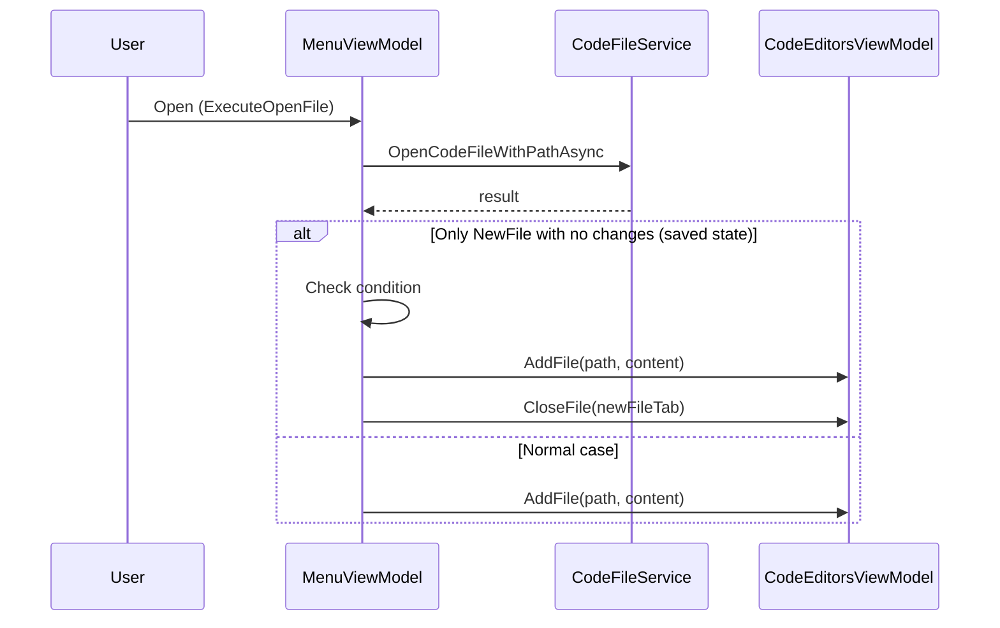

# План: Замена NewFile при открытии файла

## 1. Анализ требований

### Описание функции

При вызове «Открыть» (Open) и выборе файла в диалоге: если открыта только одна вкладка — NewFile в сохранённом состоянии — то открываемый файл добавляется в список, а вкладка NewFile закрывается. «Сохранённое состояние» означает, что пользователь не редактировал NewFile (IsModified == false), сразу пошёл открывать другой файл — значит NewFile ему не нужен.

### Целевой сценарий

- Пользователь запускает приложение (по умолчанию открыт NewFile с шаблоном)
- **Не редактирует** NewFile (IsModified = false)
- Сразу выбирает «Файл → Открыть» и выбирает файл на диске
- **Ожидание:** NewFile закрывается, выбранный файл открывается в единственной вкладке

### Условия срабатывания

- `OpenedFiles.Count == 1`
- Единственная вкладка — NewFile (`FilePath` равен `/NewFile.cs` или заканчивается на `NewFile.cs`)
- Вкладка в сохранённом состоянии (`IsModified == false`) — пользователь не трогал файл

### Ограничения

- Диалог «Сохранить перед закрытием?» не нужен — NewFile не изменялся, отбрасывать нечего
- Не требуется локализация (лишь изменение логики)

---

## 2. Архитектурный анализ

### Затронутые компоненты


| Компонент                                                                                                            | Роль                                                                            |
| -------------------------------------------------------------------------------------------------------------------- | ------------------------------------------------------------------------------- |
| [MenuViewModel.cs](d:\Visual Studio Projects\KID\KID.WPF.IDE\ViewModels\MenuViewModel.cs)                            | `ExecuteOpenFile` — точка входа, здесь добавляется проверка и вызов `CloseFile` |
| [CodeEditorsViewModel.cs](d:\Visual Studio Projects\KID\KID.WPF.IDE\ViewModels\CodeEditorsViewModel.cs)              | Не меняется — уже есть `AddFile`, `CloseFile`, `OpenedFiles`                    |
| [ICodeEditorsViewModel.cs](d:\Visual Studio Projects\KID\KID.WPF.IDE\ViewModels\Interfaces\ICodeEditorsViewModel.cs) | Не меняется — интерфейс достаточен                                              |
| [OpenedFileTab.cs](d:\Visual Studio Projects\KID\KID.WPF.IDE\Models\OpenedFileTab.cs)                                | Не меняется — `IsModified` уже есть                                             |


### Поток данных




### Пояснение логики

Проверка выполняется **до** вызова `AddFile`. Если условие выполняется, вызываются оба метода:

1. `AddFile` — добавляет выбранный файл и делает его активным
2. `CloseFile(newFileTab)` — закрывает вкладку NewFile (которой теперь две: NewFile и новый файл)

После `CloseFile` вкладка NewFile удаляется, остаётся только открытый файл. Метод `CloseFile` создаёт новый NewFile только при `OpenedFiles.Count == 0`, поэтому в данном случае он не сработает.

---

## 3. Список задач

### Задача 1: Изменить ExecuteOpenFile в MenuViewModel

**Файл:** [MenuViewModel.cs](d:\Visual Studio Projects\KID\KID.WPF.IDE\ViewModels\MenuViewModel.cs)

**Изменения:**

- Перед `AddFile` проверить: `OpenedFiles.Count == 1`, путь — NewFile, `IsModified == false`
- Сохранить ссылку на вкладку NewFile
- Вызвать `AddFile`
- Если условие выполнено — вызвать `CloseFile` для сохранённой вкладки

**Фрагмент кода (строки 221–234):**

```csharp
private async void ExecuteOpenFile()
{
    // ... null checks ...
    
    var result = await codeFileService.OpenCodeFileWithPathAsync(GetFileFilter());
    if (result != null)
    {
        var openedFiles = codeEditorsViewModel.OpenedFiles;
        var onlyTab = openedFiles.Count == 1 ? openedFiles[0] : null;
        var shouldReplaceNewFile = onlyTab != null 
            && IsNewFilePath(onlyTab.FilePath) 
            && !onlyTab.IsModified;

        codeEditorsViewModel.AddFile(result.FilePath, result.Code); 
        consoleOutputViewModel.Text = localizationService.GetString("Console_Output");
        graphicsOutputViewModel.Clear();

        if (shouldReplaceNewFile && onlyTab != null)
            codeEditorsViewModel.CloseFile(onlyTab);
    }
}
```

### Задача 2: Проверить доступ к IsModified

`OpenedFileTab` и `ICodeEditorsViewModel.OpenedFiles` уже доступны в `MenuViewModel`, `IsModified` — публичное свойство. Дополнительных изменений не требуется.

---

## 4. Порядок выполнения

1. Добавить проверку и вызов `CloseFile` в `ExecuteOpenFile` в `MenuViewModel.cs`.

---

## 5. Оценка сложности


| Задача                    | Сложность | Время     | Риски                           |
| ------------------------- | --------- | --------- | ------------------------------- |
| Изменение ExecuteOpenFile | Низкая    | 15–20 мин | Минимальные, логика изолирована |


---

## 6. Важные детали

- **Единый источник проверки NewFile:** `IsNewFilePath` уже есть в `MenuViewModel` (строки 184–186), используется и для Save, и для SaveAs.
- **Коллекция OpenedFiles:** `ObservableCollection<OpenedFileTab>`, доступ через `ICodeEditorsViewModel.OpenedFiles`.
- **Без диалога подтверждения:** NewFile не изменялся, диалог «Сохранить?» не нужен.

