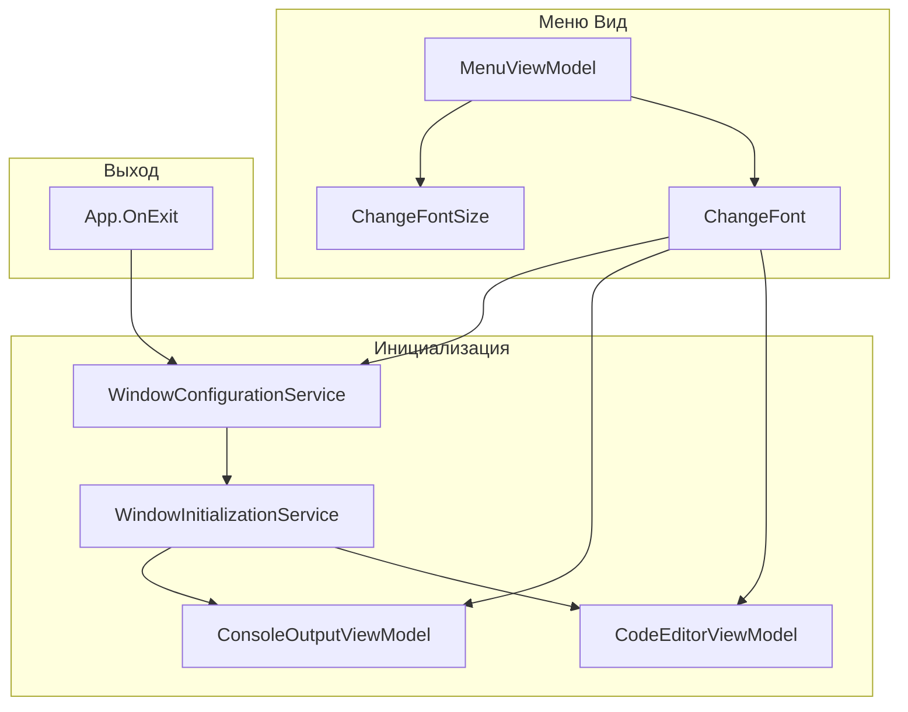

# Рефакторинг UI и модуля Initialize в KID.WPF.IDE

## 1. Анализ требований

### Функциональные изменения

- **Переименование** `WindowConfigurationData.Language` в `ProgrammingLanguage` — свойство определяет язык программирования (C#) для подсветки синтаксиса
- **Применение шрифта** — `FontFamily` и `FontSize` должны влиять на CodeEditor и Console (сейчас Console использует жёстко заданные Consolas/13)
- **Удаление** `WindowConfigurationData.ConsoleMessage` — заменить на `localizationService.GetString("Console_Output")` (строка уже есть в [Strings.en-US.resx](KID.WPF.IDE/Resources/Strings.en-US.resx))
- **Меню "Вид"** — добавить подменю выбора шрифта и размера с сохранением при выходе (как для темы и языка)

### Затронутые компоненты

- [WindowConfigurationData.cs](KID.WPF.IDE/Services/Initialize/WindowConfigurationData.cs)
- [WindowInitializationService.cs](KID.WPF.IDE/Services/Initialize/WindowInitializationService.cs)
- [WindowConfigurationService.cs](KID.WPF.IDE/Services/Initialize/WindowConfigurationService.cs)
- [ConsoleOutputViewModel](KID.WPF.IDE/ViewModels/ConsoleOutputViewModel.cs) и [IConsoleOutputViewModel](KID.WPF.IDE/ViewModels/Interfaces/IConsoleOutputViewModel.cs)
- [ConsoleOutputView.xaml](KID.WPF.IDE/Views/ConsoleOutputView.xaml)
- [MenuView.xaml](KID.WPF.IDE/Views/MenuView.xaml), [MenuViewModel.cs](KID.WPF.IDE/ViewModels/MenuViewModel.cs)

---

## 2. Архитектурный анализ

---

## 3. Список задач и порядок выполнения

### Задача 1: Переименование Language -> ProgrammingLanguage

**Файлы:**

- [WindowConfigurationData.cs](KID.WPF.IDE/Services/Initialize/WindowConfigurationData.cs) — свойство `Language` -> `ProgrammingLanguage`
- [WindowInitializationService.cs](KID.WPF.IDE/Services/Initialize/WindowInitializationService.cs) — `Settings.Language` -> `Settings.ProgrammingLanguage` (строка 103)
- [WindowConfigurationService.cs](KID.WPF.IDE/Services/Initialize/WindowConfigurationService.cs) — миграция: при загрузке JSON заменить `"Language"` на `"ProgrammingLanguage"` для совместимости со старыми settings.json
- [DefaultWindowConfiguration.json](KID.WPF.IDE/DefaultWindowConfiguration.json) — `"Language"` -> `"ProgrammingLanguage"`

**Сложность:** низкая | **Время:** 15 мин

---

### Задача 2: Удаление ConsoleMessage и использование локализации

**Файлы:**

- [WindowConfigurationData.cs](KID.WPF.IDE/Services/Initialize/WindowConfigurationData.cs) — удалить свойство `ConsoleMessage`
- [WindowInitializationService.cs](KID.WPF.IDE/Services/Initialize/WindowInitializationService.cs) — в `InitializeConsole()` заменить `windowConfigurationService.Settings.ConsoleMessage` на `localizationService.GetString("Console_Output")`
- [DefaultWindowConfiguration.json](KID.WPF.IDE/DefaultWindowConfiguration.json) — удалить `"ConsoleMessage"`

**Сложность:** низкая | **Время:** 10 мин

---

### Задача 3: Применение FontFamily/FontSize к Console

**Файлы:**

- [IConsoleOutputViewModel.cs](KID.WPF.IDE/ViewModels/Interfaces/IConsoleOutputViewModel.cs) — добавить свойства `FontFamily` и `FontSize`
- [ConsoleOutputViewModel.cs](KID.WPF.IDE/ViewModels/ConsoleOutputViewModel.cs) — реализовать get/set для `FontFamily` и `FontSize` (аналогично [CodeEditorViewModel](KID.WPF.IDE/ViewModels/CodeEditorViewModel.cs) строки 41–57)
- [ConsoleOutputView.xaml](KID.WPF.IDE/Views/ConsoleOutputView.xaml) — удалить жёстко заданные `FontFamily="Consolas"` и `FontSize="13"`, добавить биндинги `FontFamily="{Binding FontFamily}"` и `FontSize="{Binding FontSize}"`
- [WindowInitializationService.cs](KID.WPF.IDE/Services/Initialize/WindowInitializationService.cs) — в `InitializeConsole()` после установки `Text` применить `FontFamily` и `FontSize` из `Settings`

**Сложность:** средняя | **Время:** 25 мин

---

### Задача 4: Модели и источник данных для выбора шрифта

**Файлы:**

- Создать [Models/AvailableFont.cs](KID.WPF.IDE/Models/AvailableFont.cs) — модель с `FontFamilyName`, `LocalizedDisplayName` (по аналогии с `AvailableTheme`)
- Создать [Models/AvailableFontSize.cs](KID.WPF.IDE/Models/AvailableFontSize.cs) — модель с `Size`, `LocalizedDisplayName`
- Создать [Services/Fonts/IFontProviderService.cs](KID.WPF.IDE/Services/Fonts/Interfaces/IFontProviderService.cs) — интерфейс с `GetAvailableFonts()` и `GetAvailableFontSizes()`
- Создать [Services/Fonts/FontProviderService.cs](KID.WPF.IDE/Services/Fonts/FontProviderService.cs) — реализация: список моноширинных шрифтов (Consolas, Cascadia Code, Courier New, JetBrains Mono и др.) и размеров (10, 11, 12, 13, 14, 16, 18, 20)
- Зарегистрировать сервис в [ServiceCollectionExtensions.cs](KID.WPF.IDE/Services/DI/ServiceCollectionExtensions.cs)

**Сложность:** средняя | **Время:** 30 мин

---

### Задача 5: Локализация для меню шрифта

**Файлы:**

- [Strings.en-US.resx](KID.WPF.IDE/Resources/Strings.en-US.resx), [Strings.ru-RU.resx](KID.WPF.IDE/Resources/Strings.ru-RU.resx), [Strings.uk-UA.resx](KID.WPF.IDE/Resources/Strings.uk-UA.resx) — добавить ключи:
  - `Menu_Font` — "Font" / "Шрифт" / "Шрифт"
  - `Menu_FontSize` — "Font Size" / "Размер шрифта" / "Розмір шрифту"
  - `Font_Consolas`, `Font_CascadiaCode`, `Font_CourierNew`, и т.д. (для отображаемых имён шрифтов)
  - `FontSize_10`, `FontSize_12`, `FontSize_14`, и т.д. (опционально — можно показывать число как есть)

**Сложность:** низкая | **Время:** 15 мин

---

### Задача 6: Меню "Вид" — пункты шрифта и размера

**Файлы:**

- [MenuViewModel.cs](KID.WPF.IDE/ViewModels/MenuViewModel.cs):
  - Внедрить `IFontProviderService`
  - Добавить `ObservableCollection<AvailableFont> AvailableFonts` и `ObservableCollection<AvailableFontSize> AvailableFontSizes`
  - Добавить `ChangeFontCommand` и `ChangeFontSizeCommand`
  - Реализовать `ChangeFont(AvailableFont)` и `ChangeFontSize(AvailableFontSize)`: обновить `codeEditorViewModel`, `consoleOutputViewModel`, `windowConfigurationService.Settings`, вызвать `SaveSettings()`
  - Подписаться на `CultureChanged` для обновления `UpdateFontDisplayNames`
- [MenuView.xaml](KID.WPF.IDE/Views/MenuView.xaml) — добавить в меню "Вид" подменю "Font" и "Font Size" по аналогии с Theme и ChangeLanguage

**Сложность:** средняя | **Время:** 35 мин

---

### Задача 7: Сохранение шрифта при выходе

**Текущее поведение:** [App.OnExit](KID.WPF.IDE/App.xaml.cs) уже вызывает `SaveSettings()`. При изменении шрифта через меню мы обновляем `Settings` и вызываем `SaveSettings()` сразу (как для темы). Если пользователь не менял шрифт — `Settings` уже содержит актуальные значения из инициализации. Дополнительно: в `OnExit` перед `SaveSettings()` синхронизировать `Settings.FontFamily` и `Settings.FontSize` из текущих значений `codeEditorViewModel` (на случай если что-то изменилось вне меню — маловероятно, но страховка).

**Файлы:**

- [App.xaml.cs](KID.WPF.IDE/App.xaml.cs) — перед `SaveSettings()` получить `IWindowConfigurationService` и `ICodeEditorViewModel`, обновить `Settings.FontFamily` и `Settings.FontSize` из ViewModel
- Альтернатива: сохранять только при выборе из меню (без изменений в App). Рекомендуется первый вариант для надёжности.

**Сложность:** низкая | **Время:** 15 мин

---

### Задача 8: Обновление документации

**Файлы:**

- [docs/FEATURES.md](docs/FEATURES.md) — если есть описание настроек/конфигурации, обновить структуру JSON (ProgrammingLanguage, удаление ConsoleMessage)

**Сложность:** низкая | **Время:** 5 мин

---

## 4. Порядок выполнения

1. Задача 1 (ProgrammingLanguage)
2. Задача 2 (ConsoleMessage)
3. Задача 3 (Font в Console)
4. Задача 4 (FontProviderService)
5. Задача 5 (Локализация)
6. Задача 6 (Меню Вид)
7. Задача 7 (Сохранение при выходе)
8. Задача 8 (Документация)

---

## 5. Потенциальные риски

- **Миграция JSON:** старые файлы settings.json с ключом `"Language"` не будут корректно десериализоваться. Решение: в `SetConfigurationFromFile` перед `JsonSerializer.Deserialize` выполнить замену `"Language"` -> `"ProgrammingLanguage"` в строке JSON.
- **Шрифты:** часть шрифтов (Cascadia Code, JetBrains Mono) может отсутствовать на системе. Решение: использовать `FontFamily` с fallback или проверять `Fonts.SystemFontFamilies` и фильтровать только установленные моноширинные шрифты.
- **ConsoleOutputView.xaml bindings:** `TextBox` должен быть инициализирован до установки FontFamily/FontSize. Порядок: `Initialize()` вызывается в `MainWindow_Loaded`, а `vm.Initialize(ConsoleOutputControl)` — в конструкторе `ConsoleOutputView`. Инициализация в `WindowInitializationService.InitializeConsole()` выполняется после создания View, значит `ConsoleOutputControl` уже есть.

---

## 6. Оценка общей сложности

| Метрика           | Значение                         |
| ----------------- | -------------------------------- |
| Общее время       | ~2.5 часа                        |
| Новых файлов      | 4                                |
| Изменяемых файлов | ~15                              |
| Риск регрессии    | Низкий (изолированные изменения) |

