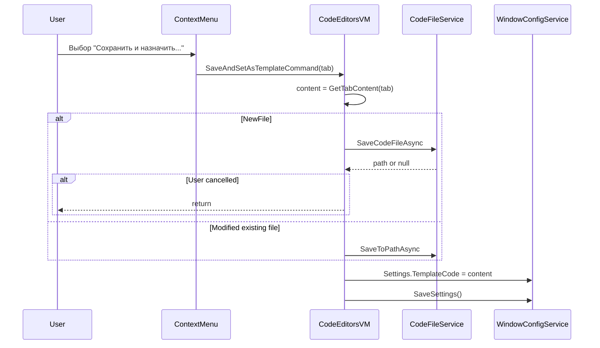

# План: Пункт «Сохранить и назначить в качестве шаблона» в контекстном меню вкладок

## 1. Анализ требований

### Описание функции

- Команда сохраняет текущее содержимое вкладки в файл (если ещё не сохранено или есть изменения), затем присваивает это содержимое как шаблон нового файла (`TemplateCode` в настройках).
- Новый файл по умолчанию и при закрытии последней вкладки будет открываться с этим кодом.

### Целевые сценарии

- Учитель подготовил пример кода в вкладке и хочет сделать его шаблоном для учеников.
- Пользователь настроил свой «стартовый» код и хочет использовать его при создании новых файлов.

### Входные данные

- Контекстное меню: `OpenedFileTab` (вкладка) через `PlacementTarget.DataContext`.

### Выходные данные

- Файл сохранён на диск (если NewFile или есть изменения).
- `Settings.TemplateCode` и `SaveSettings()` обновлены.

### Ограничения

- Должно работать только при непустом содержимом вкладки.
- Для NewFile: при отмене диалога «Сохранить как» шаблон не меняется.

---

## 2. Архитектурный анализ

### Затронутые подсистемы

- **CodeEditorsViewModel** — новая команда и логика.
- **CodeEditorsView.xaml** — новый пункт меню.
- **Локализация** — новая строка во всех .resx.
- **ICodeEditorsViewModel** — объявление новой команды.

### Существующие компоненты

- `CodeEditorsViewModel` уже имеет `IWindowConfigurationService`, `ICodeFileService`, `ILocalizationService`.
- `ExecuteSaveFile` и `ExecuteSaveAsFile` реализованы — логику нужно переиспользовать.
- `Settings.TemplateCode` и `SaveSettings()` — готовый механизм сохранения шаблона.

### Flow




---

## 3. Список задач

### 3.1. CodeEditorsViewModel — команда и логика

**Файл:** [KID.WPF.IDE/ViewModels/CodeEditorsViewModel.cs](KID.WPF.IDE/ViewModels/CodeEditorsViewModel.cs)

- Добавить `SaveAndSetAsTemplateCommand` типа `RelayCommand<OpenedFileTab>`.
- Реализовать `ExecuteSaveAndSetAsTemplate(OpenedFileTab tab)`:
  1. `content = GetTabContent(tab)`; если пусто — return.
  2. Если `IsNewFilePath(tab.FilePath)` — вызвать `SaveCodeFileAsync`; при null (отмена) — return; при успехе обновить `tab.FilePath` и `UpdateSavedContent`.
  3. Если `tab.IsModified` и не NewFile — вызвать `SaveToPathAsync(tab.FilePath, content)` и `UpdateSavedContent`.
  4. `windowConfigurationService.Settings.TemplateCode = content`.
  5. `windowConfigurationService.SaveSettings()`.
- `CanExecute`: `tab != null && !string.IsNullOrEmpty(GetTabContent(tab))`.

### 3.2. ICodeEditorsViewModel — объявление команды

**Файл:** [KID.WPF.IDE/ViewModels/Interfaces/ICodeEditorsViewModel.cs](KID.WPF.IDE/ViewModels/Interfaces/ICodeEditorsViewModel.cs)

- Добавить `ICommand SaveAndSetAsTemplateCommand { get; }`.

### 3.3. CodeEditorsView.xaml — пункт меню

**Файл:** [KID.WPF.IDE/Views/CodeEditorsView.xaml](KID.WPF.IDE/Views/CodeEditorsView.xaml)

- После `MenuItem` «Сохранить как» (стр. 84–86) и перед `<Separator/>` добавить:

```xml
<MenuItem Header="{localization:Localization TabContext_SaveAndSetAsTemplate}"
          Command="{Binding DataContext.SaveAndSetAsTemplateCommand, Source={x:Reference CodeEditorsViewRoot}}"
          CommandParameter="{Binding PlacementTarget.DataContext, RelativeSource={RelativeSource AncestorType=ContextMenu}}"/>
```

- Для переноса текста: в локализации использовать `\n` в строке (например, «Сохранить и назначить\nв качестве шаблона»). WPF MenuItem отображает `\n` как перенос строки.

### 3.4. Локализация

Добавить ключ `TabContext_SaveAndSetAsTemplate`:


| Файл                                                           | Значение                                       |
| -------------------------------------------------------------- | ---------------------------------------------- |
| [Strings.ru-RU.resx](KID.WPF.IDE/Resources/Strings.ru-RU.resx) | `Сохранить и назначить&#10;в качестве шаблона` |
| [Strings.en-US.resx](KID.WPF.IDE/Resources/Strings.en-US.resx) | `Save and set as&#10;template`                 |
| [Strings.uk-UA.resx](KID.WPF.IDE/Resources/Strings.uk-UA.resx) | `Зберегти і призначити&#10;як шаблон`          |


В .resx для переноса используется `&#10;` (LF).

### 3.5. CommandManager.InvalidateRequerySuggested

В `CodeEditorsViewModel` при изменении содержимого вкладки уже вызывается `CommandManager.InvalidateRequerySuggested()`, поэтому `SaveAndSetAsTemplateCommand` будет обновляться. Дополнительных правок не требуется.

---

## 4. Порядок выполнения

1. Обновить `ICodeEditorsViewModel` — объявление команды.
2. Реализовать логику и команду в `CodeEditorsViewModel`.
3. Добавить пункт меню в `CodeEditorsView.xaml`.
4. Добавить строки локализации во все .resx.

---

## 5. Оценка сложности


| Задача                | Сложность | Время  | Риски                                                     |
| --------------------- | --------- | ------ | --------------------------------------------------------- |
| ICodeEditorsViewModel | Низкая    | 2 мин  | —                                                         |
| CodeEditorsViewModel  | Средняя   | 15 мин | Корректная async-логика (await перед обновлением шаблона) |
| CodeEditorsView.xaml  | Низкая    | 3 мин  | —                                                         |
| Локализация (3 файла) | Низкая    | 5 мин  | —                                                         |


**Общая оценка:** ~25–30 минут.

---

## 6. Важные детали реализации

### Async-логика

`ExecuteSaveAsFile` — `async void`. Для `SaveAndSetAsTemplate` лучше сделать `async void ExecuteSaveAndSetAsTemplate` и внутри использовать `await`:

```csharp
private async void ExecuteSaveAndSetAsTemplate(OpenedFileTab tab)
{
    if (tab == null || !OpenedFiles.Contains(tab) || codeFileService == null 
        || windowConfigurationService?.Settings == null) return;

    var content = GetTabContent(tab);
    if (string.IsNullOrEmpty(content)) return;

    if (IsNewFilePath(tab.FilePath))
    {
        var savedPath = await codeFileService.SaveCodeFileAsync(...);
        if (savedPath == null) return; // пользователь отменил
        tab.FilePath = savedPath;
        tab.UpdateSavedContent(content);
    }
    else if (tab.IsModified)
    {
        await codeFileService.SaveToPathAsync(tab.FilePath, content);
        tab.UpdateSavedContent(content);
    }

    windowConfigurationService.Settings.TemplateCode = content;
    windowConfigurationService.SaveSettings();
}
```

### CanExecute

Для `RelayCommand` с `CanExecute` нужно, чтобы `SaveAndSetAsTemplateCommand` проверял `tab != null && !string.IsNullOrEmpty(GetTabContent(tab))`. Поскольку `GetTabContent` требует `tab`, а `CanExecute` в `RelayCommand<T>` получает `T` через `CommandParameter`, можно использовать `CanExecuteSaveAndSetAsTemplate(OpenedFileTab tab)` аналогично `CanSaveTab`.