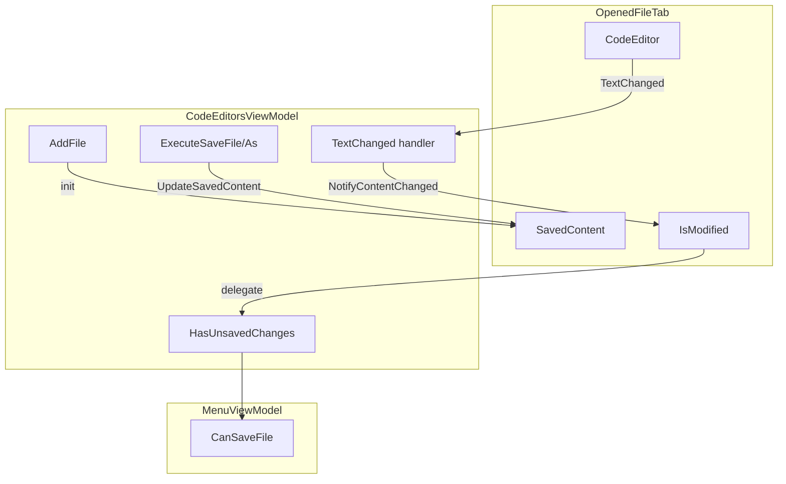

# План: Условная активация пункта меню «Сохранить»

## 1. Анализ требований

### Описание

Пункт меню «Сохранить» (в главном меню, контекстном меню вкладок и по Ctrl+S) должен быть активен только когда пользователь внёс изменения в редактор и ещё не сохранил их.

### Текущее поведение

- **MenuViewModel.CanSaveFile** (строки 179–181): активен, если есть путь к файлу и путь не `NewFile.cs` — без проверки изменений.
- **CodeEditorsViewModel.SaveFileCommand** (строка 93): без `CanExecute` — всегда активен.

### Места использования «Сохранить»

1. [MenuView.xaml](KID.WPF.IDE/Views/MenuView.xaml) — главное меню File → Save (Ctrl+S)
2. [CodeEditorsView.xaml](KID.WPF.IDE/Views/CodeEditorsView.xaml) — контекстное меню вкладки (строки 81–83)
3. [MainWindow.xaml](KID.WPF.IDE/MainWindow.xaml) — привязка Ctrl+S к `SaveFileCommand`

### Логика «есть несохранённые изменения»

- Для существующего файла: текущий текст ≠ текст на момент последнего сохранения/открытия.
- Для NewFile: `SavedContent` = текст шаблона нового файла по умолчанию (`TemplateCode`); `IsModified = true`, если пользователь изменил текст относительно шаблона.

---

## 2. Архитектурный анализ

### Затронутые подсистемы

- **Models**: `OpenedFileTab` — хранение «сохранённого» состояния.
- **ViewModels**: `CodeEditorsViewModel`, `MenuViewModel`.
- **Interfaces**: `ICodeEditorsViewModel`.

### Новые/изменённые компоненты


| Компонент               | Изменение                                                                                          |
| ----------------------- | -------------------------------------------------------------------------------------------------- |
| `OpenedFileTab`         | Добавить `SavedContent`, `IsModified`, `NotifyContentChanged()`, `UpdateSavedContent()`            |
| `CodeEditorsViewModel`  | Отслеживание изменений, обновление `SavedContent` при сохранении, `CanExecute` для SaveFileCommand |
| `ICodeEditorsViewModel` | Добавить свойство `HasUnsavedChanges`                                                              |
| `MenuViewModel`         | Обновить `CanSaveFile` с учётом `HasUnsavedChanges`, подписаться на изменение этого свойства       |


### Схема потока данных




---

## 3. Список задач

### 3.1. Модель OpenedFileTab

**Файл**: [OpenedFileTab.cs](KID.WPF.IDE/Models/OpenedFileTab.cs)

- Добавить private-поле `savedContent` и свойство `SavedContent` (или внутренний setter).
- Добавить вычисляемое свойство `IsModified`: `(CodeEditor?.Text ?? Content) != SavedContent`.
- Добавить метод `NotifyContentChanged()` — вызывает `OnPropertyChanged(nameof(IsModified))`.
- Добавить метод `UpdateSavedContent(string content)` — устанавливает `SavedContent` и вызывает `OnPropertyChanged(nameof(IsModified))`.
- Инициализировать `SavedContent` в сеттере `Content` или через отдельный метод (при создании вкладки).

### 3.2. CodeEditorsViewModel

**Файл**: [CodeEditorsViewModel.cs](KID.WPF.IDE/ViewModels/CodeEditorsViewModel.cs)

- В `AddFile`: при создании вкладки задать `SavedContent = content` (через `UpdateSavedContent` или инициализацию).
- В `CloseFile`: при fallback (OpenedFiles.Count == 0) вызывать `AddFile(NewFilePath, windowConfigurationService.Settings.TemplateCode ?? string.Empty)` вместо `AddFile(NewFilePath, string.Empty)` — чтобы NewFile всегда имел шаблон как SavedContent.
- В подписке на `TextChanged`: всегда вызывать `tab.NotifyContentChanged()`, а не только при `tab == ActiveFile`.
- В `ExecuteSaveFile` и `ExecuteSaveAsFile`: после успешного сохранения вызывать `tab.UpdateSavedContent(GetTabContent(tab))`.
- Добавить `CanSaveTab(OpenedFileTab tab) => tab?.IsModified == true`.
- Для `SaveFileCommand`: `RelayCommand<OpenedFileTab>(ExecuteSaveFile, CanSaveTab)`.
- Добавить свойство `HasUnsavedChanges => ActiveFile?.IsModified ?? false`.
- В `CodeEditorViewModel_PropertyChanged` и при смене `ActiveFile` вызывать `OnPropertyChanged(nameof(HasUnsavedChanges))` и `CommandManager.InvalidateRequerySuggested()`.

### 3.3. ICodeEditorsViewModel

**Файл**: [ICodeEditorsViewModel.cs](KID.WPF.IDE/ViewModels/Interfaces/ICodeEditorsViewModel.cs)

- Добавить свойство `bool HasUnsavedChanges { get; }`.

### 3.4. MenuViewModel

**Файл**: [MenuViewModel.cs](KID.WPF.IDE/ViewModels/MenuViewModel.cs)

- Изменить `CanSaveFile`:
  ```csharp
  private bool CanSaveFile =>
      !string.IsNullOrEmpty(codeEditorsViewModel.FilePath) &&
      !IsNewFilePath(codeEditorsViewModel.FilePath) &&
      codeEditorsViewModel.HasUnsavedChanges;
  ```
- В `CodeEditorViewModel_PropertyChanged` добавить обработку `HasUnsavedChanges`:
  ```csharp
  if (e.PropertyName == nameof(ICodeEditorsViewModel.HasUnsavedChanges))
  {
      OnPropertyChanged(nameof(CanSaveFile));
      CommandManager.InvalidateRequerySuggested();
  }
  ```
- Добавить `HasUnsavedChanges` в условную проверку при смене `ActiveFile` (если нужно).

### 3.5. Локализация и документация

- Локализация не требуется — меняется только логика активности, тексты меню не трогаем.
- Документация: обновить комментарии в `CanSaveFile` и `OpenedFileTab.IsModified` при необходимости.

---

## 4. Порядок выполнения

1. Обновить `OpenedFileTab` (SavedContent, IsModified, NotifyContentChanged, UpdateSavedContent).
2. Обновить `CodeEditorsViewModel` (инициализация SavedContent, TextChanged, Save-обработчики, CanSaveTab, HasUnsavedChanges).
3. Обновить `ICodeEditorsViewModel` (HasUnsavedChanges).
4. Обновить `MenuViewModel` (CanSaveFile, подписка на HasUnsavedChanges).

---

## 5. Оценка сложности


| Задача                | Сложность | Время   | Риски                                        |
| --------------------- | --------- | ------- | -------------------------------------------- |
| OpenedFileTab         | Низкая    | ~15 мин | —                                            |
| CodeEditorsViewModel  | Средняя   | ~30 мин | Синхронизация SavedContent при смене вкладок |
| ICodeEditorsViewModel | Низкая    | ~2 мин  | —                                            |
| MenuViewModel         | Низкая    | ~10 мин | Корректная подписка на PropertyChanged       |


### Особая логика

- **NewFile**: `SavedContent` = текст шаблона (`TemplateCode` из `windowConfigurationService.Settings`). При создании NewFile (через меню «Новый» или при закрытии последней вкладки) всегда передавать в `AddFile` шаблон, а не пустую строку. `IsModified = true` только если пользователь изменил текст относительно шаблона.
- **Открытый файл**: `SavedContent = content` при `AddFile`; при сохранении — `SavedContent = текущий текст`.
- **Смена вкладки**: `HasUnsavedChanges` пересчитывается из `ActiveFile`, через `OnPropertyChanged` при смене `ActiveFile` и при `TextChanged` активной вкладки.

