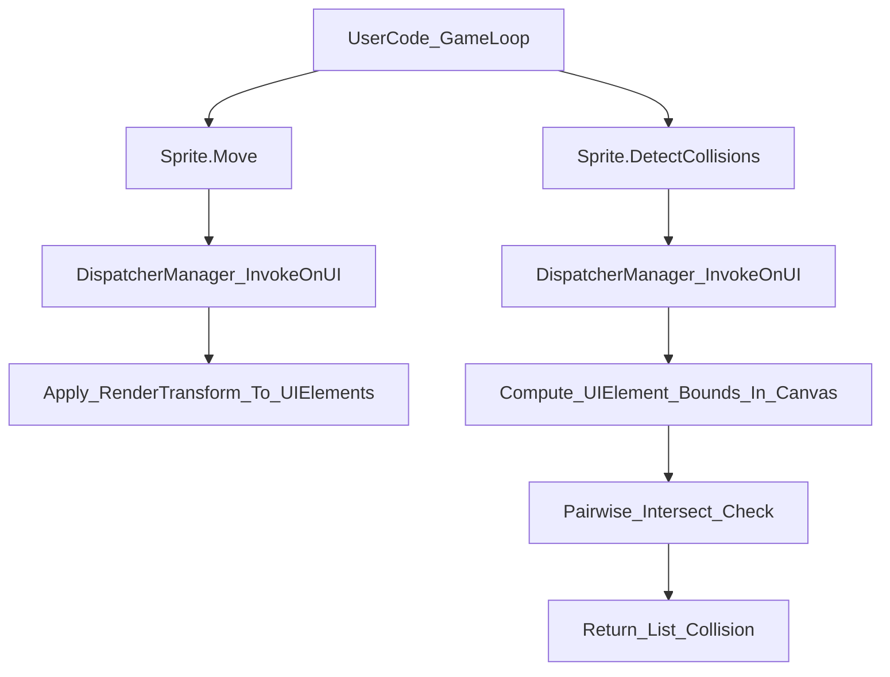

# План: модуль `Sprite` (KID.Library)

## 1. Анализ требований

1.1. **Цель функции**

- Дать детям простой объектный API для “персонажей/объектов игры” (спрайтов), которые состоят из нескольких фигур/текста/картинок (`KID.Graphics`) и могут:
  - появляться/исчезать,
  - двигаться в игровом цикле,
  - детектировать столкновения.

1.2. **Целевая аудитория и сценарии**

- **Дети/начинающие**: пишут простой игровой цикл (как в шаблоне `GameLoop.Template.cs`), перемещают спрайты, проверяют столкновения и реагируют.
- **Преподаватели**: дают задания на ООП (класс, свойства, методы, цепочки вызовов), координаты, базовую геометрию.

1.3. **Входные и выходные данные (API-контракт)**

- **Sprite**:
  - `IsVisible: bool` (virtual)
  - `X, Y: double` (virtual) — **абсолютная точка-опора (anchor)** спрайта
  - `GraphicElements: List<...>` (virtual) — список элементов, из которых состоит спрайт
    - Решение по типу `...`: `**System.Windows.UIElement**`, т.к. все возвращаемые `KID.Graphics` типы (`Ellipse/Rectangle/Line/Polygon/Path/TextBlock/Image`) наследуются от `UIElement`.
  - `Collisions: List<Collision>` (virtual)
  - Методы (virtual): `Show()`, `Hide()`, `Move(dx,dy)`, `DetectCollisions(List<Sprite>)`
- **Collision**:
  - `Type: string` (virtual) — вы выбрали PascalCase
  - `SpritesPair: (Sprite First, Sprite Second)` (virtual) — пара спрайтов-участников столкновения
  - `GraphicElementsPair: (UIElement First, UIElement Second)` (virtual) — пара конкретных графических элементов, которые пересеклись
  - `AdditionalInfo: dynamic` (virtual) — “карман” для пользовательской логики/данных (например, скорость удара, очки, имя события)

1.4. **Ограничения и требования**

- **Потокобезопасность WPF**: все операции с `UIElement` выполнять через `DispatcherManager.InvokeOnUI(...)` (по паттерну `KID.Graphics`).
- **Совместимость с текущим Graphics API**: нельзя опираться на `Canvas.GetLeft/GetTop` как на обязательные значения, т.к. `Graphics.Line/Polygon/Path` не выставляют `Canvas.Left/Top` (по умолчанию будет `NaN`).
- **SOLID**: отделить “модель спрайта” от “вычисления коллизий/геометрии” внутри модуля (внутренние helper-классы/методы).
- **Локализация UI-строк**: модуль библиотечный, UI не создаёт — избегаем новых пользовательских строк; сообщения исключений держим минимальными и в стиле существующего `KID.Library` (у `Graphics` уже есть строка `"Canvas is null"`).

---

## 2. Архитектурный анализ

2.1. **Какие подсистемы затронуты**

- `KID.Library` (новые классы в библиотеке пользовательского API)
- `KID.Library/Graphics` (использование `Graphics.Canvas` для вычисления координат/границ в координатах канваса)
- Документация (`docs/*`)
- Шаблоны проектов (`KID.WPF.IDE/ProjectTemplates/*`) — как демонстрация/ручной тест

2.2. **Новые компоненты**

- Папка `[KID.Library/Sprite/](KID.Library/Sprite/)`
  - `Sprite` (partial) — публичный нестатический класс
  - `Collision` — публичный нестатический класс
  - Внутренние helper-типы/методы (например `SpriteElementBinding`, `SpriteCollisionDetector`)

2.3. **Какие существующие компоненты менять**

- **Не требуется** менять DI/MVVM/контексты выполнения: `Sprite` будет работать поверх уже инициализированного `Graphics.Canvas`.
- Нужно обновить:
  - `[docs/README.md](docs/README.md)` (ссылка на документацию спрайтов)
  - `[docs/FEATURES.md](docs/FEATURES.md)` (упоминание возможности спрайтов)
  - `[docs/SUBSYSTEMS.md](docs/SUBSYSTEMS.md)` (добавить секцию/подсистему или расширить KIDLibrary layer)
  - Добавить новый документ `[docs/Sprite-API.md](docs/Sprite-API.md)`

2.4. **Ключевые архитектурные решения**

- **Тип графического элемента**: `UIElement`.
- **Перемещение**: через `RenderTransform` (translate), чтобы корректно двигать и те элементы, у которых `Canvas.Left/Top == NaN` (например, `Line/Polygon/Path`).
- **Семантика `X/Y**`:
  - `X/Y` = **абсолютная позиция anchor**.
  - `Move(dx,dy)` меняет `X/Y` и смещает все элементы.
  - Чтобы поддержать “относительные координаты каждого элемента”, внутри `Sprite` хранится привязка `UIElement -> (offsetX, offsetY)` (относительно anchor). Для удобства делаем авто-захват offsets при первом использовании элемента.
- **Формат пар в `Collision**`:
  - Использовать стандартный `ValueTuple` с именованными элементами `First/Second`:
    - `SpritesPair: (Sprite First, Sprite Second)`
    - `GraphicElementsPair: (UIElement First, UIElement Second)`
  - Удобный доступ: `collision.SpritesPair.First`/`Second`, `collision.GraphicElementsPair.First`/`Second`.
- **Столкновения**: на первом этапе детектируем пересечения по **bounding-box** в координатах канваса:
  - Для каждого `UIElement` вычисляем `Rect` в координатах `Graphics.Canvas` через `VisualTreeHelper.GetDescendantBounds(element)` + `TransformToAncestor(Graphics.Canvas).TransformBounds(...)`.
  - Коллизия фиксируется, если `Rect.IntersectsWith(...)`.
  - `Collision.Type` = например `"Bounds"` (и/или `"AABB"`) — документируем.

2.5. **Диаграмма потока (упрощённо)**

---

## 3. Список задач (с файлами)

### 3.1. Реализация `Sprite`

- **Создать** папку `[KID.Library/Sprite/](KID.Library/Sprite/)`.
- **Создать файлы**:
  - `[KID.Library/Sprite/Sprite.Core.cs](KID.Library/Sprite/Sprite.Core.cs)`
    - `public partial class Sprite`
    - virtual свойства: `IsVisible`, `X`, `Y`, `GraphicElements`, `Collisions`
    - базовые конструкторы (минимум: `Sprite()` и опционально `Sprite(double x, double y, params UIElement[] elements)`)
    - внутреннее хранилище offsets для элементов
  - `[KID.Library/Sprite/Sprite.Visibility.cs](KID.Library/Sprite/Sprite.Visibility.cs)`
    - `Show()`/`Hide()` — установка `Visibility` для всех `GraphicElements` + `IsVisible`
  - `[KID.Library/Sprite/Sprite.Movement.cs](KID.Library/Sprite/Sprite.Movement.cs)`
    - `Move(dx,dy)` — смещение anchor и элементов
    - реализация через `RenderTransform` (TranslateTransform / TransformGroup)
    - корректная работа при `Canvas.Left/Top == NaN`
  - `[KID.Library/Sprite/Sprite.Collision.cs](KID.Library/Sprite/Sprite.Collision.cs)`
    - `DetectCollisions(List<Sprite> sprites)`
    - обновление `Collisions` и возврат результата
    - “быстрый отсев” по bounding-box всего спрайта (union Rect) перед попарной проверкой элементов
  - (опционально) `[KID.Library/Sprite/Sprite.Helpers.cs](KID.Library/Sprite/Sprite.Helpers.cs)`
    - `GetElementBoundsInCanvas(UIElement)`
    - `GetOrCreateTranslateTransform(UIElement)`
    - хелперы для поддержки offsets

### 3.2. Реализация `Collision`

- **Создать файл** `[KID.Library/Sprite/Collision.cs](KID.Library/Sprite/Collision.cs)`
  - `public class Collision`
  - virtual свойства: `Type`, `SpritesPair`, `GraphicElementsPair`, `AdditionalInfo`
  - конструктор(ы) для удобного создания

### 3.3. Документация

- **Создать** `[docs/Sprite-API.md](docs/Sprite-API.md)`:
  - обзор “что такое Sprite”
  - описание `X/Y` (anchor) и как задавать относительные координаты элементов
  - примеры: создать спрайт из круга+текста, двигать, скрывать/показывать, проверять столкновения
  - секция “как работает DetectCollisions”: bounding-box, ограничения, советы по производительности
- **Обновить**:
  - `[docs/README.md](docs/README.md)` — добавить ссылку на `Sprite-API.md`
  - `[docs/FEATURES.md](docs/FEATURES.md)` — добавить пункт про спрайты/столкновения
  - `[docs/SUBSYSTEMS.md](docs/SUBSYSTEMS.md)` — расширить описание KIDLibrary layer новым модулем

### 3.4. Шаблоны (пример/ручной тест)

- **Добавить по одному примеру** (минимально) в каждую локаль, чтобы пользователи сразу увидели “ВАУ-эффект”:
  - `[KID.WPF.IDE/ProjectTemplates/ru-RU/Gold/Sprites.BasicCollision.cs](KID.WPF.IDE/ProjectTemplates/ru-RU/Gold/Sprites.BasicCollision.cs)`
  - `[KID.WPF.IDE/ProjectTemplates/en-US/Gold/Sprites.BasicCollision.cs](KID.WPF.IDE/ProjectTemplates/en-US/Gold/Sprites.BasicCollision.cs)`
  - `[KID.WPF.IDE/ProjectTemplates/uk-UA/Gold/Sprites.BasicCollision.cs](KID.WPF.IDE/ProjectTemplates/uk-UA/Gold/Sprites.BasicCollision.cs)`
- Сценарий примера:
  - 2 спрайта (например “шарик” и “препятствие”), движение по `vx/vy`, отскок от стен (`Graphics.GetCanvasSize()`), проверка `DetectCollisions`, визуальная реакция (смена цвета/текста).

### 3.5. Тестирование

- **Ручные сценарии** (чек-лист в PR/описании задачи):
  - создание спрайта из `Circle/Rectangle/Text/Image/Line/Polygon/Path`
  - `Show/Hide` меняют видимость всех элементов
  - `Move` работает для фигур без `Canvas.Left/Top` (Line/Polygon/Path)
  - `DetectCollisions` возвращает ожидаемые коллизии при пересечении bounding-box
  - отсутствие коллизий при разнесении
  - работа в игровом цикле 60 FPS без заметных лагов на 20–50 элементов
- (опционально) **Автотесты**: если захотите, можно добавить отдельный проект тестов позже, но WPF/STA усложняет; на старте упор на шаблон‑демо и чек‑лист.

---

## 4. Порядок выполнения

4.1. Реализовать `Collision` как простой DTO.
4.2. Реализовать базовый `Sprite.Core` (свойства, хранение `GraphicElements`, `Collisions`, `X/Y`, `IsVisible`).
4.3. Реализовать `Show/Hide` (через `UIElement.Visibility`) с маршаллингом в UI-поток.
4.4. Реализовать `Move(dx,dy)` на `RenderTransform` (TranslateTransform/TransformGroup), обновление `X/Y`.
4.5. Реализовать вычисление bounds в координатах `Graphics.Canvas`.
4.6. Реализовать `DetectCollisions`:

- union bounds спрайта → быстрый отсев;
- затем попарно элементы → `Collision` записи.
4.7. Добавить документацию `docs/Sprite-API.md` и обновить ссылки/разделы.
4.8. Добавить шаблоны примеров для 3 локалей.
4.9. Пройти ручной чек‑лист.

---

## 5. Оценка сложности, времени и рисков (по задачам)

5.1. `**Collision` DTO**

- **Сложность**: низкая
- **Время**: 0.5–1 ч
- **Риски**: минимальные

5.2. `**Sprite` (свойства/состояние/цепочки вызовов)**

- **Сложность**: средняя
- **Время**: 2–4 ч
- **Риски**:
  - продумать поведение, если `GraphicElements` содержит `null` или элементы не на текущем `Graphics.Canvas`

5.3. `**Show/Hide**`

- **Сложность**: низкая
- **Время**: 1–2 ч
- **Риски**: корректно обрабатывать элементы, уже удалённые с Canvas

5.4. `**Move(dx,dy)` через `RenderTransform**`

- **Сложность**: средняя
- **Время**: 3–6 ч
- **Риски**:
  - разные комбинации `RenderTransform` (TranslateTransform vs TransformGroup)
  - накопление трансформаций при частых вызовах (нужно аккуратно обновлять translate-компонент)

5.5. **Вычисление bounds и `DetectCollisions**`

- **Сложность**: средняя/высокая
- **Время**: 4–8 ч
- **Риски**:
  - корректность преобразования координат (`TransformToAncestor`) и случаи, когда элемент ещё не измерен/не в визуальном дереве
  - производительность при большом числе элементов (решаем быстрым отсевом по bounds спрайта)
  - bounding-box даёт “ложные” столкновения для диагональных линий/тонких фигур (это ожидаемое ограничение первой версии)

5.6. **Документация**

- **Сложность**: низкая
- **Время**: 1–3 ч
- **Риски**: неполное описание семантики `X/Y` и ограничений collision — нужно явно прописать

5.7. **Шаблоны примеров (3 локали)**

- **Сложность**: средняя
- **Время**: 2–4 ч
- **Риски**: поддерживать три версии синхронно; минимизируем различия (только комментарии/сообщения)

