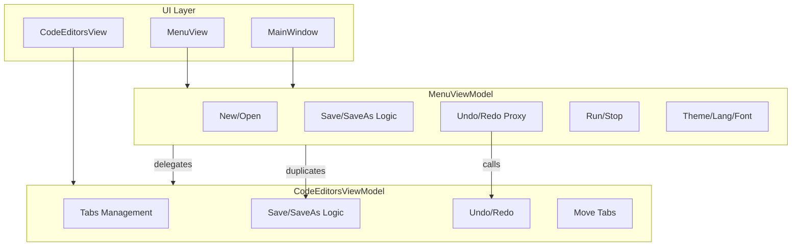

# Анализ пересечения логики MenuViewModel и CodeEditorsViewModel

## 1. Текущее разграничение ответственности


| Компонент                | Ожидаемая ответственность                            | Фактическая ответственность                                                                                        |
| ------------------------ | ---------------------------------------------------- | ------------------------------------------------------------------------------------------------------------------ |
| **MenuViewModel**        | Управление меню, глобальные команды (Ctrl+S, Ctrl+Z) | Меню + полная реализация New/Open/Save/SaveAs + Run/Stop + делегирование Undo/Redo + настройки (тема, язык, шрифт) |
| **CodeEditorsViewModel** | Управление вкладками и редакторами                   | Вкладки + полная реализация Save/SaveAs/SaveAsTemplate + Undo/Redo + Move tabs                                     |


**Проблема:** операции с файлами (Save, SaveAs) реализованы **дважды** с почти идентичной логикой.

---

## 2. Конкретные примеры дублирования и пересечения

### 2.1. Сохранение файлов — дублирование ~80 строк

**MenuViewModel** ([MenuViewModel.cs](d:\Visual Studio Projects\KID\KID.WPF.IDE\ViewModels\MenuViewModel.cs) 264-311):

```csharp
private async Task ExecuteSaveFileAsync() {
    if (!CanSaveFile) { await ExecuteSaveAsFileAsync(); return; }
    var currentFileTab = codeEditorsViewModel.CurrentFileTab;
    await codeFileService.SaveToPathAsync(currentFileTab.FilePath, code);
    codeEditorsViewModel.NotifyCurrentFileTabSaved(code);
}
private async Task ExecuteSaveAsFileAsync() {
    var defaultFileName = codeFileService.IsNewFilePath(...) ? "NewFile.cs" : Path.GetFileName(...);
    var savedPath = await codeFileService.SaveCodeFileAsync(code, FileFilter, defaultFileName);
    currentFileTab.FilePath = savedPath;
    codeEditorsViewModel.NotifyCurrentFileTabSaved(code);
}
```

**CodeEditorsViewModel** ([CodeEditorsViewModel.cs](d:\Visual Studio Projects\KID\KID.WPF.IDE\ViewModels\CodeEditorsViewModel.cs) 357-393):

```csharp
private async Task ExecuteSaveFileAsync(OpenedFileTab tab) {
    if (codeFileService.IsNewFilePath(tab.FilePath)) { await ExecuteSaveAsFileAsync(tab); return; }
    await codeFileService.SaveToPathAsync(tab.FilePath, content);
    tab.UpdateSavedContent(content);
}
private async Task ExecuteSaveAsFileAsync(OpenedFileTab tab) {
    var defaultFileName = codeFileService.IsNewFilePath(tab.FilePath) ? "NewFile.cs" : Path.GetFileName(tab.FilePath);
    var savedPath = await codeFileService.SaveCodeFileAsync(content, fileFilter, defaultFileName);
    tab.FilePath = savedPath;
    tab.UpdateSavedContent(content);
}
```

Логика совпадает, отличается только источник данных (CurrentFileTab vs параметр tab).

---

### 2.2. Undo/Redo — избыточное проксирование

**MenuViewModel** (364-378, 445-451):

- Создаёт свои `UndoCommand`, `RedoCommand`, которые вызывают `codeEditorsViewModel.UndoCommand.Execute(null)`
- Проксирует `CanUndo`/`CanRedo` из CodeEditorsViewModel
- Подписывается на `PropertyChanged` CodeEditorsViewModel для `RaiseCanExecuteChanged`

**CodeEditorsViewModel** (108-118):

- Реализует Undo/Redo напрямую через `CurrentFileTab.CodeEditor.Undo()/Redo()`

Итог: два слоя команд для одной операции. MenuView и MainWindow KeyBindings привязаны к MenuViewModel, хотя логика полностью в CodeEditorsViewModel.

---

### 2.3. CanSaveFile vs CanSaveTab — разная логика


| Место                                     | Условие                                                                                                                              | Следствие                                                                                         |
| ----------------------------------------- | ------------------------------------------------------------------------------------------------------------------------------------ | ------------------------------------------------------------------------------------------------- |
| **MenuViewModel.CanSaveFile** (184-193)   | `currentFileTab != null && !string.IsNullOrEmpty(FilePath) && !codeFileService.IsNewFilePath(FilePath) && currentFileTab.IsModified` | Save в меню отключён для нового файла; при нажатии Save вызывается SaveAs                         |
| **CodeEditorsViewModel.CanSaveTab** (124) | `tab?.IsModified == true`                                                                                                            | Save в контексте вкладки доступен и для NewFile; внутри ExecuteSaveFileAsync — редирект на SaveAs |


Поведение в итоге сходится (оба редиректят на SaveAs для NewFile), но проверки разные — при изменении одной логики легко забыть обновить другую.

---

### 2.4. FileFilter — дублирование и расхождение

- **MenuViewModel** (232): `"C# Files (*.cs)|*.cs"`
- **CodeEditorsViewModel** (336, 386): `"C# Files (*.cs)|*.cs|All Files (*.*)|*.*"`

Разные fallback-значения в двух местах.

---

### 2.5. SaveAndSetAsTemplate — частичное дублирование

**MenuViewModel** (312-319): делегирует в `codeEditorsViewModel.SaveAndSetAsTemplateCommand.Execute(currentFileTab)` — корректно.

Но MenuViewModel имеет свою проверку `CanExecute` через `SaveAndSetAsTemplateCommand.CanExecute(currentFileTab)` (138), а CodeEditorsViewModel — свою `CanSaveAndSetAsTemplate(tab)` (126-127). Логика совпадает, но определена в двух местах.

---

### 2.6. Обработка ошибок при сохранении

- **MenuViewModel**: `ExecuteAsync(Func<Task> asyncAction, string errorMessageKey)` — общий try/catch с MessageBox
- **CodeEditorsViewModel**: `ShowSaveError(Exception ex)` — локальный try/catch в каждом `ExecuteSave*`

Дублирование паттерна обработки ошибок.

---

## 3. Диаграмма текущих зависимостей




---

## 4. Варианты решения

### Вариант A: CodeEditorsViewModel как единственный источник операций с файлами

**Идея:** MenuViewModel не реализует Save/SaveAs, а делегирует в CodeEditorsViewModel.

**Изменения:**

- Добавить в `ICodeEditorsViewModel` команды для текущей вкладки: `SaveCurrentFileCommand`, `SaveAsCurrentFileCommand` (без параметра, работают с `CurrentFileTab`)
- MenuViewModel.SaveFileCommand → `codeEditorsViewModel.SaveCurrentFileCommand`
- MenuViewModel.SaveAsFileCommand → `codeEditorsViewModel.SaveAsCurrentFileCommand`
- MenuViewModel.UndoCommand/RedoCommand → напрямую биндить к `codeEditorsViewModel.UndoCommand/RedoCommand` (через свойство или композицию)

**Плюсы:** один источник логики Save, меньше дублирования.  
**Минусы:** MenuViewModel зависит от CodeEditorsViewModel; CodeEditorsViewModel обрастает командами «для меню».

---

### Вариант B: Выделить IFileOperationsService

**Идея:** Вся логика Save/SaveAs/SaveAsTemplate в отдельном сервисе.

**Изменения:**

- Создать `IFileOperationsService` с методами `SaveAsync(OpenedFileTab)`, `SaveAsAsync(OpenedFileTab)`, `SaveAndSetAsTemplateAsync(OpenedFileTab)`
- Реализация в `FileOperationsService` (ICodeFileService, ILocalizationService, IWindowConfigurationService)
- MenuViewModel и CodeEditorsViewModel вызывают сервис
- Команды в ViewModels — тонкие обёртки над сервисом

**Плюсы:** чёткое разделение, тестируемость, единая логика.  
**Минусы:** новый сервис, рефакторинг обоих ViewModels.

---

### Вариант C: Медиатор команд (IApplicationCommandProvider)

**Идея:** Глобальные команды (Save, Undo, Redo) предоставляет отдельный провайдер.

**Изменения:**

- Создать `IApplicationCommandProvider` с `SaveFileCommand`, `UndoCommand`, `RedoCommand` и т.п.
- Реализация внутри провайдера использует ICodeEditorsViewModel, ICodeFileService и др.
- MenuViewModel и MainWindow биндятся к провайдеру
- CodeEditorsViewModel остаётся с контекстными командами (Save для конкретной вкладки, Move tabs)

**Плюсы:** MenuViewModel фокусируется на настройках (тема, язык, шрифт), команды редактирования централизованы.  
**Минусы:** новый слой абстракции.

---

### Вариант D: Минимальный рефакторинг (устранение дублирования без смены архитектуры)

**Идея:** Сохранить текущую структуру, но убрать дублирование кода.

**Изменения:**

1. Вынести `FileFilter` в `ICodeFileService` или `ILocalizationService` (единый метод `GetFileFilter()`)
2. MenuViewModel.ExecuteSaveFileAsync → вызывать `codeEditorsViewModel`-метод для CurrentFileTab (добавить `SaveFileAsync(OpenedFileTab)` в интерфейс)
3. MenuViewModel.ExecuteSaveAsFileAsync → аналогично делегировать
4. Undo/Redo: MenuViewModel экспонирует команды CodeEditorsViewModel (например, `UndoCommand => codeEditorsViewModel.UndoCommand`), убрать прокси-логику и подписку на PropertyChanged для Undo/Redo

**Плюсы:** малый объём изменений, быстрая реализация.  
**Минусы:** MenuViewModel по-прежнему оркестрирует вызовы, разделение ответственности не улучшается.

---

## 5. Рекомендация

- **Вариант D** — для быстрого снижения дублирования и риска расхождений.
- **Вариант B** — для долгосрочной архитектуры и соблюдения SRP.
- **Вариант A** — компромисс: меньше кода, чем в B, но CodeEditorsViewModel становится перегруженным.

---

## 6. Сводная таблица задач по вариантам


| Вариант | Новые файлы                                   | Изменяемые файлы                                                                 | Сложность |
| ------- | --------------------------------------------- | -------------------------------------------------------------------------------- | --------- |
| A       | —                                             | MenuViewModel, CodeEditorsViewModel, ICodeEditorsViewModel, MainWindow, MenuView | Средняя   |
| B       | IFileOperationsService, FileOperationsService | MenuViewModel, CodeEditorsViewModel, DI                                          | Высокая   |
| C       | IApplicationCommandProvider, реализация       | MenuViewModel, MainWindow, MenuView, DI                                          | Высокая   |
| D       | — (или 1 метод в сервисе)                     | MenuViewModel, CodeEditorsViewModel, возможно ICodeFileService                   | Низкая    |


