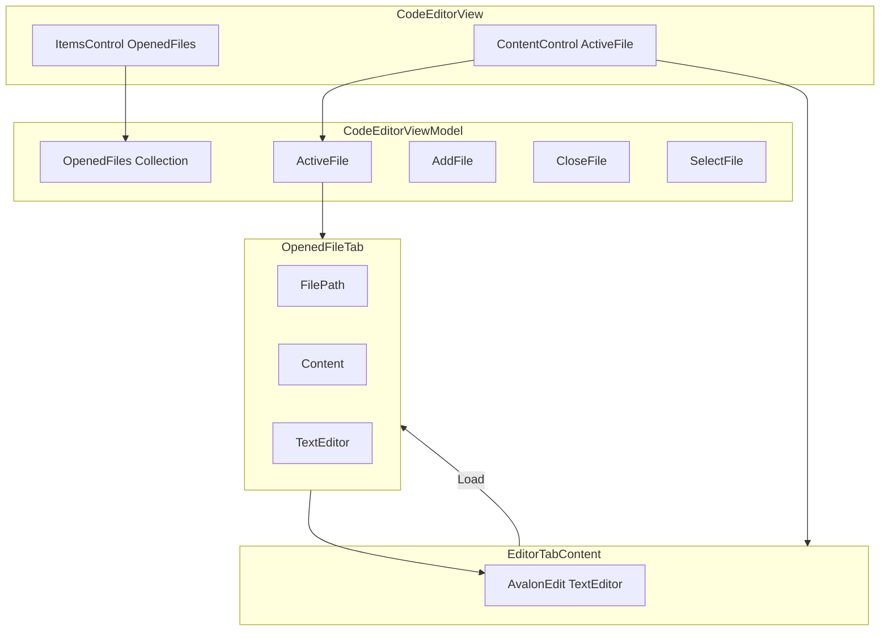

# Архитектура CodeEditorView и CodeEditorViewModel

## 1. Общая схема




---

## 2. CodeEditorViewModel — логика и состояние

Файл: `[KID.WPF.IDE/ViewModels/CodeEditorViewModel.cs](KID.WPF.IDE/ViewModels/CodeEditorViewModel.cs)`

### 2.1 Роль

ViewModel для редактора кода: хранит список открытых вкладок, активную вкладку и проксирует действия меню (Undo, Redo, Save, Run) к активной вкладке.

### 2.2 Основные поля и свойства


| Свойство      | Тип                                   | Описание                                                           |
| ------------- | ------------------------------------- | ------------------------------------------------------------------ |
| `OpenedFiles` | `ObservableCollection<OpenedFileTab>` | Все открытые вкладки                                               |
| `ActiveFile`  | `OpenedFileTab?`                      | Вкладка, выбранная сейчас                                          |
| `TextEditor`  | `TextEditor?`                         | Референс на AvalonEdit активной вкладки (для совместимости с меню) |


### 2.3 Делегирование активной вкладке

`Text`, `FilePath`, `FontFamily`, `FontSize`, `CanUndo`, `CanRedo` всегда относятся к `ActiveFile`:

- **Text** — `GetActiveContent()` / `SetActiveContent()`: берут текст из `ActiveFile.TextEditor.Text` или `ActiveFile.Content`
- **FilePath** — get/set через `ActiveFile.FilePath`
- **FontFamily**, **FontSize** — применяются к `ActiveFile.TextEditor`
- **CanUndo**, **CanRedo** — `ActiveFile.TextEditor?.CanUndo/CanRedo`

### 2.4 Команды


| Команда                  | Поведение                                                |
| ------------------------ | -------------------------------------------------------- |
| `AddFile(path, content)` | Добавляет вкладку или переключается на уже открытый файл |
| `CloseFile(tab)`         | Удаляет вкладку; если закрыта последняя — создаёт пустую |
| `SelectFile(tab)`        | Устанавливает `ActiveFile = tab`                         |
| `UndoCommand`            | Делегирует в `ActiveFile.TextEditor.Undo()`              |
| `RedoCommand`            | Делегирует в `ActiveFile.TextEditor.Redo()`              |


### 2.5 AddFile — детали

1. Проверка `FindTabByPath(path)` — если файл уже открыт, вызывается `SelectFile` и выход.
2. Создаётся `OpenedFileTab` с `FilePath` и `Content`.
3. Подписка на `PropertyChanged`: при смене `Content` или `TextEditor` у активной вкладки обновляются `Text`, `CanUndo`, `CanRedo`.
4. Вкладка добавляется в `OpenedFiles`, `ActiveFile` устанавливается на неё.

### 2.6 Синхронизация Text и Content

- **При наличии TextEditor:** используется `TextEditor.Text` (источник истины).
- **Иначе:** берётся `Content` (например, до загрузки редактора или при закрытии вкладки).

---

## 3. OpenedFileTab — модель вкладки

Файл: `[KID.WPF.IDE/Models/OpenedFileTab.cs](KID.WPF.IDE/Models/OpenedFileTab.cs)`


| Поле         | Тип         | Описание                                                     |
| ------------ | ----------- | ------------------------------------------------------------ |
| `FilePath`   | string      | Путь к файлу или `/NewFile.cs`                               |
| `Content`    | string      | Текст, начальное значение и резерв при отсутствии TextEditor |
| `TextEditor` | TextEditor? | AvalonEdit, назначается View при загрузке                    |
| `FileName`   | string      | Имя файла без пути для UI                                    |


---

## 4. CodeEditorView — структура XAML

Файл: `[KID.WPF.IDE/Views/CodeEditorView.xaml](KID.WPF.IDE/Views/CodeEditorView.xaml)`

### 4.1 DataContext

```xml
<di:ServiceProviderExtension ServiceType="{x:Type viewModelsInterfaces:ICodeEditorViewModel}" />
```

DataContext — синглтон `ICodeEditorViewModel` из DI.

### 4.2 Разметка

```
Grid
├── Row 0 (Auto): Border — панель вкладок
│   └── ItemsControl ItemsSource="{Binding OpenedFiles}"
│       └── ItemTemplate: Border (вкладка)
│           ├── TextBlock Text="{Binding FileName}"
│           └── Button "×" CloseFileCommand
└── Row 1 (*): ContentControl Content="{Binding ActiveFile}"
    └── DataTemplate для OpenedFileTab → EditorTabContent
```

### 4.3 Отображение активной вкладки

Во всех трёх местах используется один и тот же `MultiBinding`:

1. Фон вкладки (Border): `TabInactiveBrush` / `TabActiveBrush`
2. Текст имени (TextBlock): `TabTextStyle` — цвет и `FontWeight`
3. Кнопка закрытия (Button): `TabCloseButtonStyle` — цвет

`EqualityToBoolConverter` сравнивает `ActiveFile` и текущий элемент (`Binding` без path). Если совпадают — применяются стили для активной вкладки.

### 4.4 Привязки команд


| Элемент                  | Команда             | CommandParameter                    |
| ------------------------ | ------------------- | ----------------------------------- |
| Border (клик по вкладке) | `SelectFileCommand` | `{Binding}` (текущий OpenedFileTab) |
| Button "×"               | `CloseFileCommand`  | `{Binding}`                         |


---

## 5. EditorTabContent — связь View и модели

Файлы: `[EditorTabContent.xaml](KID.WPF.IDE/Views/EditorTabContent.xaml)`, `[EditorTabContent.xaml.cs](KID.WPF.IDE/Views/EditorTabContent.xaml.cs)`

### 5.1 Назначение

UserControl с AvalonEdit, используется как содержимое вкладки (`ContentControl` показывает его для `ActiveFile`).

### 5.2 OnLoaded

1. `DataContext` — это `OpenedFileTab` (передан через `Content`).
2. `tab.TextEditor = TextEditor` — привязка модели к контролу.
3. `TextEditor.Text = tab.Content` — загрузка текста.
4. Подписка на `TextChanged` → обновление `tab.Content`.

### 5.3 OnUnloaded

1. Последнее сохранение: `tab.Content = TextEditor.Text`.
2. `tab.TextEditor = null` — отвязка редактора от модели.

### 5.4 Жизненный цикл

При смене `ActiveFile` старый `EditorTabContent` уничтожается (вызывается `Unloaded`), новый создаётся (вызывается `Loaded`). Каждая вкладка получает свой экземпляр EditorTabContent при отображении; у неактивных вкладок `EditorTabContent` нет, их контент хранится в `Content`.

---

## 6. Поток данных

### 6.1 Открытие файла (Меню → Файл → Открыть)

1. `MenuViewModel.ExecuteOpenFile` → `codeFileService.OpenCodeFileWithPathAsync` → `OpenFileResult(Code, FilePath)`.
2. `codeEditorViewModel.AddFile(result.FilePath, result.Code)`.
3. Добавление вкладки в `OpenedFiles`, установка `ActiveFile`.
4. `ContentControl` создаёт `EditorTabContent` → `Loaded` → `tab.TextEditor = TextEditor`, `TextEditor.Text = Content`.

### 6.2 Переключение вкладок

1. Клик по вкладке → `SelectFileCommand` с параметром `OpenedFileTab`.
2. `ActiveFile = tab`.
3. `ContentControl` при смене `Content`:
  - у старой вкладки вызывается `Unloaded` → сохранение `Content`, `TextEditor = null`;
  - у новой создаётся `EditorTabContent` → `Loaded` → привязка `TextEditor`, загрузка `Content`.

### 6.3 Запуск (Меню → Запуск)

1. `MenuViewModel.ExecuteRun` берёт `codeEditorViewModel.Text` (через `GetActiveContent()`).
2. Выполняется код активной вкладки.

---

## 7. Важные замечания

- **Один редактор на вкладку:** `ContentControl` показывает редактор только для текущей вкладки; остальные хранят текст в `Content`.
- **EqualityToBoolConverter:** используется для условного стиля (активная/неактивная вкладка) через `MultiBinding`.
- **Темы:** цвета вкладок задаются в `LightTheme.xaml` и `DarkTheme.xaml` (`TabActiveBrush`, `TabInactiveBrush`, `TabActiveTextBrush`, `TabInactiveTextBrush`).

