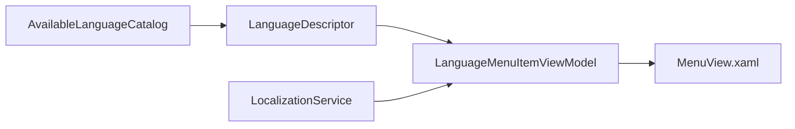

# Анализ и план рефакторинга списка языков

## 1. Что сейчас реализовано и как это работает

- Источник данных языков формируется в сервисе локализации: `[d:/Visual Studio Projects/KID/KID.WPF.IDE/Services/Localization/LocalizationService.cs](d:/Visual%20Studio%20Projects/KID/KID.WPF.IDE/Services/Localization/LocalizationService.cs)`
  - `GetAvailableLanguages()` читает `Language_Count`, `Language_{i}_CultureCode`, `Language_{i}_EnglishName` из `[d:/Visual Studio Projects/KID/KID.WPF.IDE/Resources/AvailableLanguage.resx](d:/Visual%20Studio%20Projects/KID/KID.WPF.IDE/Resources/AvailableLanguage.resx)`
  - Сразу же вычисляет `LocalizedDisplayName = GetString($"Language_{englishName}")`
  - Кэширует список `List<AvailableLanguage>` в `_cachedAvailableLanguages`
- `MenuViewModel` получает список и повторно локализует его по событию смены культуры:
  - `[d:/Visual Studio Projects/KID/KID.WPF.IDE/ViewModels/MenuViewModel.cs](d:/Visual%20Studio%20Projects/KID/KID.WPF.IDE/ViewModels/MenuViewModel.cs)`
  - В конструкторе `AvailableLanguages = new ObservableCollection<AvailableLanguage>(...)`
  - На `localizationService.CultureChanged` вызывает `UpdateLanguageDisplayNames()` и вручную обновляет каждую `language.LocalizedDisplayName`
- UI привязан к `LocalizedDisplayName` каждого элемента коллекции:
  - `[d:/Visual Studio Projects/KID/KID.WPF.IDE/Views/MenuView.xaml](d:/Visual%20Studio%20Projects/KID/KID.WPF.IDE/Views/MenuView.xaml)`
  - `ItemsSource="{Binding AvailableLanguages}"`, `Header="{Binding LocalizedDisplayName}"`
- Модель языка — mutable DTO с `INotifyPropertyChanged`:
  - `[d:/Visual Studio Projects/KID/KID.WPF.IDE/Models/AvailableLanguage.cs](d:/Visual%20Studio%20Projects/KID/KID.WPF.IDE/Models/AvailableLanguage.cs)`

## 2. Выявленные минусы текущего решения

1. **Дублирование ответственности за локализацию**
  - И `LocalizationService`, и `MenuViewModel` обновляют `LocalizedDisplayName`.
  - Поведение размазано по слоям, сложно понять “кто владелец” финального текста.
2. **Хрупкая контрактная связка по строковым ключам**
  - Ключи строятся динамически: `Language_{EnglishName}`.
  - Любое переименование `EnglishName` или ресурса ломает UI без компиляторной проверки.
3. **Смешение доменной модели и UI-представления**
  - `AvailableLanguage` содержит `LocalizedDisplayName` (чисто UI-атрибут), но живёт в `Models`.
  - Модель не отражает устойчивую предметную сущность, а хранит проекцию для конкретного экрана.
4. **Состояние и кэш в сервисе возвращают изменяемые объекты**
  - `_cachedAvailableLanguages` отдаётся наружу как те же экземпляры.
  - ViewModel мутирует эти же объекты (`LocalizedDisplayName`), что усиливает shared mutable state и неявные побочные эффекты.
5. **Избыточная реактивность и ручная синхронизация**
  - Вместо декларативного вычисления отображаемого имени — ручной проход по коллекции при каждом `CultureChanged`.
  - Повышается риск рассинхронизации при добавлении новых мест использования языков.
6. **Симптом “God ViewModel” в `MenuViewModel**`
  - `MenuViewModel` уже отвечает за файлы, запуск, undo/redo, темы, шрифты, языки.
  - Логика пересчёта локализованных названий ещё сильнее увеличивает связность и размер класса.

## 3. Какие принципы проектирования нарушены

- **SRP (Single Responsibility Principle)**
  - Локализация названия языка распределена между сервисом и ViewModel.
  - Модель `AvailableLanguage` одновременно хранит данные и UI-представление.
- **Separation of Concerns / MVVM boundaries**
  - Уровень `Models` содержит presentation-specific поле `LocalizedDisplayName`.
  - UI-представление не изолировано от инфраструктуры ресурсов и ключей.
- **DRY (Don’t Repeat Yourself)**
  - Одинаковая идея “собрать локализованное имя по ключу” повторяется в нескольких местах.
- **OCP (Open/Closed Principle), частично**
  - Добавление/переименование языка требует координированных правок в нескольких ресурсах и строковых шаблонах.
  - Система плохо расширяется без модификации существующей логики ключей.
- **Law of Demeter / низкая связность, частично**
  - `MenuViewModel` знает детали построения ключа `Language_{EnglishName}`, хотя это деталь локализации.

## 4. Целевая архитектура (что должно быть вместо этого)

- Каталог языков хранит стабильные данные (`CultureCode`, `DisplayKey` или enum/id).
- Локализуемое имя вычисляется в одном месте (например, в `LanguageMenuItemViewModel` как `DisplayName => localization.GetString(DisplayKey)` + реакция на `CultureChanged`).
- Модель языка становится immutable и не содержит `INotifyPropertyChanged`.
- `MenuViewModel` работает с готовыми item-view-model, не собирая ключи руками.

## 5. Порядок выполнения рефакторинга

1. Ввести устойчивую модель языка (без `LocalizedDisplayName` и без `INotifyPropertyChanged`).
2. Ввести item-view-model для меню языка с `DisplayName` и командным параметром.
3. Перенести логику локализованного отображения в item-view-model или отдельный formatter.
4. Упростить `LocalizationService.GetAvailableLanguages()` до выдачи только базовых метаданных языка.
5. Удалить из `MenuViewModel` `UpdateLanguageDisplayNames()` и связанную ручную синхронизацию.
6. Проверить и унифицировать аналогичный паттерн для тем (`AvailableTheme`).
7. Обновить документацию в `[d:/Visual Studio Projects/KID/docs/ARCHITECTURE.md](d:/Visual%20Studio%20Projects/KID/docs/ARCHITECTURE.md)` с новой границей ответственности.

## 6. Оценка сложности и рисков

- **Ввод item-view-model для языков** — средняя, 1-2 часа
  - Риск: изменить binding в `MenuView.xaml` без регрессий по `IsChecked`/`CommandParameter`.
- **Очистка `LocalizationService` и модели** — средняя, 1-2 часа
  - Риск: не сломать текущий fallback локализации и выбор языка в настройках.
- **Унификация с темами** — средняя, 1-2 часа
  - Риск: асимметрия поведения темы/языка после рефакторинга.
- **Документация + smoke-проверка UI** — низкая, 30-60 минут
  - Риск: пропустить edge-case при смене культуры во время открытого меню.

## 7. Критерии приёмки

- В коде больше нет ручного массового присвоения `LocalizedDisplayName` в `MenuViewModel`.
- `AvailableLanguage` не содержит UI-специфичных mutable-полей.
- Отображаемое имя языка меняется при `CultureChanged` декларативно и предсказуемо.
- Добавление нового языка требует правки каталога языка и ресурсов, но без дублирования логики в нескольких классах.

