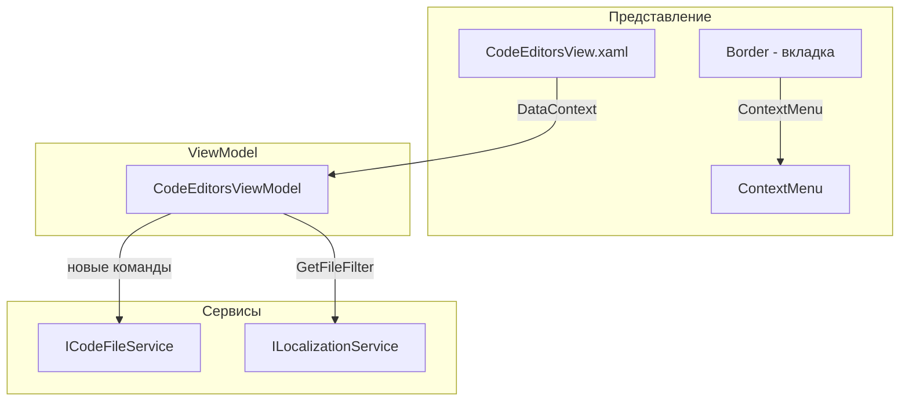

# Контекстное меню вкладок редактора

## 1. Анализ требований

### Описание функции

При правом клике на вкладку открытого файла показывается контекстное меню с действиями:

- **Закрыть** — закрыть вкладку (уже есть `CloseFileCommand`)
- **Сохранить** — сохранить файл вкладки
- **Сохранить как** — сохранить копию в новый путь
- **Разделитель**
- **Передвинуть вправо** — сдвинуть вкладку на одну позицию вправо (доступно только если есть сосед справа)
- **Передвинуть влево** — сдвинуть вкладку на одну позицию влево (доступно только если есть сосед слева)

### Целевая логика

- Сохранить/Сохранить как работают с конкретной вкладкой, по которой кликнули (не только с активной)
- Передвинуть влево/вправо — swap вкладки с соседом; пункты должны быть disabled, когда перемещение невозможно

### Входные/выходные данные

- Вход: правый клик по вкладке (`OpenedFileTab`)
- Выход: выполнение соответствующей команды для выбранной вкладки

---

## 2. Архитектурный анализ

### Затрагиваемые компоненты




### Изменения в компонентах


| Компонент                                                                                | Тип изменения                                                                                                                                         |
| ---------------------------------------------------------------------------------------- | ----------------------------------------------------------------------------------------------------------------------------------------------------- |
| [CodeEditorsViewModel.cs](KID.WPF.IDE/ViewModels/CodeEditorsViewModel.cs)                | Добавить: `SaveFileCommand`, `SaveAsFileCommand`, `MoveTabLeftCommand`, `MoveTabRightCommand`; зависимости `ICodeFileService`, `ILocalizationService` |
| [ICodeEditorsViewModel.cs](KID.WPF.IDE/ViewModels/Interfaces/ICodeEditorsViewModel.cs)   | Добавить объявления новых команд                                                                                                                      |
| [CodeEditorsView.xaml](KID.WPF.IDE/Views/CodeEditorsView.xaml)                           | Добавить `ContextMenu` на `Border` вкладки и `x:Name` для привязки                                                                                    |
| [ServiceCollectionExtensions.cs](KID.WPF.IDE/Services/DI/ServiceCollectionExtensions.cs) | Добавить `ICodeFileService` и `ILocalizationService` в конструктор `CodeEditorsViewModel`                                                             |
| Строки локализации                                                                       | Добавить ключи для пунктов «Передвинуть влево», «Передвинуть вправо»                                                                                  |


### Работа с ContextMenu в DataTemplate

В WPF `ContextMenu` попадает в отдельное Popup-дерево, поэтому `RelativeSource AncestorType` не сработает. Рекомендуемый подход:

- Использовать `x:Reference` на `UserControl` для доступа к `DataContext` (`ICodeEditorsViewModel`) и его командам
- Использовать `PlacementTarget.DataContext` для передачи `OpenedFileTab` в `CommandParameter`

---

## 3. Список задач

### 3.1 Изменение CodeEditorsViewModel

**Файл:** `KID.WPF.IDE/ViewModels/CodeEditorsViewModel.cs`

- Добавить зависимости: `ICodeFileService`, `ILocalizationService`
- Добавить команды:
  - `SaveFileCommand` — `RelayCommand<OpenedFileTab>` (логика как в `MenuViewModel.ExecuteSaveFile`, но для заданной вкладки)
  - `SaveAsFileCommand` — `RelayCommand<OpenedFileTab>` (аналогично `ExecuteSaveAsFile` для вкладки)
  - `MoveTabLeftCommand` — `RelayCommand<OpenedFileTab>`, `CanExecute`: `index > 0`
  - `MoveTabRightCommand` — `RelayCommand<OpenedFileTab>`, `CanExecute`: `index < Count - 1`
- В `MoveTabLeft`/`MoveTabRight` — swap вкладки с соседом в `OpenedFiles`
- При необходимости вызывать `CommandManager.InvalidateRequerySuggested()` после изменений коллекции

### 3.2 Обновление интерфейса ICodeEditorsViewModel

**Файл:** `KID.WPF.IDE/ViewModels/Interfaces/ICodeEditorsViewModel.cs`

- Добавить свойства: `SaveFileCommand`, `SaveAsFileCommand`, `MoveTabLeftCommand`, `MoveTabRightCommand`

### 3.3 Регистрация зависимостей в DI

**Файл:** `KID.WPF.IDE/Services/DI/ServiceCollectionExtensions.cs`

- Убедиться, что `CodeEditorsViewModel` получает `ICodeFileService` и `ILocalizationService` через конструктор (регистрация уже есть, требуется только обновление конструктора)

### 3.4 Изменение CodeEditorsView.xaml

**Файл:** `KID.WPF.IDE/Views/CodeEditorsView.xaml`

- Добавить `x:Name="CodeEditorsView"` на корневой `UserControl`
- Добавить `ContextMenu` на `Border` вкладки (в `DataTemplate`):

```xml
<Border.ContextMenu>
    <ContextMenu>
        <MenuItem Header="{localization:Localization Menu_Close}" 
                  Command="{Binding DataContext.CloseFileCommand, Source={x:Reference CodeEditorsView}}"
                  CommandParameter="{Binding PlacementTarget.DataContext, RelativeSource={RelativeSource AncestorType=ContextMenu}}"/>
        <MenuItem Header="{localization:Localization Menu_Save}" ...
        <MenuItem Header="{localization:Localization Menu_SaveAs}" ...
        <Separator/>
        <MenuItem Header="..." Command="{Binding DataContext.MoveTabLeftCommand, ...}" 
                  CommandParameter="..." IsEnabled="{Binding ...}"/>
        <MenuItem Header="..." Command="{Binding DataContext.MoveTabRightCommand, ...}" 
                  CommandParameter="..." IsEnabled="{Binding ...}"/>
    </ContextMenu>
</Border.ContextMenu>
```

- Для «Передвинуть влево/вправо» использовать `IsEnabled` + `CanExecute` (или привязку к команде, которая уже проверяет `CanExecute`)

### 3.5 Локализация

**Файлы:** `Strings.ru-RU.resx`, `Strings.en-US.resx`, `Strings.uk-UA.resx`, `Strings.Designer.cs`

- Добавить ключи:
  - `TabContext_Close` — «Закрыть» (или переиспользовать `Menu_Save`-подобные, если есть общий «Закрыть»)
  - `TabContext_MoveLeft` — «Передвинуть влево»
  - `TabContext_MoveRight` — «Передвинуть вправо»

Проверить наличие `Menu_Close` или аналога; при отсутствии — добавить.

### 3.6 Дополнительно: выбор вкладки при правом клике

- При правом клике выполнять `SelectFile(tab)` для вкладки, по которой кликнули, чтобы активная вкладка совпадала с контекстом меню (опционально, по желанию).

---

## 4. Порядок выполнения

1. Добавить ключи локализации (TabContext_MoveLeft, TabContext_MoveRight и т.п.)
2. Обновить `ICodeEditorsViewModel` — объявления команд
3. Обновить `CodeEditorsViewModel` — реализация команд и внедрение `ICodeFileService`, `ILocalizationService`
4. Обновить `CodeEditorsView.xaml` — `ContextMenu` и привязки
5. Проверить DI (при необходимости — регистрацию/конструктор)
6. Ручное тестирование

---

## 5. Оценка сложности


| Задача                | Сложность | Время  | Риски                                                        |
| --------------------- | --------- | ------ | ------------------------------------------------------------ |
| Локализация           | Низкая    | 5 мин  | —                                                            |
| ICodeEditorsViewModel | Низкая    | 2 мин  | —                                                            |
| CodeEditorsViewModel  | Средняя   | 25 мин | Учесть `NewFile.cs` при Save; корректный CanExecute для Move |
| CodeEditorsView.xaml  | Низкая    | 10 мин | Проверка привязок для ContextMenu                            |
| DI                    | Низкая    | 3 мин  | —                                                            |
| Тестирование          | Низкая    | 10 мин | —                                                            |


---

## 6. Важные детали реализации

### Логика MoveTabLeft / MoveTabRight

```csharp
// MoveTabLeft: index 3 -> index 2 (swap с левым соседом)
var index = OpenedFiles.IndexOf(tab);
if (index <= 0) return;
OpenedFiles.Move(index, index - 1);
// Обновить indexOfActiveFile если он меняется
```

### Логика Save для вкладки

- `SaveFile(tab)`: если `tab.FilePath` — NewFile.cs, вызывать `SaveAsFile(tab)`; иначе — `SaveToPathAsync(tab.FilePath, content)`
- `SaveAsFile(tab)`: вызвать `SaveCodeFileAsync`, при успехе обновить `tab.FilePath`

### Проверка CanExecute для Move

- `CanMoveTabLeft(tab)`: `OpenedFiles.IndexOf(tab) > 0`
- `CanMoveTabRight(tab)`: `OpenedFiles.IndexOf(tab) < OpenedFiles.Count - 1`

