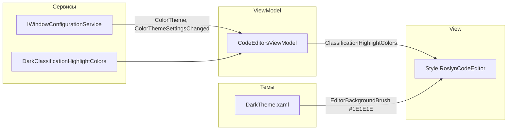

# План: контраст подсветки редактора в тёмной теме

## 1. Анализ требований

**Цель:** при переключении на тёмную тему текст и подсветка синтаксиса в RoslynCodeEditor должны оставаться читаемыми.

**Требования:**

- Фон редактора в тёмной теме — `#1E1E1E`.
- Отдельная палитра синтаксической подсветки для тёмной темы (класс `DarkClassificationHighlightColors`).
- Свойство во ViewModel, возвращающее `IClassificationHighlightColors` в зависимости от `IWindowConfigurationService.Settings.ColorTheme`.
- Привязка этого свойства к элементу RoslynCodeEditor в XAML.

**Ограничения:** типы `IClassificationHighlightColors`, `HighlightingColor`, `SimpleHighlightingBrush`, `ClassificationTypeNames` берутся из пакетов RoslynPad (уже подключены: RoslynPad.Editor.Windows 4.12.1, RoslynPad.Roslyn 4.12.1). Редактор создаётся в [RoslynCodeEditorFactory.cs](KID.WPF.IDE/Services/CodeEditor/RoslynCodeEditorFactory.cs) и отображается через `ContentPresenter` в [CodeEditorsView.xaml](KID.WPF.IDE/Views/CodeEditorsView.xaml) (нет имени у элемента — привязка через `Style` для `roslyn:RoslynCodeEditor`).

---

## 2. Архитектурный анализ

**Затронутые подсистемы:**

- Темы: [DarkTheme.xaml](KID.WPF.IDE/Themes/DarkTheme.xaml) — цвет фона редактора.
- Редактор: новый класс палитры в `Services/CodeEditor`, использование в ViewModel и привязка в View.
- Настройки: уже есть `Settings.ColorTheme` ("Light" / "Dark") и событие `ColorThemeSettingsChanged` в [IWindowConfigurationService](KID.WPF.IDE/Services/Initialize/Interfaces/IWindowConfigurationService.cs).

**Новые компоненты:**

- Класс `DarkClassificationHighlightColors` в `KID.WPF.IDE/Services/CodeEditor/`.

**Изменяемые компоненты:**

- [DarkTheme.xaml](KID.WPF.IDE/Themes/DarkTheme.xaml) — цвет фона и при желании цвет текста по умолчанию.
- [CodeEditorsViewModel.cs](KID.WPF.IDE/ViewModels/CodeEditorsViewModel.cs) — свойство палитры и подписка на смену темы.
- [ICodeEditorsViewModel.cs](KID.WPF.IDE/ViewModels/Interfaces/ICodeEditorsViewModel.cs) — объявление свойства в интерфейсе.
- [CodeEditorsView.xaml](KID.WPF.IDE/Views/CodeEditorsView.xaml) — привязка палитры в стиле для `roslyn:RoslynCodeEditor`.

**Важно:** Редактор создаётся в фабрике с `new ClassificationHighlightColors()` в `InitializeAsync`. После отображения контрола стиль с привязкой установит `ClassificationHighlightColors` из ViewModel, поэтому менять фабрику не обязательно (при смене темы свойство обновится через binding).

---

## 3. Список задач и порядок выполнения

### 3.1. Фон редактора в тёмной теме

- **Файл:** [KID.WPF.IDE/Themes/DarkTheme.xaml](KID.WPF.IDE/Themes/DarkTheme.xaml)
- **Действие:** Заменить цвет `EditorBackground` с `#505050` на `#1E1E1E`. По желанию задать `EditorForeground` как `#D4D4D4` (как в VS Dark) для лучшей читаемости.
- **Сложность:** низкая.

### 3.2. Класс DarkClassificationHighlightColors

- **Файл:** новый — `KID.WPF.IDE/Services/CodeEditor/DarkClassificationHighlightColors.cs`
- **Действие:** Создать класс, реализующий `RoslynPad.Editor.IClassificationHighlightColors`, по образцу приложенного `ClassificationHighlightColors.cs`. Использовать типы из RoslynPad: `HighlightingColor`, `SimpleHighlightingBrush`, `Microsoft.CodeAnalysis.Classification.ClassificationTypeNames`, `RoslynPad.Roslyn.Classification.AdditionalClassificationTypeNames`. Заполнить словарь классификаций так же, как в образце, но с цветами для тёмного фона (палитра в духе VS Dark):
  - **Default (текст):** `#D4D4D4`
  - **Keyword / ControlKeyword:** `#569CD6`
  - **Type (классы, интерфейсы и т.д.):** `#4EC9B0`
  - **Method:** `#DCDCAA`
  - **Parameter:** `#9CDCFE`
  - **Comment:** `#6A9955`
  - **XmlComment:** `#808080`
  - **PreprocessorKeyword:** `#C586C0`
  - **StringLiteral / VerbatimStringLiteral:** `#CE9178`
  - **BraceMatching:** контрастный фон (например полупрозрачный жёлтый/серый) и читаемый foreground.
  - **StaticSymbol:** жирный шрифт, foreground как у обычного текста или типа.
- **Сложность:** средняя (нужно проверить доступность `AsFrozen()` и пространств имён в пакетах 4.12.1).

### 3.3. Свойство во ViewModel и реакция на смену темы

- **Файлы:**
  - [KID.WPF.IDE/ViewModels/Interfaces/ICodeEditorsViewModel.cs](KID.WPF.IDE/ViewModels/Interfaces/ICodeEditorsViewModel.cs) — добавить в интерфейс: `RoslynPad.Editor.IClassificationHighlightColors ClassificationHighlightColors { get; }`.
  - [KID.WPF.IDE/ViewModels/CodeEditorsViewModel.cs](KID.WPF.IDE/ViewModels/CodeEditorsViewModel.cs):
    - Добавить свойство `ClassificationHighlightColors`, возвращающее `new ClassificationHighlightColors()` при `Settings.ColorTheme` "Light" (или не "Dark") и `new DarkClassificationHighlightColors()` при "Dark". Для уменьшения аллокаций можно кэшировать два экземпляра (светлый/тёмный) и возвращать нужный в зависимости от темы.
    - В конструкторе подписаться на `windowConfigurationService.ColorThemeSettingsChanged` и в обработчике вызывать `OnPropertyChanged(nameof(ClassificationHighlightColors))`.
- **Сложность:** низкая.

### 3.4. Привязка в XAML

- **Файл:** [KID.WPF.IDE/Views/CodeEditorsView.xaml](KID.WPF.IDE/Views/CodeEditorsView.xaml)
- **Действие:** В существующем `Style TargetType="roslyn:RoslynCodeEditor"` добавить сеттер, например:
`Setter Property="ClassificationHighlightColors" Value="{Binding DataContext.ClassificationHighlightColors, RelativeSource={RelativeSource AncestorType=UserControl}}"`
Источник привязки — DataContext пользовательского контрола (ICodeEditorsViewModel). Проверить, что у RoslynCodeEditor в сборке RoslynPad.Editor.Windows есть свойство `ClassificationHighlightColors` (по публичному API RoslynPad оно задаётся после инициализации).
- **Сложность:** низкая.

### 3.5. Документация

- **Файлы:** при необходимости — [docs/SUBSYSTEMS.md](docs/SUBSYSTEMS.md) и [docs/ARCHITECTURE.md](docs/ARCHITECTURE.md).
- **Действие:** Кратко описать: тёмная тема редактора (фон #1E1E1E, палитра DarkClassificationHighlightColors), свойство ClassificationHighlightColors во ViewModel и привязка к редактору.
- **Сложность:** низкая.

---

## 4. Порядок выполнения

1. Изменить DarkTheme.xaml (фон и при желании цвет текста).
2. Создать DarkClassificationHighlightColors.cs и проверить компиляцию/тесты.
3. Добавить свойство в ICodeEditorsViewModel и CodeEditorsViewModel с подпиской на ColorThemeSettingsChanged.
4. Добавить привязку в Style для roslyn:RoslynCodeEditor в CodeEditorsView.xaml.
5. Обновить документацию (при необходимости).

---

## 5. Оценка сложности и риски

| Задача                            | Сложность | Время     | Риски                                                                                                                               |
| --------------------------------- | --------- | --------- | ----------------------------------------------------------------------------------------------------------------------------------- |
| Фон в DarkTheme.xaml              | Низкая    | 5 мин     | Нет                                                                                                                                 |
| DarkClassificationHighlightColors | Средняя   | 30–45 мин | Отличия API RoslynPad 4.12.1 (например AsFrozen, пространства имён)                                                                 |
| Свойство во ViewModel + интерфейс | Низкая    | 15 мин    | Нет                                                                                                                                 |
| Привязка в XAML                   | Низкая    | 10 мин    | Если у RoslynCodeEditor нет свойства ClassificationHighlightColors — потребуется обход (например, установка из кода при смене темы) |
| Документация                      | Низкая    | 10 мин    | Нет                                                                                                                                 |

**Общее время:** около 1–1,5 часа.

**Примечание:** Если в RoslynPad.Editor.Windows 4.12.1 свойство редактора называется иначе или не является DependencyProperty, привязка через Style может не сработать; тогда нужно будет устанавливать палитру в коде (например, при присвоении `Content` или в обработчике смены темы обходить открытые вкладки и выставлять свойство у каждого `CodeEditor`).