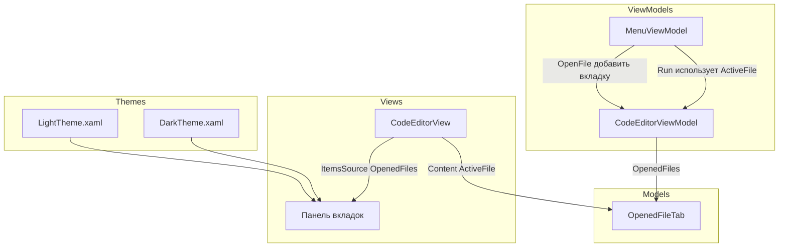

# План реализации многофайловой системы в .KID IDE

## 1. Анализ требований

### Описание функции

Многофайловая система с вкладками (как в Visual Studio 2022):

- Панель вкладок над редактором кода с прямоугольниками (имя файла + кнопка закрытия)
- Активная вкладка — выделенный цвет; остальные — нейтральный
- Фон панели вкладок — SplitterColor
- Файл→Открыть — новая вкладка
- Запуск — выполняется код активной вкладки

### Цветовая схема


| Элемент            | Светлая тема | Тёмная тема             |
| ------------------ | ------------ | ----------------------- |
| Активная вкладка   | #F5CC84      | #7160E8                 |
| Неактивная вкладка | #3B4F81      | #2E2E2E                 |
| Фон панели вкладок | #5d6b99      | #1F1F1F (SplitterColor) |


### Ограничения

- Сохранить совместимость с меню (Файл, Правка, Запуск)
- Undo/Redo, шрифт — применяются к активному редактору
- Локализация новых строк (если потребуется)

---

## 2. Архитектурный анализ

### Затрагиваемые подсистемы




### Новые компоненты

- `[KID.WPF.IDE/Models/OpenedFileTab.cs](KID.WPF.IDE/Models/OpenedFileTab.cs)` — модель вкладки (FilePath, Content, TextEditor)
- `[KID.WPF.IDE/Views/EditorTabContent.xaml](KID.WPF.IDE/Views/EditorTabContent.xaml)` (+ .cs) — UserControl с TextEditor для контента вкладки

### Изменяемые компоненты

- `[CodeEditorViewModel.cs](KID.WPF.IDE/ViewModels/CodeEditorViewModel.cs)` — OpenedFiles, ActiveFile, AddFile, CloseFile, SelectFile
- `[ICodeEditorViewModel.cs](KID.WPF.IDE/ViewModels/Interfaces/ICodeEditorViewModel.cs)` — расширение интерфейса
- `[MenuViewModel.cs](KID.WPF.IDE/ViewModels/MenuViewModel.cs)` — OpenFile добавляет вкладку; Run/Save используют ActiveFile
- `[CodeEditorView.xaml](KID.WPF.IDE/Views/CodeEditorView.xaml)` — панель вкладок + ContentControl с активным редактором
- `[LightTheme.xaml](KID.WPF.IDE/Themes/LightTheme.xaml)`, `[DarkTheme.xaml](KID.WPF.IDE/Themes/DarkTheme.xaml)` — цвета вкладок

---

## 3. Детальная реализация

### 3.1 Модель OpenedFileTab

**Файл:** `KID.WPF.IDE/Models/OpenedFileTab.cs`

```csharp
public class OpenedFileTab : ViewModelBase
{
    public string FilePath { get; set; }
    public string Content { get; set; }
    public TextEditor? TextEditor { get; set; }  // присваивается View при загрузке
}
```

- `FilePath` — путь к файлу (или `CodeEditorViewModel.NewFilePath` для нового)
- `Content` — текст файла (начальное значение и синхронизация при смене вкладки)
- `TextEditor` — ссылка на AvalonEdit, которую View устанавливает при Loaded

### 3.2 CodeEditorViewModel

**Изменения в** `[CodeEditorViewModel.cs](KID.WPF.IDE/ViewModels/CodeEditorViewModel.cs)`:

- `ObservableCollection<OpenedFileTab> OpenedFiles`
- `OpenedFileTab? ActiveFile` — текущая вкладка
- `AddFile(string path, string content)` — добавить вкладку (или переключиться, если уже открыт)
- `CloseFile(OpenedFileTab tab)` — закрыть вкладку
- `SelectFile(OpenedFileTab tab)` — сделать вкладку активной
- При первой загрузке — одна вкладка с NewFile.cs
- `Text`, `FilePath`, `CanUndo`, `CanRedo` — делегируются в `ActiveFile` (обратная совместимость с меню)

### 3.3 MenuViewModel

**Изменения в** `[MenuViewModel.cs](KID.WPF.IDE/ViewModels/MenuViewModel.cs)`:

- `ExecuteOpenFile` — вместо замены содержимого вызывать `codeEditorViewModel.AddFile(result.FilePath, result.Code)`
- `ExecuteRun` — использовать `codeEditorViewModel.ActiveFile` (его TextEditor.Text или Content)
- `ExecuteSaveFile`, `ExecuteSaveAsFile` — работа с `ActiveFile`
- `ExecuteNewFile` — добавлять новую вкладку через `AddFile(NewFilePath, templateCode)`
- `CanSaveFile` — проверять `ActiveFile` вместо `codeEditorViewModel.FilePath`

### 3.4 UI — панель вкладок

**Изменения в** `[CodeEditorView.xaml](KID.WPF.IDE/Views/CodeEditorView.xaml)`:

Структура:

```
<Grid>
  <Grid.RowDefinitions>
    <RowDefinition Height="Auto"/>   <!-- Панель вкладок -->
    <RowDefinition Height="*"/>     <!-- Контент -->
  </Grid.RowDefinitions>
  
  <!-- Панель вкладок: ItemsControl с OpenedFiles -->
  <Border Background="{DynamicResource TabBarBackgroundBrush}">
    <ItemsControl ItemsSource="{Binding OpenedFiles}">
      <ItemsControl.ItemsPanel>
        <ItemsPanelTemplate>
          <StackPanel Orientation="Horizontal"/>
        </ItemsPanelTemplate>
      </ItemsControl.ItemsPanel>
      <ItemsControl.ItemTemplate>
        <!-- Заголовок: имя файла + кнопка закрытия -->
        <!-- Стиль: активная — TabActiveBrush, неактивная — TabInactiveBrush -->
      </ItemsControl.ItemTemplate>
    </ItemsControl>
  </Border>
  
  <!-- Контент: ContentControl, Content = ActiveFile -->
  <ContentControl Content="{Binding ActiveFile}" 
                  ContentTemplate="{StaticResource EditorTabContentTemplate}"/>
</Grid>
```

- Клик по вкладке — `SelectFile`
- Клик по «×» — `CloseFile`

### 3.5 EditorTabContent

**Файл:** `KID.WPF.IDE/Views/EditorTabContent.xaml` (+ .cs)

- UserControl с одним `avalonedit:TextEditor`
- При Loaded: `(DataContext as OpenedFileTab).TextEditor = TextEditor`, `TextEditor.Text = Content`
- При TextChanged: синхронизация `Content` из `TextEditor.Text` (для Save)

### 3.6 Темы

**Добавить в** `[LightTheme.xaml](KID.WPF.IDE/Themes/LightTheme.xaml)`:

```xml
<Color x:Key="TabActiveBackground">#F5CC84</Color>
<Color x:Key="TabInactiveBackground">#3B4F81</Color>
<Color x:Key="TabBarBackground">#5d6b99</Color>
<SolidColorBrush x:Key="TabActiveBrush" .../>
<SolidColorBrush x:Key="TabInactiveBrush" .../>
<SolidColorBrush x:Key="TabBarBackgroundBrush" .../>
```

**Добавить в** `[DarkTheme.xaml](KID.WPF.IDE/Themes/DarkTheme.xaml)`:

```xml
<Color x:Key="TabActiveBackground">#7160E8</Color>
<Color x:Key="TabInactiveBackground">#2E2E2E</Color>
<Color x:Key="TabBarBackground">#1F1F1F</Color>
```

### 3.7 Инициализация

**Изменения в** `[WindowInitializationService.cs](KID.WPF.IDE/Services/Initialize/WindowInitializationService.cs)`:

- Вместо прямого `codeEditorViewModel.Text = ...` и `codeEditorViewModel.FilePath = ...` — добавлять первую вкладку через `AddFile(NewFilePath, templateCode)` и устанавливать её как ActiveFile

---

## 4. Порядок выполнения задач

1. Создать `OpenedFileTab`
2. Добавить цвета вкладок в LightTheme и DarkTheme
3. Реализовать `EditorTabContent` (UserControl)
4. Обновить `CodeEditorViewModel` (OpenedFiles, ActiveFile, AddFile, CloseFile, SelectFile)
5. Обновить `ICodeEditorViewModel`
6. Изменить `CodeEditorView.xaml` — панель вкладок + ContentControl
7. Обновить `MenuViewModel` (OpenFile, Run, Save, NewFile)
8. Обновить `WindowInitializationService`
9. Настроить ChangeFont/ChangeFontSize для ActiveFile
10. Ручное тестирование

---

## 5. Оценка сложности и риски


| Задача                      | Сложность | Время  | Риски                                |
| --------------------------- | --------- | ------ | ------------------------------------ |
| OpenedFileTab               | Низкая    | 15 мин | —                                    |
| Цвета в темах               | Низкая    | 10 мин | —                                    |
| EditorTabContent            | Средняя   | 30 мин | Синхронизация Text↔Content           |
| CodeEditorViewModel         | Высокая   | 1 ч    | Обратная совместимость Text/FilePath |
| CodeEditorView              | Средняя   | 45 мин | Стилизация вкладок                   |
| MenuViewModel               | Средняя   | 30 мин | Проверка null для ActiveFile         |
| WindowInitializationService | Низкая    | 15 мин | —                                    |
| Font/Size для ActiveFile    | Низкая    | 15 мин | —                                    |


**Риски:**

- AvalonEdit `Text` может не поддерживать TwoWay binding — возможна синхронизация через TextChanged
- При закрытии последней вкладки — создавать новую пустую

---

## 6. Важные замечания

- `CodeEditorViewModel` остаётся Singleton; `OpenedFiles` и `ActiveFile` — коллекция вкладок
- Для Undo/Redo: `MenuViewModel` вызывает `codeEditorViewModel.UndoCommand`, который внутри выполняет `ActiveFile?.TextEditor?.Undo()`
- При переключении шрифта/размера — применять к `ActiveFile?.TextEditor`

