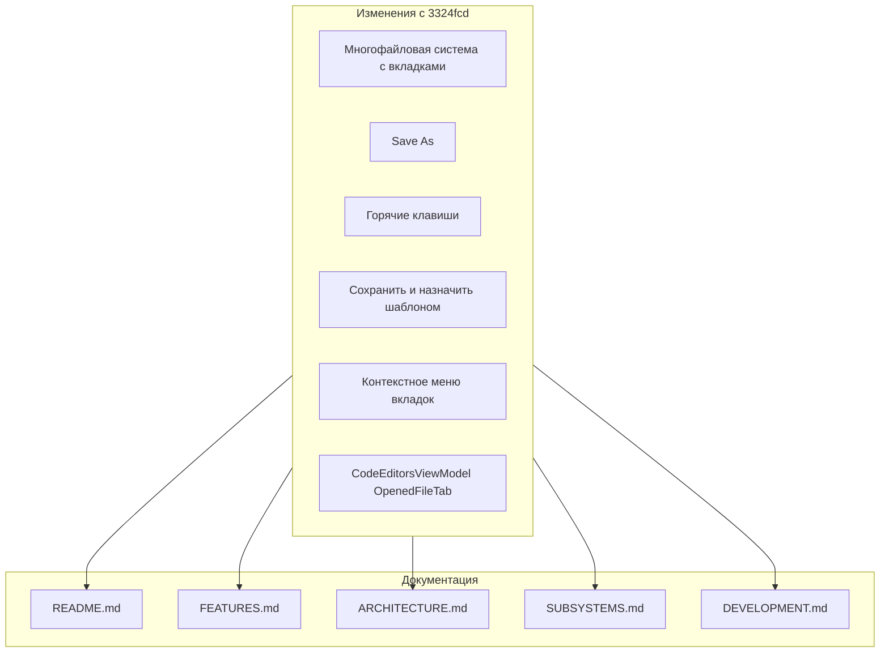

# План обновления документации проекта .KID

## Анализ изменений (с коммита 3324fcd)

### Изменённые/добавленные компоненты

| Компонент                       | Изменение                                                                               |
| ------------------------------- | --------------------------------------------------------------------------------------- |
| **CodeEditorView**              | Удалён, заменён на CodeEditorsView                                                      |
| **CodeEditorsView**             | Новый — панель с вкладками                                                              |
| **CodeEditorViewModel**         | Удалён                                                                                  |
| **CodeEditorsViewModel**        | Новый — управление вкладками                                                            |
| **OpenedFileTab**               | Новая модель вкладки                                                                    |
| **CodeFileService**             | Новый API: OpenFileWithPathAsync, SaveToPathAsync, SaveCodeFileAsync возвращает путь    |
| **OpenFileResult**              | Новая модель результата открытия                                                        |
| **MenuView**                    | Добавлены Save As, InputGestureText для горячих клавиш                                  |
| **MainWindow**                  | KeyBindings для Ctrl+N, Ctrl+O, Ctrl+S, Ctrl+Shift+S, Ctrl+F5, Shift+F5, Ctrl+Z, Ctrl+Y |
| **Themes**                      | Новые ресурсы вкладок (TabActive, TabInactive, TabBarBackground)                        |
| **WindowInitializationService** | Инициализация через AddFile, отложенное применение настроек шрифта                      |

### Новый функционал

1. **Многофайловая система с вкладками** — несколько открытых файлов, переключение кликом
2. **Отслеживание несохранённых изменений** — индикация изменений во вкладках
3. **Разделение Save и Save As** — отдельные пункты меню
4. **«Сохранить и назначить шаблоном»** — сохранение текущего файла как шаблона для новых
5. **Контекстное меню вкладок** — Закрыть, Сохранить, Сохранить как, Шаблон, Переместить влево/вправо
6. **Горячие клавиши** — Ctrl+N, Ctrl+O, Ctrl+S, Ctrl+Shift+S, Ctrl+F5, Shift+F5, Ctrl+Z, Ctrl+Y
7. **Поведение при открытии** — NewFile заменяется при открытии файла, если без изменений
8. **Защита от перезаписи** — при открытии не перезаписываются несохранённые изменения

---

## Задачи по обновлению документации

### 1. README.md

**Путь:** [docs/README.md](docs/README.md)

**Изменения:**

- Секция «Работа с файлами»: добавить поддержку нескольких файлов, вкладок, Save As, «Сохранить и назначить шаблоном»
- Секция «Редактор кода»: указать панель вкладок, подсветку активной вкладки, индикацию несохранённых изменений
- Быстрый старт: привести в соответствие с текущим UI (вкладки)
- Структура проекта: заменить `CodeEditorView` на `CodeEditorsView`, добавить `OpenedFileTab` в Models

**Сложность:** Низкая  
**Время:** ~15 мин

---

### 2. FEATURES.md

**Путь:** [docs/FEATURES.md](docs/FEATURES.md)

**Изменения:**

- **Раздел 1. Редактор кода:**
  - Панель вкладок: несколько открытых файлов, переключение, закрытие по кнопке ×
  - Контекстное меню вкладки: Закрыть, Сохранить, Сохранить как, Сохранить и назначить шаблоном, Переместить влево/вправо
  - Индикация изменений: жирный шрифт активной вкладки
  - Применение шрифта ко всем открытым редакторам
- **Раздел 2. Выполнение кода:**
  - Уточнить: выполняется код активной вкладки
- **Раздел 6. Работа с файлами:**
  - Добавить: «Сохранить как» (Ctrl+Shift+S)
  - Добавить: «Сохранить и назначить шаблоном» — из контекстного меню вкладки
  - Уточнить: несколько файлов — открытие добавляет вкладку/заменяет NewFile при пустом содержимом
  - Сохранение текущего содержимого активной вкладки
  - Отслеживание несохранённых изменений
- **Раздел 10. Пользовательский интерфейс — Меню:**
  - Добавить InputGestureText для всех пунктов: Ctrl+N, Ctrl+O, Ctrl+S, Ctrl+Shift+S, Ctrl+F5, Shift+F5, Ctrl+Z, Ctrl+Y
  - Добавить: «Сохранить как»
  - Раздел «Панели»: редактор — панель вкладок, одна активная вкладка с редактором
- **Раздел 9. Настройки — Шаблоны:**
  - Добавить: «Сохранить и назначить шаблоном» — сохранение текущего файла как шаблона

**Сложность:** Средняя  
**Время:** ~30 мин

---

### 3. ARCHITECTURE.md

**Путь:** [docs/ARCHITECTURE.md](docs/ARCHITECTURE.md)

**Изменения:**

- **Presentation Layer:**
  - Заменить `CodeEditorView.xaml` на `CodeEditorsView.xaml` — панель с вкладками, `ItemsControl` для вкладок, `ContentControl` для редактора активной вкладки
- **ViewModel Layer:**
  - Удалить `CodeEditorViewModel`
  - Добавить `CodeEditorsViewModel`:
    - Команды: Undo, Redo, CloseFile, SelectFile, SaveFile, SaveAsFile, SaveAndSetAsTemplate, MoveTabLeft, MoveTabRight
    - Свойства: OpenedFiles, ActiveFile, Text, FilePath, CodeEditor, FontFamily, FontSize, CanUndo, CanRedo, HasUnsavedChanges
    - Методы: AddFile, CloseFile, SelectFile, SetSyntaxHighlighting
  - `MenuViewModel`: добавить `SaveAsFileCommand`, `SaveFileCommand`; зависимости от `ICodeEditorsViewModel`
- **Model Layer:**
  - Добавить `OpenedFileTab` в Models
- **Service Layer — Files:**
  - Описать `OpenFileResult` (Code, FilePath)
  - Обновить `ICodeFileService` / `CodeFileService`:
    - `OpenCodeFileWithPathAsync` → `OpenFileResult?`
    - `SaveToPathAsync` — сохранение без диалога
    - `SaveCodeFileAsync` — возвращает `string?` (путь)
- **Initialize:**
  - `WindowInitializationService`: инициализация через `AddFile(NewFilePath, templateCode)`, `ApplyCodeEditorSettings` (отложенный вызов)
- **Диаграммы потоков:**
  - Обновить связи MenuViewModel → CodeEditorsViewModel
  - Добавить поток: NewFile → OpenFile (замена вкладки при пустом содержимом)
- **Схема DI:**
  - `ICodeEditorViewModel` → `ICodeEditorsViewModel`

**Сложность:** Высокая  
**Время:** ~40 мин

---

### 4. SUBSYSTEMS.md

**Путь:** [docs/SUBSYSTEMS.md](docs/SUBSYSTEMS.md)

**Изменения:**

- **Раздел 3. Подсистема работы с файлами:**
  - `CodeFileService`: описать `OpenCodeFileWithPathAsync`, `SaveToPathAsync`, `SaveCodeFileAsync(code, filter, defaultFileName)`
  - Добавить `OpenFileResult` (Code, FilePath)
- **Раздел 6. Подсистема инициализации:**
  - `WindowInitializationService`: инициализация через `codeEditorsViewModel.AddFile(NewFilePath, templateCode)`, `ApplyCodeEditorSettings` (Dispatcher.BeginInvoke)
- **Раздел 11. Подсистема DI:**
  - `ICodeEditorViewModel` → `ICodeEditorsViewModel`
- **Схема взаимодействия:**
  - Добавить: MenuViewModel → CodeEditorsViewModel
  - Добавить: CodeEditorsViewModel → CodeFileService
- **Секция «Подсистема редактора кода» (новая):**
  - Описать `CodeEditorsViewModel`, `OpenedFileTab`, `CodeEditorsView`
  - Контекстное меню вкладок, команды вкладок, отслеживание изменений

**Сложность:** Средняя  
**Время:** ~25 мин

---

### 5. DEVELOPMENT.md (если применимо)

**Путь:** [docs/DEVELOPMENT.md](docs/DEVELOPMENT.md)

**Проверить:** упоминания CodeEditorView, CodeEditorViewModel — заменить на CodeEditorsView, CodeEditorsViewModel.

**Сложность:** Низкая  
**Время:** ~10 мин

---

## Порядок выполнения

1. **ARCHITECTURE.md** — базовая архитектура (влияет на остальные документы)
2. **SUBSYSTEMS.md** — детализация подсистем
3. **FEATURES.md** — функциональность для пользователя
4. **README.md** — обзор и быстрый старт
5. **DEVELOPMENT.md** — проверка и правки

---

## Рекомендуемая схема изменений (mermaid)

---

## Риски и учёт

- Убедиться, что в `README.md` и `FEATURES.md` нет противоречий с описанием работы с файлами
- Синхронизировать названия: «Сохранить как» / «Save As» в меню и в документах
- В `ARCHITECTURE.md` и `SUBSYSTEMS.md` одинаково описать `CodeFileService` и `OpenFileResult`
- В `DEVELOPMENT.md` проверить актуальность инструкций по запуску и тестированию

