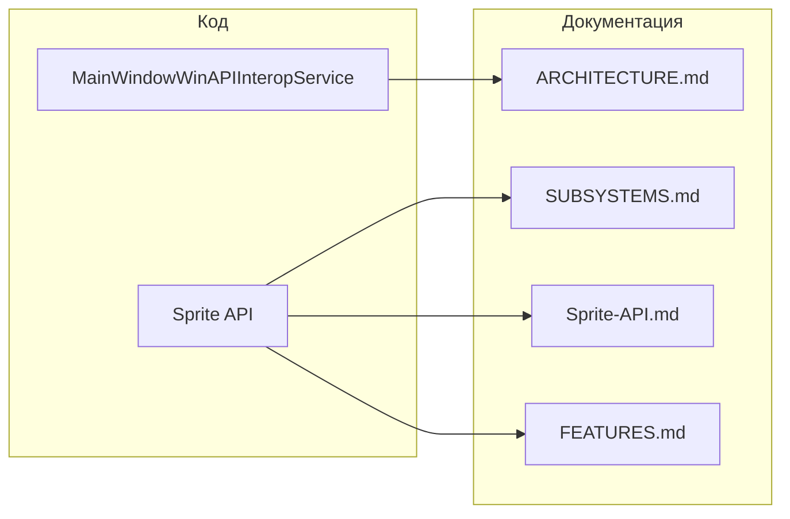

# План обновления документации (изменения с коммита 9c2e21f)

## Анализ изменений в коде

С коммита `9c2e21fdd05a570312b8c74e44794c636a6b489d` в репозитории выполнены 4 коммита:

| Коммит  | Изменение                                                                                                                  |
| ------- | -------------------------------------------------------------------------------------------------------------------------- |
| efd7ac7 | Добавлено свойство `Position` (Point) в класс Sprite для управления позицией anchor                                        |
| 6197956 | Добавлен конструктор `Sprite(double x, double y, string imagePath)`                                                        |
| ead0b3f | Унифицирована инициализация GraphicElements во всех конструкторах Sprite (фильтрация null, единый стиль)                   |
| 028a88d | Переименованы класс и интерфейс: `WindowInteropService` → `MainWindowWinAPIInteropService`, файлы приведены к новым именам |

**Затронутые области:**

- Подсистема WinAPI-интеграции окна (только имена файлов/типов в документации)
- Sprite API: новый API и поведение конструкторов

---

## 1. Требования к обновлению документации

- **Цель:** привести документацию в соответствие с текущим кодом после указанных коммитов.
- **Входные данные:** текущие версии [ARCHITECTURE.md](docs/ARCHITECTURE.md), [SUBSYSTEMS.md](docs/SUBSYSTEMS.md), [Sprite-API.md](docs/Sprite-API.md), [FEATURES.md](docs/FEATURES.md).
- **Выходные данные:** обновлённые разделы в этих файлах без противоречий с кодом.
- **Ограничения:** не менять структуру разделов без необходимости; сохранять тон и стиль существующей документации; не дублировать полное описание API там, где есть ссылка на Sprite-API.md.

---

## 2. Архитектурный анализ

**Затронутые документы и разделы:**

- **ARCHITECTURE.md** — секция 3.8 ссылается на устаревшее имя файла `WindowInteropService.cs`; фактические файлы: [MainWindowWinAPIInteropService.cs](KID.WPF.IDE/Services/WindowInterop/MainWindowWinAPIInteropService.cs), [IMainWindowWinAPIInteropService.cs](KID.WPF.IDE/Services/WindowInterop/Interfaces/IMainWindowWinAPIInteropService.cs).
- **SUBSYSTEMS.md** — раздел 12 «Подсистема Sprite API» не описывает свойство `Position`, конструктор с `imagePath` и единообразие инициализации `GraphicElements`.
- **Sprite-API.md** — основной документ по Sprite: нужно добавить `Position`, конструктор с путём к изображению и кратко — единообразие конструкторов.
- **FEATURES.md** — раздел 4 «Графический вывод» (Sprite API): при необходимости добавить одну-две фразы про `Position` и создание спрайта из изображения.
- **DEVELOPMENT.md** — упоминаний WindowInterop/Sprite не найдено; изменений не требуется.

---

## 3. Список задач

### Задача 1. ARCHITECTURE.md — актуализация имён файлов WinAPI-сервиса

**Файл:** [docs/ARCHITECTURE.md](docs/ARCHITECTURE.md)

**Изменения:**

- В секции **3.8. Window Interop** заменить строку с указанием файла:
  - Было: `**IMainWindowWinAPIInteropService** / **MainWindowWinAPIInteropService** (\`WindowInteropService.cs)`
  - Стало: указать актуальные файлы: интерфейс `Interfaces/IMainWindowWinAPIInteropService.cs`, реализация `MainWindowWinAPIInteropService.cs` (в каталоге `KID.WPF.IDE/Services/WindowInterop/`).

**Сложность:** низкая. **Время:** ~5 мин. **Риски:** нет.

---

### Задача 2. Sprite-API.md — свойство Position, конструктор с изображением, конструкторы

**Файл:** [docs/Sprite-API.md](docs/Sprite-API.md)

**Изменения:**

- В секции **«Координаты: X, Y (anchor)»** (или сразу после неё):
  - Добавить описание свойства `**Position`** (тип `Point`): чтение и запись позиции anchor; запись эквивалентна установке `X` и `Y`.
- Добавить подсекцию **«Конструкторы»** (или расширить существующее описание):
  - Конструктор по умолчанию `Sprite()` — anchor в (0, 0), пустой список элементов.
  - `Sprite(double x, double y, params UIElement[] graphicElements)` и перегрузка с `IEnumerable<UIElement>` — anchor в (x, y), заданные элементы; нулевые элементы отфильтровываются.
  - **Новый:** `Sprite(double x, double y, string imagePath)` — спрайт с anchor в (x, y) и одним элементом — изображением по указанному пути (через `Graphics.Image`).
- Кратко упомянуть, что во всех конструкторах список `GraphicElements` инициализируется единообразно (включая фильтрацию null).

**Сложность:** средняя. **Время:** ~15 мин. **Риски:** нет.

---

### Задача 3. SUBSYSTEMS.md — подсистема Sprite API

**Файл:** [docs/SUBSYSTEMS.md](docs/SUBSYSTEMS.md)

**Изменения:**

- В **разделе 12. Подсистема Sprite API**, в описании класса `Sprite`:
  - Добавить свойство `**Position`** (Point) — позиция anchor, чтение/запись.
  - Добавить конструктор `**Sprite(double x, double y, string imagePath)**` — создание спрайта с одним изображением по пути.
  - Добавить примечание: во всех конструкторах инициализация `GraphicElements` унифицирована (фильтрация null, приведение к списку).

**Сложность:** низкая. **Время:** ~10 мин. **Риски:** нет.

---

### Задача 4. FEATURES.md — раздел про Sprite

**Файл:** [docs/FEATURES.md](docs/FEATURES.md)

**Изменения:**

- В разделе **4. Графический вывод → Sprite API** (абзац про Sprite):
  - Добавить краткое упоминание: управление позицией anchor через свойство `**Position`** (Point).
  - Добавить: создание спрайта из одного изображения по пути — конструктор `**Sprite(x, y, imagePath)**`.

**Сложность:** низкая. **Время:** ~5 мин. **Риски:** нет.

---

### Задача 5. Проверка согласованности и перекрёстных ссылок

- Убедиться, что имена файлов и типов WinAPI упоминаются одинаково в ARCHITECTURE.md и (если появится в будущем) в SUBSYSTEMS.md.
- Проверить, что в README.md, FEATURES.md и Sprite-API.md нет противоречий по конструкторам Sprite и свойству Position.
- При необходимости обновить оглавление или навигационные ссылки внутри документов (если появятся новые подсекции в Sprite-API.md).

**Сложность:** низкая. **Время:** ~5 мин. **Риски:** минимальные.

---

## 4. Порядок выполнения

1. **Задача 1** — ARCHITECTURE.md (WinAPI): быстрая правка имён файлов.
2. **Задача 2** — Sprite-API.md: основное описание Position, конструкторов и единообразия.
3. **Задача 3** — SUBSYSTEMS.md: синхронизация описания Sprite с Sprite-API.md.
4. **Задача 4** — FEATURES.md: краткое упоминание Position и конструктора с imagePath.
5. **Задача 5** — финальная проверка согласованности и ссылок.

---

## 5. Оценка сложности

| Задача                      | Сложность | Время   | Риски       |
| --------------------------- | --------- | ------- | ----------- |
| 1. ARCHITECTURE.md (WinAPI) | Низкая    | ~5 мин  | Нет         |
| 2. Sprite-API.md            | Средняя   | ~15 мин | Нет         |
| 3. SUBSYSTEMS.md (Sprite)   | Низкая    | ~10 мин | Нет         |
| 4. FEATURES.md (Sprite)     | Низкая    | ~5 мин  | Нет         |
| 5. Проверка согласованности | Низкая    | ~5 мин  | Минимальные |

**Итого:** ориентировочно 40 минут; все задачи можно выполнять последовательно по плану выше.

---

## 6. Локализация и прочая документация

- Строки интерфейса и сообщения в коде не менялись; обновление файлов локализации не требуется.
- DEVELOPMENT.md, README.md, Console-API.md, Graphics-API.md, Music-API.md, Mouse-API.md, Keyboard-API.md в рамках данных коммитов не затрагиваются; изменения в них не предусмотрены (если только по результатам задачи 5 не появятся точечные правки ссылок).

