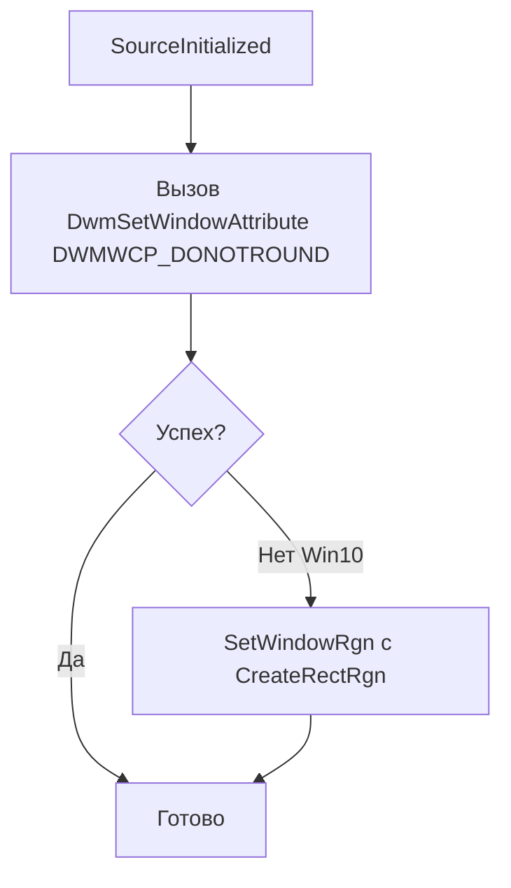

# План: отключение закругления углов окна (расширенный)

## 1. Гипотезы о причине

### Гипотеза A: DWM Windows 11 (наиболее вероятная)
**Причина:** Windows 11 автоматически закругляет углы top-level окон. Комбинация `WindowStyle="None"` + `WindowChrome` относит окно к категории «кастомизируемых», и DWM применяет закругление по умолчанию.

**Подтверждение:** Документация Microsoft, API `DWMWA_WINDOW_CORNER_PREFERENCE` (Win11 build 22000+).

### Гипотеза B: Фактически используется Windows 11
**Причина:** Окружение может быть Windows 11, а не Windows 10. Версия можно проверить (`winver` или `Environment.OSVersion`).

### Гипотеза C: Обновлённый DWM в Windows 10
**Причина:** В поздних обновлениях Windows 10 (22H2 и новее) DWM мог получить частичную поддержку закругления.

### Гипотеза D: Влияние WindowChrome
**Причина:** `WindowChrome` с `GlassFrameThickness="0"` расширяет клиентскую область до краёв окна. DWM может иначе обрабатывать такие окна и рисовать закруглённую рамку.

### Гипотеза E: CornerRadius в теме
**Причина:** В XAML или в теме у `Border` может быть задан `CornerRadius`.

**Проверка:** В [LightTheme.xaml](KID.WPF.IDE/Themes/LightTheme.xaml) и [MainWindow.xaml](KID.WPF.IDE/MainWindow.xaml) `CornerRadius` не задан — эта гипотеза маловероятна.

### Гипотеза F: Артефакт DPI / сглаживания
**Причина:** При определённом масштабировании DPI край окна может выглядеть слегка закруглённым из‑за сглаживания.

**Вероятность:** Низкая при «отчётливо закруглённых» углах.

### Гипотеза G: Тень окна
**Причина:** Мягкая тень DWM может создавать впечатление закругления.

**Вероятность:** Низкая; тень обычно подчёркивает, а не создаёт форму углов.

---

## 2. Варианты решения

### Вариант 1: DwmSetWindowAttribute + DWMWCP_DONOTROUND

**Суть:** Вызов `DwmSetWindowAttribute` с атрибутом `DWMWA_WINDOW_CORNER_PREFERENCE` (33) и значением `DWMWCP_DONOTROUND` (1).

**Плюсы:** Официальный API, минимум кода, не требует обновления при resize.  
**Минусы:** Только Windows 11 (build 22000+).  
**Файл:** [MainWindow.xaml.cs](KID.WPF.IDE/MainWindow.xaml.cs) — P/Invoke и вызов в `OnSourceInitialized`.

---

### Вариант 2: SetWindowRgn + CreateRectRgn

**Суть:** Задать прямоугольную область окна через `CreateRectRgn` и `SetWindowRgn`. Жёстко обрезает окно по прямоугольнику и перекрывает DWM-закругление.

**Плюсы:** Работает на Windows 10 и 11, не зависит от DWM API.  
**Минусы:** Обновление региона при каждом resize/DPI; возможное влияние на тень; требуется P/Invoke `GetWindowRect`, `CreateRectRgn`, `SetWindowRgn`, `DeleteObject`.

**Реализация:** Обработка `WM_SIZE` в `WindowProc` и подписка на `SizeChanged` в WPF. Размер и масштаб DPI брать из Win32 (GetWindowRect + DPI).

---

### Вариант 3: Откат WindowChrome

**Суть:** Удалить `WindowChrome` и вернуть `WindowStyle="None"` без расширения клиентской области.

**Плюсы:** На Windows 10 окно может снова стать прямоугольным.  
**Минусы:** Возвращается белый зазор сверху.  
**Файл:** [MainWindow.xaml](KID.WPF.IDE/MainWindow.xaml) — удалить `Window.Style` с `WindowChrome`.

---

### Вариант 4: DWMWA_NCRENDERING_POLICY + DWMNCRP_DISABLED

**Суть:** Отключить отрисовку non-client области через `DwmSetWindowAttribute` с `DWMWA_NCRENDERING_POLICY`.

**Плюсы:** Может убрать часть DWM-оформления, включая закругление.  
**Минусы:** Влияние на рамку и тень; поведение может отличаться в разных версиях Windows.  
**Файл:** [MainWindow.xaml.cs](KID.WPF.IDE/MainWindow.xaml.cs).

---

### Вариант 5: Явный CornerRadius="0" на Border

**Суть:** Добавить `CornerRadius="0"` на корневой `Border` в MainWindow.

**Плюсы:** Простое изменение в XAML.  
**Минусы:** По умолчанию `CornerRadius` и так 0; вряд ли устранит системное закругление.  
**Файл:** [MainWindow.xaml](KID.WPF.IDE/MainWindow.xaml).

---

### Вариант 6: Комбинированный подход

**Суть:** Сначала пробовать `DwmSetWindowAttribute` (Win11). При неудаче — `SetWindowRgn` (Win10 и другие случаи).

---

## 3. Рекомендуемый порядок действий

1. **Проверить версию ОС** — `winver` или код: `Environment.OSVersion` / `RtlGetVersion`.
2. **Применить Вариант 1** — `DwmSetWindowAttribute` с `DWMWCP_DONOTROUND` (подходит для Win11).
3. **При сохранении проблемы** — добавить Вариант 2 (`SetWindowRgn` + `CreateRectRgn`) для Win10 и краевых случаев.

---

## 4. Список задач

| # | Задача | Вариант | Файл |
|---|--------|---------|------|
| 1 | Добавить P/Invoke DwmSetWindowAttribute | 1 | MainWindow.xaml.cs |
| 2 | Вызвать DwmSetWindowAttribute в OnSourceInitialized | 1 | MainWindow.xaml.cs |
| 3 | (Опционально) P/Invoke SetWindowRgn, CreateRectRgn, GetWindowRect | 2 | MainWindow.xaml.cs |
| 4 | (Опционально) Обработка WM_SIZE / SizeChanged для SetWindowRgn | 2 | MainWindow.xaml.cs |

---

## 5. Оценка

| Вариант | Сложность | Время | Риски |
|---------|-----------|-------|-------|
| DwmSetWindowAttribute | Низкая | 10 мин | Не сработает на Win10 |
| SetWindowRgn | Средняя | 25 мин | Обновление при resize, DPI |
| Откат WindowChrome | Низкая | 5 мин | Возврат белого зазора |
| Комбинированный | Средняя | 35 мин | — |
