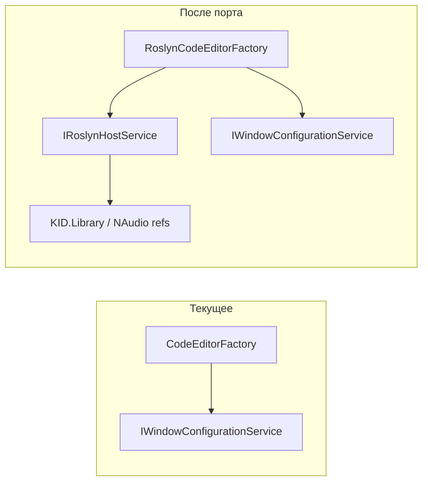

# План портирования на RoslynCodeEditor

## 1. Анализ требований

**Цель:** заменить использование «голого» AvalonEdit на RoslynCodeEditor (RoslynPad) с IntelliSense и подсветкой на базе Roslyn, сохранив текущий контракт ICodeEditorFactory и поведение вкладок.

**Целевая аудитория:** разработчик IDE KID и пользователи редактора кода.

**Входные/выходные данные:**

- Фабрика по-прежнему возвращает `TextEditor` (базовый тип AvalonEdit); RoslynCodeEditor наследует от него, поэтому [ICodeEditorFactory](KID.WPF.IDE/Services/CodeEditor/Interfaces/ICodeEditorFactory.cs) не меняется.
- [OpenedFileTab.CodeEditor](KID.WPF.IDE/Models/OpenedFileTab.cs) остаётся типа `TextEditor?` — присваивание экземпляра RoslynCodeEditor допустимо.
- [CodeEditorsViewModel](KID.WPF.IDE/ViewModels/CodeEditorsViewModel.cs) создаёт вкладки через `codeEditorFactory.Create(content, programmingLanguage)` и подписывается на `TextChanged`, использует `CanUndo`/`CanRedo`/`Undo()`/`Redo()` и `Text` — всё есть у наследника TextEditor.

**Ограничения:**

- Совместимость версий: RoslynPad 4.12.x опирается на Microsoft.CodeAnalysis; в проекте сейчас 4.13.0 — нужно понизить до 12.x и согласовать с пакетами RoslynPad 4.12.1.
- CSharpCompiler использует [Microsoft.CodeAnalysis](KID.WPF.IDE/Services/CodeExecution/CSharpCompiler.cs) для компиляции пользовательского кода и собирает ссылки из `AppDomain.CurrentDomain.GetAssemblies()` (в т.ч. KID.Library, NAudio). Эти же сборки и пространства имён должны быть доступны в RoslynHost для IntelliSense (например, `using KID;` как в [WindowConfigurationData.TemplateCode](KID.WPF.IDE/Models/WindowConfigurationData.cs)).

---

## 2. Архитектурный анализ

**Затронутые подсистемы:**

- Сервисы редактора кода (фабрика, новый хост Roslyn).
- DI ([ServiceCollectionExtensions](KID.WPF.IDE/Services/DI/ServiceCollectionExtensions.cs)).
- При необходимости — представление [CodeEditorsView.xaml](KID.WPF.IDE/Views/CodeEditorsView.xaml) (стили для RoslynCodeEditor).

**Новые компоненты:**

- `IRoslynHostService` + `RoslynHostService` — создание и настройка `RoslynHost` (ссылки: KID.Library, NAudio, стандартные; импорты по умолчанию: System, KID и при необходимости KID.Services.CodeExecution).
- `RoslynCodeEditorFactory` — реализация [ICodeEditorFactory](KID.WPF.IDE/Services/CodeEditor/Interfaces/ICodeEditorFactory.cs): создание `RoslynCodeEditor`, вызов `Initialize(roslynHost, colors, workingDirectory, …)`, применение настроек из IWindowConfigurationService (шрифт и т.д.), возврат экземпляра как `TextEditor`.

**Изменяемые компоненты:**

- [CodeEditorFactory.cs](KID.WPF.IDE/Services/CodeEditor/CodeEditorFactory.cs) — переименовать класс и файл в `AvalonTextEditorFactory` (интерфейс не трогать).
- [KID.WPF.IDE.csproj](KID.WPF.IDE/KID.WPF.IDE.csproj) — пакеты: добавить RoslynPad.*, зафиксировать Microsoft.CodeAnalysis 12.x.
- [ServiceCollectionExtensions.cs](KID.WPF.IDE/Services/DI/ServiceCollectionExtensions.cs) — зарегистрировать IRoslynHostService/RoslynHostService, заменить привязку ICodeEditorFactory на RoslynCodeEditorFactory.

**Зависимости:**

- RoslynCodeEditorFactory зависит от IRoslynHostService, IWindowConfigurationService.
- RoslynHostService может зависеть от путей/сборок приложения (KID.Library, NAudio) — через отражение или явный список сборок для references/imports.

---

## 3. Список задач и порядок выполнения

### 3.1. Переименование текущей фабрики

- Переименовать файл [CodeEditorFactory.cs](KID.WPF.IDE/Services/CodeEditor/CodeEditorFactory.cs) в `AvalonTextEditorFactory.cs`.
- В файле: класс `CodeEditorFactory` переименовать в `AvalonTextEditorFactory`, реализация `ICodeEditorFactory` без изменений.
- В [ServiceCollectionExtensions.cs](KID.WPF.IDE/Services/DI/ServiceCollectionExtensions.cs) пока оставить регистрацию `ICodeEditorFactory` → `CodeEditorFactory`; после появления RoslynCodeEditorFactory заменить на неё (см. ниже). Если переименование делается в одном коммите с портом — сразу регистрировать RoslynCodeEditorFactory; при этом AvalonTextEditorFactory можно не регистрировать в DI (оставить в решении для возможности отката или тестов).

### 3.2. Пакеты

- В [KID.WPF.IDE.csproj](KID.WPF.IDE/KID.WPF.IDE.csproj):
  - Добавить:
    - `RoslynPad.Editor.Windows` 4.12.1
    - `RoslynPad.Roslyn` 4.12.1
    - `RoslynPad.Roslyn.Windows` 4.12.1
  - Зафиксировать `Microsoft.CodeAnalysis` и `Microsoft.CodeAnalysis.CSharp` на версии **12** (например 12.0.0 или совместимой с 4.12.1; при необходимости уточнить по документации RoslynPad 4.12.1).
- Убедиться, что после восстановления пакетов проект собирается и конфликтов версий нет.

### 3.3. RoslynHostService

- Создать интерфейс `IRoslynHostService` (например в `KID.WPF.IDE/Services/CodeEditor/Interfaces/IRoslynHostService.cs`): метод, возвращающий экземпляр `RoslynHost` (или фабричный метод для создания хоста), с учётом того, что хост обычно один на приложение.
- Создать класс `RoslynHostService` (например в `KID.WPF.IDE/Services/CodeEditor/RoslynHostService.cs`):
  - Формировать `RoslynHost` с:
    - `additionalAssemblies`: при необходимости для WPF-редактора (например сборки RoslynPad.Editor.Windows / RoslynPad.Roslyn.Windows по документации).
    - `references`: на базе `RoslynHostReferences.NamespaceDefault` (или аналога в 4.12) с добавлением ссылок на KID.Library и NAudio (как в [CSharpCompiler](KID.WPF.IDE/Services/CodeExecution/CSharpCompiler.cs)) и импортов по умолчанию (`System`, `KID`, при необходимости `KID.Services.CodeExecution` для IntelliSense по шаблону).
  - Рабочую директорию для документов можно задавать фиксированную (например текущая директория приложения или специальная папка) и при необходимости передавать в фабрику редактора.
- Зарегистрировать в DI: `services.AddSingleton<IRoslynHostService, RoslynHostService>();`.

### 3.4. RoslynCodeEditorFactory

- Создать класс [RoslynCodeEditorFactory](KID.WPF.IDE/Services/CodeEditor/RoslynCodeEditorFactory.cs):
  - Зависимости: `IRoslynHostService`, `IWindowConfigurationService`.
  - Реализовать `ICodeEditorFactory.Create(string content, string programmingLanguage)`:
    - Получить `RoslynHost` из IRoslynHostService.
    - Создать экземпляр `RoslynCodeEditor` (из RoslynPad.Editor / RoslynPad.Editor.Windows).
    - Вызвать `Initialize(roslynHost, new ClassificationHighlightColors(), workingDirectory, content)` (или с пустым документом и затем установить Text — по API RoslynPad 4.12).
    - Применить к редактору настройки из `IWindowConfigurationService.Settings` (ShowLineNumbers, WordWrap, шрифт — через свойства, наследующиеся от TextEditor).
    - Вернуть экземпляр как `TextEditor`.
  - Учесть, что параметр `programmingLanguage` для C# можно игнорировать или использовать для будущего расширения; RoslynCodeEditor ориентирован на C#.
- В [ServiceCollectionExtensions.cs](KID.WPF.IDE/Services/DI/ServiceCollectionExtensions.cs): заменить регистрацию на `services.AddSingleton<ICodeEditorFactory, RoslynCodeEditorFactory>();`, добавить `using` при необходимости.

### 3.5. XAML и стили

- В [CodeEditorsView.xaml](KID.WPF.IDE/Views/CodeEditorsView.xaml) сейчас задан `Style` с `TargetType="avalonedit:TextEditor"`. В WPF стиль с таким TargetType применяется только к элементу типа TextEditor, а не к производным. Поэтому при отображении `RoslynCodeEditor` через `ContentPresenter Content="{Binding CodeEditor}"` этот стиль не применится.
- Добавить xmlns для RoslynPad.Editor (или RoslynPad.Editor.Windows), где определён RoslynCodeEditor.
- Добавить второй `Style` с `TargetType`, соответствующим RoslynCodeEditor, с теми же сеттерами (Background, Foreground, FontFamily, FontSize), чтобы визуально поведение совпало с текущим. Либо задать один общий стиль по ключу и применять его к редактору из кода при создании в фабрике — если так проще.

### 3.6. Дополнительные настройки и обводки

- По результатам теста: если нужны особые настройки (подсветка ошибок, цветовая тема ClassificationHighlightColors из темы приложения), расширить IRoslynHostService или фабрику и при необходимости IWindowConfigurationService/темы.
- Если RoslynCodeEditor предоставляет панель поиска (например SearchReplacePanel) и её нужно скрыть или настроить — делать это в RoslynCodeEditorFactory после создания контрола.

### 3.7. Документация и локализация

- Обновить [docs/SUBSYSTEMS.md](docs/SUBSYSTEMS.md) и [docs/ARCHITECTURE.md](docs/ARCHITECTURE.md): описать переход на RoslynCodeEditor, RoslynHostService и RoslynCodeEditorFactory; при необходимости обновить диаграммы зависимостей.
- Локализация: если появятся новые пользовательские строки в UI — добавить ключи в ресурсы и использовать их; текущая функциональность фабрики не добавляет новых сообщений.

### 3.8. Тестирование

- Сборка решения, открытие приложения, создание/закрытие вкладок, ввод кода с использованием KID/Graphics, сохранение, Undo/Redo.
- Проверка IntelliSense для `KID`, `Graphics`, `System` и т.д.
- Проверка компиляции и запуска кода (CSharpCompiler по-прежнему использует свой набор ссылок; версии Roslyn должны быть совместимы).

---

## 4. Порядок выполнения

1. Переименовать CodeEditorFactory → AvalonTextEditorFactory (файл и класс).
2. Обновить csproj: пакеты RoslynPad.* и Microsoft.CodeAnalysis 12.
3. Реализовать IRoslynHostService и RoslynHostService с references/imports для KID и NAudio.
4. Реализовать RoslynCodeEditorFactory и зарегистрировать его в DI вместо текущей фабрики.
5. Обновить CodeEditorsView.xaml: стиль для RoslynCodeEditor.
6. При необходимости доработать настройки/обводки/темы.
7. Обновить документацию.
8. Ручное тестирование сценариев выше.

---

## 5. Оценка сложности и риски

| Задача                  | Сложность      | Время     | Риски                                                                                                                                                    |
| ----------------------- | -------------- | --------- | -------------------------------------------------------------------------------------------------------------------------------------------------------- |
| Переименование фабрики  | Низкая         | 5–10 мин  | Нет.                                                                                                                                                     |
| Пакеты и версии         | Низкая         | 10–15 мин | Конфликт версий Microsoft.CodeAnalysis 12 vs 4.13 в других пакетах — проверить совместимость RoslynPad 4.12.1 с CA 12.                                   |
| RoslynHostService       | Средняя        | 30–45 мин | Точный API RoslynHostReferences в 4.12 (With/NamespaceDefault) может отличаться — смотреть исходники/документацию пакета.                                |
| RoslynCodeEditorFactory | Средняя        | 30–40 мин | Сигнатура Initialize (workingDirectory, начальный текст) — уточнить по API; порядок вызовов (сначала Initialize, потом Text?) может влиять на поведение. |
| Стили XAML              | Низкая         | 15 мин    | Только дублирование стиля под новый тип.                                                                                                                 |
| Доп. настройки          | Низкая–средняя | 15–30 мин | Зависит от объёма пожеланий (темы, панель поиска).                                                                                                       |
| Документация            | Низкая         | 15–20 мин | —                                                                                                                                                        |
| Тестирование            | Средняя        | 20–30 мин | Регрессии в компиляции/запуске кода при смене версии CA.                                                                                                 |

**Общее:** средняя сложность; основная неопределённость — точный API RoslynHost/RoslynHostReferences и Initialize в версии 4.12.1 и совместимость версий Microsoft.CodeAnalysis.