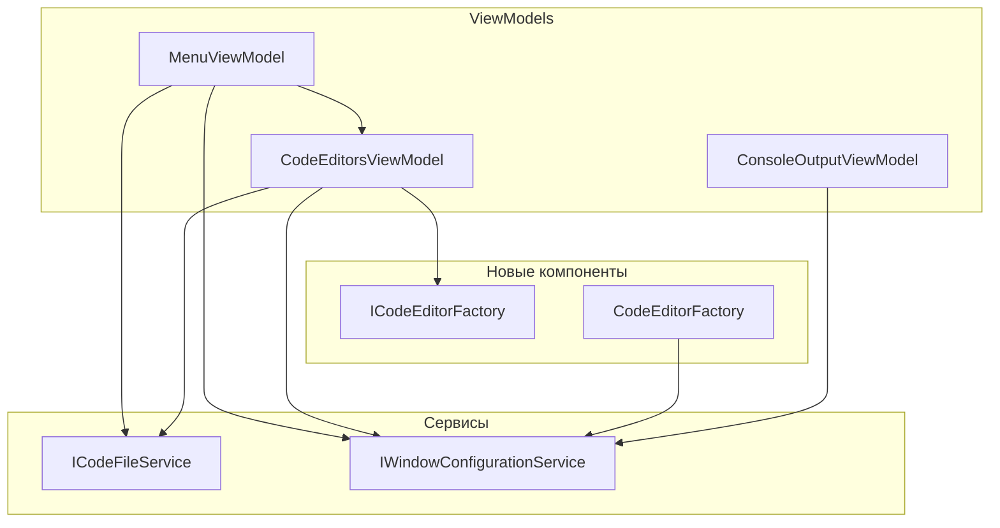

# План рефакторинга MenuViewModel и CodeEditorsViewModel

## 1. Анализ требований

### Целевые задачи

1. **async void** — заменить на async Task с try/catch, ConfigureAwait(false) и показом ошибок пользователю
2. **IsNewFilePath** — добавить метод в ICodeFileService
3. **RelayCommand** — добавить RaiseCanExecuteChanged() и вызывать его вместо CommandManager.InvalidateRequerySuggested()
4. **IFontSettingsService** — централизовать хранение и рассылку настроек шрифта
5. **ICodeEditorFactory** — вынести создание TextEditor из CodeEditorsViewModel
6. **IMenuViewModel** — добавить ChangeLanguageCommand, ChangeThemeCommand, ChangeFontCommand, ChangeFontSizeCommand

### Ограничения

- Сохранить существующее поведение UI
- Без изменения публичных API View (MenuView.xaml уже использует ChangeFontCommand и т.д.)
- Проект без ILogger — для ошибок использовать MessageBox и локализацию

---

## 2. Архитектурный анализ

### Диаграмма зависимостей после рефакторинга




### Затронутые подсистемы

- [MenuViewModel.cs](KID.WPF.IDE/ViewModels/MenuViewModel.cs)
- [CodeEditorsViewModel.cs](KID.WPF.IDE/ViewModels/CodeEditorsViewModel.cs)
- [RelayCommand.cs](KID.WPF.IDE/ViewModels/Infrastructure/RelayCommand.cs)
- [WindowInitializationService.cs](KID.WPF.IDE/Services/Initialize/WindowInitializationService.cs)
- [ConsoleOutputViewModel.cs](KID.WPF.IDE/ViewModels/ConsoleOutputViewModel.cs)
- [ServiceCollectionExtensions.cs](KID.WPF.IDE/Services/DI/ServiceCollectionExtensions.cs)
- [App.xaml.cs](KID.WPF.IDE/App.xaml.cs)

---

## 3. Список задач

### Задача 1: Метод IsNewFilePath в ICodeFileService (приоритет 1)

**Изменить:** [KID.WPF.IDE/Services/Files/Interfaces/ICodeFileService.cs](KID.WPF.IDE/Services/Files/Interfaces/ICodeFileService.cs)

Добавить метод в интерфейс:
```csharp
/// <summary>
/// Возвращает true, если путь указывает на новый несохранённый файл.
/// </summary>
bool IsNewFilePath(string path);
```

**Изменить:** [KID.WPF.IDE/Services/Files/CodeFileService.cs](KID.WPF.IDE/Services/Files/CodeFileService.cs)

Реализовать метод:
```csharp
public bool IsNewFilePath(string path) =>
    path.EndsWith("NewFile.cs", StringComparison.OrdinalIgnoreCase) ||
    path == "/NewFile.cs";
```

**Изменить:**
- [MenuViewModel.cs](KID.WPF.IDE/ViewModels/MenuViewModel.cs): удалить приватный `IsNewFilePath`, заменить вызовы на `codeFileService.IsNewFilePath(path)`
- [CodeEditorsViewModel.cs](KID.WPF.IDE/ViewModels/CodeEditorsViewModel.cs): удалить статический `IsNewFilePath`, заменить вызовы на `codeFileService.IsNewFilePath(path)` (ICodeFileService уже внедрён)

---

### Задача 2: Обновление IMenuViewModel (приоритет 2)

**Изменить:** [KID.WPF.IDE/ViewModels/Interfaces/IMenuViewModel.cs](KID.WPF.IDE/ViewModels/Interfaces/IMenuViewModel.cs)

Добавить в интерфейс:

```csharp
ICommand ChangeLanguageCommand { get; }
ICommand ChangeThemeCommand { get; }
ICommand ChangeFontCommand { get; }
ICommand ChangeFontSizeCommand { get; }
```

---

### Задача 3: RelayCommand с RaiseCanExecuteChanged (приоритет 3)

**Изменить:** [KID.WPF.IDE/ViewModels/Infrastructure/RelayCommand.cs](KID.WPF.IDE/ViewModels/Infrastructure/RelayCommand.cs)

- Добавить приватное поле `event EventHandler _canExecuteChanged`
- Реализовать `event EventHandler CanExecuteChanged` так, чтобы добавлять/удалять подписчика в `_canExecuteChanged`
- Добавить публичный метод `public void RaiseCanExecuteChanged() => _canExecuteChanged?.Invoke(this, EventArgs.Empty);`
- Сохранить совместимость с `CommandManager.RequerySuggested` при необходимости (по желанию — можно оставить только RaiseCanExecuteChanged)

**Изменить:** [MenuViewModel.cs](KID.WPF.IDE/ViewModels/MenuViewModel.cs)

- В `CodeEditorViewModel_PropertyChanged`: вместо `CommandManager.InvalidateRequerySuggested()` вызывать `SaveFileCommand.RaiseCanExecuteChanged()` (и др. при необходимости). RelayCommand реализует ICommand, нужно привести к типу с RaiseCanExecuteChanged — создать интерфейс `IRaiseCanExecuteChanged` или изменить RelayCommand.
- В сеттере `IsStopButtonEnabled`: вызывать `RunCommand.RaiseCanExecuteChanged()`, `StopCommand.RaiseCanExecuteChanged()`

**Вариант:** RelayCommand наследует ICommand. Добавить в RelayCommand метод `RaiseCanExecuteChanged()`. В MenuViewModel команды объявлены как `ICommand`, но фактически RelayCommand — можно объявить как `RelayCommand` для сохранения ссылки, либо создать интерфейс `ICommandWithRaiseCanExecute` с методом `RaiseCanExecuteChanged()`.

**Рекомендация:** Создать интерфейс `IRaisableCommand : ICommand { void RaiseCanExecuteChanged(); }`. RelayCommand реализует его. В MenuViewModel хранить `RelayCommand` (или `IRaisableCommand`) для команд, которым нужен ручной вызов.

**Изменить:** [CodeEditorsViewModel.cs](KID.WPF.IDE/ViewModels/CodeEditorsViewModel.cs)

- В `ActiveFile` setter, `AddFile` (TextChanged), `ExecuteMoveTabLeft`, `ExecuteMoveTabRight`: заменить `CommandManager.InvalidateRequerySuggested()` на вызовы `SaveFileCommand.RaiseCanExecuteChanged()` и других затронутых команд

---

### Задача 4: Расширение IWindowConfigurationService для шрифтов (приоритет 4)

Вместо отдельного IFontSettingsService — расширяем существующий IWindowConfigurationService. Меньше кода, нет дублирования (Settings уже хранит FontFamily и FontSize).

**Изменить:** [KID.WPF.IDE/Services/Initialize/Interfaces/IWindowConfigurationService.cs](KID.WPF.IDE/Services/Initialize/Interfaces/IWindowConfigurationService.cs)

Добавить в интерфейс:
```csharp
/// <summary>
/// Событие при изменении шрифта. Вызывается из SetFont.
/// </summary>
event EventHandler FontSettingsChanged;

/// <summary>
/// Устанавливает шрифт, сохраняет в Settings и уведомляет подписчиков.
/// </summary>
void SetFont(string fontFamilyName, double fontSize);
```

**Изменить:** [KID.WPF.IDE/Services/Initialize/WindowConfigurationService.cs](KID.WPF.IDE/Services/Initialize/WindowConfigurationService.cs)

- Добавить `event EventHandler? FontSettingsChanged`
- Реализовать `SetFont`: обновить `Settings.FontFamily`, `Settings.FontSize`, вызвать `SaveSettings()`, поднять `FontSettingsChanged`

**Изменить:** [MenuViewModel.cs](KID.WPF.IDE/ViewModels/MenuViewModel.cs)

- `ChangeFont`: вызывать `windowConfigurationService.SetFont(fontFamilyName, fontSize)` вместо прямого изменения ViewModels
- `ChangeFontSize`: аналогично
- Подписаться на `FontSettingsChanged` для `OnPropertyChanged(SelectedFontFamily)` и `OnPropertyChanged(SelectedFontSize)`
- `SelectedFontFamily` и `SelectedFontSize` оставить как есть (читают из `windowConfigurationService.Settings`)

**Изменить:** [CodeEditorsViewModel.cs](KID.WPF.IDE/ViewModels/CodeEditorsViewModel.cs)

- Добавить `IWindowConfigurationService` в конструктор (уже есть)
- Подписаться на `FontSettingsChanged`: при событии применять `FontFamily = new FontFamily(Settings.FontFamily)` и `FontSize = Settings.FontSize` ко всем вкладкам

**Изменить:** [ConsoleOutputViewModel.cs](KID.WPF.IDE/ViewModels/ConsoleOutputViewModel.cs)

- Добавить `IWindowConfigurationService windowConfigurationService` в конструктор
- Подписаться на `FontSettingsChanged`: при событии применять шрифт из Settings
- При `Initialize` применять текущий шрифт из Settings (если Control уже создан)

**Изменить:** [WindowInitializationService.cs](KID.WPF.IDE/Services/Initialize/WindowInitializationService.cs)

- В `ApplyCodeEditorSettings`: убрать установку шрифта — ICodeEditorFactory создаёт редактор с шрифтом из Settings
- В `InitializeConsole`: убрать установку шрифта — ConsoleOutputViewModel в Initialize применит шрифт из Settings

**Изменить:** [App.xaml.cs](KID.WPF.IDE/App.xaml.cs)

- При сохранении настроек при закрытии: FontFamily/FontSize уже в Settings (обновляются через SetFont), дополнительных действий не требуется

---

### Задача 5: ICodeEditorFactory (приоритет 5)

**Создать:** [KID.WPF.IDE/Services/CodeEditor/Interfaces/ICodeEditorFactory.cs](KID.WPF.IDE/Services/CodeEditor/Interfaces/ICodeEditorFactory.cs)

```csharp
public interface ICodeEditorFactory
{
    TextEditor Create(string content, string programmingLanguage);
}
```

**Создать:** [KID.WPF.IDE/Services/CodeEditor/CodeEditorFactory.cs](KID.WPF.IDE/Services/CodeEditor/CodeEditorFactory.cs)

- Конструктор: `IWindowConfigurationService`
- `Create`: создаёт TextEditor с `content`, `WordWrap`, `ShowLineNumbers`, синтаксис из `programmingLanguage`, шрифт из `windowConfigurationService.Settings`, кисти из `Application.Current.FindResource`

**Изменить:** [ServiceCollectionExtensions.cs](KID.WPF.IDE/Services/DI/ServiceCollectionExtensions.cs)

- `services.AddSingleton<ICodeEditorFactory, CodeEditorFactory>();`

**Изменить:** [CodeEditorsViewModel.cs](KID.WPF.IDE/ViewModels/CodeEditorsViewModel.cs)

- Добавить `ICodeEditorFactory codeEditorFactory`
- Удалить `CreateCodeEditor`
- В `AddFile`: вызывать `codeEditorFactory.Create(content, windowConfigurationService.Settings.ProgrammingLanguage)`

---

### Задача 6: async void → async Task с обработкой ошибок (приоритет 6)

**Локализация:** Добавить в [Strings.ru-RU.resx](KID.WPF.IDE/Resources/Strings.ru-RU.resx), [Strings.en-US.resx](KID.WPF.IDE/Resources/Strings.en-US.resx), [Strings.uk-UA.resx](KID.WPF.IDE/Resources/Strings.uk-UA.resx):

- `Error_FileOpenFailed` — "Не удалось открыть файл: {0}"
- `Error_FileSaveFailed` — "Не удалось сохранить файл: {0}"
- `Error_RunFailed` — "Ошибка при выполнении: {0}"

**Создать:** Вспомогательный метод в MenuViewModel (или отдельный helper):

```csharp
private async void ExecuteAsync(Func<Task> asyncAction)
{
    try
    {
        await asyncAction().ConfigureAwait(false);
    }
    catch (Exception ex)
    {
        Dispatcher.Invoke(() => MessageBox.Show(
            string.Format(localizationService.GetString("Error_FileOpenFailed"), ex.Message),
            localizationService.GetString("Error_Title"),
            MessageBoxButton.OK, MessageBoxImage.Error));
    }
}
```

**Изменить:** [MenuViewModel.cs](KID.WPF.IDE/ViewModels/MenuViewModel.cs)

- `ExecuteOpenFile`: `private async Task ExecuteOpenFileAsync()` — логика перенесена, обёрнута в try/catch
- `OpenFileCommand`: `new RelayCommand(() => ExecuteAsync(ExecuteOpenFileAsync))`
- Аналогично для `ExecuteSaveFile`, `ExecuteSaveAsFile`, `ExecuteRun`
- Для ExecuteRun: в finally обязательно сбрасывать `IsStopButtonEnabled = false`

**Изменить:** [CodeEditorsViewModel.cs](KID.WPF.IDE/ViewModels/CodeEditorsViewModel.cs)

- `ExecuteSaveFile`, `ExecuteSaveAsFile`, `ExecuteSaveAndSetAsTemplate`: переписать на `async Task` и обернуть вызов в try/catch. Но CodeEditorsViewModel не имеет доступа к ILocalizationService для MessageBox — нужно добавить ILocalizationService для отображения ошибок, либо передавать ошибку выше (в MenuViewModel ExecuteSaveAndSetAsTemplate вызывается из MenuViewModel — там можно обработать). Для команд из контекстного меню вкладок ошибки нужно показывать в CodeEditorsViewModel — добавить ILocalizationService.

---

## 4. Порядок выполнения


| Шаг | Задача                              | Зависимости          |
| --- | ----------------------------------- | -------------------- |
| 1   | IsNewFilePath в ICodeFileService    | —                    |
| 2   | IMenuViewModel — команды            | —                    |
| 3   | RelayCommand RaiseCanExecuteChanged | —                    |
| 4   | Расширение IWindowConfigurationService | —                    |
| 5   | ICodeEditorFactory                  | —                    |
| 6   | async void → async Task             | Локализация          |


---

## 5. Оценка сложности


| Задача                  | Сложность | Время  | Риски                                                          |
| ----------------------- | --------- | ------ | -------------------------------------------------------------- |
| 1. IsNewFilePath в ICodeFileService | Низкая | 15 мин | Нет |
| 2. IMenuViewModel       | Низкая    | 5 мин  | Нет                                                            |
| 3. RelayCommand         | Средняя   | 45 мин | Нужно аккуратно заменить все вызовы InvalidateRequerySuggested |
| 4. Расширение IWindowConfigurationService | Средняя | 40 мин | Порядок инициализации, подписка при создании вкладок |
| 5. ICodeEditorFactory   | Средняя   | 40 мин | Вынести логику CreateCodeEditor                                |
| 6. async void           | Средняя   | 50 мин | ExecuteRun: гарантировать сброс IsStopButtonEnabled в finally  |


---

## 6. Документация

После рефакторинга обновить:

- [docs/SUBSYSTEMS.md](docs/SUBSYSTEMS.md) — описать расширение IWindowConfigurationService (FontSettingsChanged, SetFont), ICodeEditorFactory, метод IsNewFilePath в ICodeFileService
- [docs/ARCHITECTURE.md](docs/ARCHITECTURE.md) — обновить диаграммы зависимостей (если есть)

