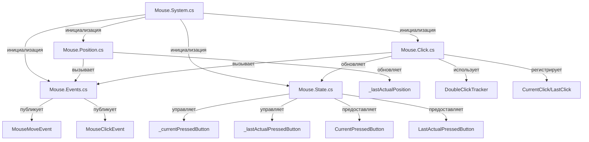

# План рефакторинга Mouse API

## 1. Анализ текущего состояния

### Выявленные проблемы

#### 1.1. Дублирование кода (DRY violation)

**Проблема:** Обработчики для левой и правой кнопок мыши практически идентичны

- `OnMouseLeftButtonDown` и `OnMouseRightButtonDown` - дублирование логики
- `OnMouseLeftButtonUp` и `OnMouseRightButtonUp` - дублирование логики
- `StartLeftClickTimer` и `StartRightClickTimer` - дублирование логики
- `StopLeftClickTimer` и `StopRightClickTimer` - дублирование логики

**Файлы:** `Mouse.Click.cs` (строки 89-220, 244-307)

#### 1.2. Смешение ответственности

**Проблема:** `Mouse.Position.cs` обновляет состояние кнопок, хотя это должно быть в `Mouse.Click.cs`

- Обновление `_currentPressedButton` и `_lastActualPressedButton` в `OnMouseMove` и `OnMouseLeave`
- Нарушение принципа единственной ответственности

**Файлы:** `Mouse.Position.cs` (строки 64-68, 89-93)

#### 1.3. Дублирование InvokeOnUI

**Проблема:** Метод `InvokeOnUI` дублируется в трех классах:

- `Graphics.System.cs`
- `Music.System.cs`
- `Mouse.System.cs`

**Решение:** Вынести в общий утилитный класс или базовый класс

#### 1.4. Разбросанная логика обновления состояния

**Проблема:** Логика обновления `_lastActualPressedButton` повторяется в нескольких местах:

- В `OnMouseLeftButtonDown` (строка 103)
- В `OnMouseRightButtonDown` (строка 146)
- В `OnMouseLeftButtonUp` (строка 188)
- В `OnMouseRightButtonUp` (строка 213)
- В `OnMouseMove` (строка 68)
- В `OnMouseLeave` (строка 90)

**Решение:** Вынести в отдельный метод `UpdateLastActualPressedButton()`

#### 1.5. Отсутствие структуры для отслеживания двойных кликов

**Проблема:** Информация о потенциальном двойном клике хранится в отдельных полях:

- `_lastLeftClickTime`, `_lastLeftClickPosition`, `_leftClickTimer`
- `_lastRightClickTime`, `_lastRightClickPosition`, `_rightClickTimer`

**Решение:** Создать структуру `DoubleClickTracker` для унификации

#### 1.6. Магические числа

**Проблема:** Константы разбросаны по коду:

- `DoubleClickDelayMs = 500` - только в Mouse.Click.cs
- `tolerance = 5.0` - хардкод в методе `IsSamePosition`

**Решение:** Вынести в константы класса или сделать настраиваемыми

#### 1.7. Плохая обработка ошибок

**Проблема:** Пустые `catch` блоки скрывают ошибки:

- Все обработчики событий используют `catch { }` без логирования
- Нет возможности диагностировать проблемы

**Решение:** Добавить логирование или хотя бы минимальную обработку

#### 1.8. Отсутствие валидации

**Проблема:** Нет проверок на валидность данных в некоторых методах

## 2. Предлагаемые решения

### 2.1. Унификация обработки кнопок

Создать общий метод для обработки нажатия/отпускания кнопок:

```csharp
private static void HandleButtonDown(MouseButtonEventArgs e, PressButtonStatus buttonFlag, ClickStatus singleClickStatus, ClickStatus doubleClickStatus, ref DoubleClickTracker tracker)
```

### 2.2. Структура DoubleClickTracker

Создать структуру для отслеживания двойных кликов:

```csharp
private struct DoubleClickTracker
{
    public DateTime? LastClickTime;
    public Point? LastClickPosition;
    public DispatcherTimer? Timer;
    public ClickStatus SingleClickStatus;
}
```

### 2.3. Вынос логики обновления состояния

Создать методы:

- `UpdateLastActualPressedButton()` - обновление последнего состояния
- `UpdateButtonState(PressButtonStatus button, bool isPressed)` - обновление состояния кнопки
- `SetOutOfArea(bool isOutOfArea)` - установка флага OutOfArea

### 2.4. Создание Mouse.State.cs

Вынести всю логику состояния кнопок в отдельный файл:

- Поля `_currentPressedButton`, `_lastActualPressedButton`
- Методы обновления состояния
- Свойства `CurrentPressedButton`, `LastActualPressedButton`

### 2.5. Реорганизация Mouse.Position.cs

Убрать из `Mouse.Position.cs` логику обновления состояния кнопок, оставить только работу с позицией

### 2.6. Вынос констант

Создать `Mouse.Constants.cs` или добавить в `Mouse.System.cs`:

- `DoubleClickDelayMs`
- `DoubleClickPositionTolerance`
- Возможно, сделать их настраиваемыми свойствами

### 2.7. Улучшение обработки ошибок

Добавить минимальное логирование или хотя бы проверки:

- Использовать `System.Diagnostics.Debug.WriteLine` для отладки
- Или добавить опциональное логирование

## 3. Структура после рефакторинга

### Новые файлы:

1. **Mouse.State.cs** - управление состоянием нажатых кнопок
2. **Mouse.Constants.cs** - константы (опционально, можно в System.cs)
3. **Mouse.DoubleClickTracker.cs** - структура для отслеживания двойных кликов (опционально, можно в Click.cs)

### Измененные файлы:

1. **Mouse.Click.cs** - унификация обработки кнопок, использование DoubleClickTracker
2. **Mouse.Position.cs** - убрать логику состояния кнопок
3. **Mouse.System.cs** - возможно, вынести InvokeOnUI в общий класс

## 4. Детальный план рефакторинга

### Задача 1: Создание структуры DoubleClickTracker

**Файл:** `Mouse.Click.cs` (внутренняя структура)

Создать структуру для унификации отслеживания двойных кликов:

```csharp
private struct DoubleClickTracker
{
    public DateTime? LastClickTime;
    public Point? LastClickPosition;
    public DispatcherTimer? Timer;
    public ClickStatus SingleClickStatus;
    public ClickStatus DoubleClickStatus;
    
    public void Reset()
    {
        LastClickTime = null;
        LastClickPosition = null;
        StopTimer();
    }
    
    public void StopTimer() { ... }
    public void StartTimer(Point position, Action<Point> onSingleClick) { ... }
}
```

### Задача 2: Унификация обработки кнопок

**Файл:** `Mouse.Click.cs`

Создать общие методы:

- `HandleButtonDown(MouseButtonEventArgs e, PressButtonStatus buttonFlag, ref DoubleClickTracker tracker)`
- `HandleButtonUp(MouseButtonEventArgs e, PressButtonStatus buttonFlag)`
- `ProcessDoubleClick(Point position, DateTime now, ref DoubleClickTracker tracker) -> bool`

### Задача 3: Создание Mouse.State.cs

**Новый файл:** `Mouse.State.cs`

Вынести всю логику состояния кнопок:

- Поля `_currentPressedButton`, `_lastActualPressedButton`
- Методы `UpdateButtonState()`, `UpdateLastActualPressedButton()`, `SetOutOfArea()`
- Свойства `CurrentPressedButton`, `LastActualPressedButton`

### Задача 4: Реорганизация Mouse.Position.cs

**Файл:** `Mouse.Position.cs`

Убрать обновление состояния кнопок, оставить только:

- Обновление `_lastActualPosition`
- Вызов события `OnMouseMove`
- Логику определения `CurrentPosition`

### Задача 5: Вынос констант

**Файл:** `Mouse.System.cs` или новый `Mouse.Constants.cs`

Добавить константы:

```csharp
private const int DoubleClickDelayMs = 500;
private const double DoubleClickPositionTolerance = 5.0;
```

### Задача 6: Улучшение обработки ошибок

**Файлы:** Все файлы Mouse API

Заменить пустые `catch { }` на:

```csharp
catch (Exception ex)
{
    // Минимальная обработка - хотя бы Debug вывод
    System.Diagnostics.Debug.WriteLine($"Mouse API error: {ex.Message}");
}
```

### Задача 7: Вынос InvokeOnUI (опционально)

**Новый файл:** `KIDLibrary/UIThreadHelper.cs` или в существующий утилитный класс

Вынести общий метод `InvokeOnUI` для использования в Graphics, Music и Mouse.

## 5. Порядок выполнения

1. Создать структуру `DoubleClickTracker` в `Mouse.Click.cs`
2. Унифицировать обработку кнопок через общие методы
3. Создать `Mouse.State.cs` и перенести логику состояния
4. Обновить `Mouse.Position.cs` - убрать логику состояния кнопок
5. Вынести константы в `Mouse.System.cs`
6. Улучшить обработку ошибок
7. (Опционально) Вынести `InvokeOnUI` в общий класс

## 6. Оценка сложности

### Задача 1: DoubleClickTracker

- **Сложность:** Низкая
- **Время:** 20-30 минут
- **Риски:** Минимальные

### Задача 2: Унификация обработки кнопок

- **Сложность:** Средняя
- **Время:** 45-60 минут
- **Риски:** Нужно тщательно протестировать все сценарии кликов

### Задача 3: Mouse.State.cs

- **Сложность:** Низкая
- **Время:** 30-40 минут
- **Риски:** Нужно убедиться, что все места обновления состояния найдены

### Задача 4: Реорганизация Mouse.Position.cs

- **Сложность:** Низкая
- **Время:** 15-20 минут
- **Риски:** Минимальные

### Задача 5: Вынос констант

- **Сложность:** Низкая
- **Время:** 10-15 минут
- **Риски:** Минимальные

### Задача 6: Улучшение обработки ошибок

- **Сложность:** Низкая
- **Время:** 15-20 минут
- **Риски:** Минимальные

### Задача 7: Вынос InvokeOnUI (опционально)

- **Сложность:** Средняя
- **Время:** 30-45 минут
- **Риски:** Нужно обновить Graphics и Music API

**Общая оценка:** 2-3.5 часа (без задачи 7), 2.5-4 часа (с задачей 7)

## 7. Преимущества после рефакторинга

1. **Устранение дублирования** - код станет более поддерживаемым
2. **Разделение ответственности** - каждый файл отвечает за свою область
3. **Улучшенная читаемость** - меньше кода, более понятная структура
4. **Легче тестировать** - изолированная логика
5. **Легче расширять** - добавление новых кнопок (средняя кнопка) будет проще
6. **Лучшая обработка ошибок** - возможность диагностики проблем

## 8. Потенциальные риски

1. **Регрессии** - нужно тщательно протестировать все сценарии
2. **Изменение поведения** - убедиться, что логика не изменилась
3. **Совместимость** - публичный API не должен измениться

## 9. Диаграмма структуры после рефакторинга



## 10. Примеры кода после рефакторинга

### Унифицированная обработка кнопок:

```csharp
private static void HandleButtonDown(MouseButtonEventArgs e, PressButtonStatus buttonFlag, ref DoubleClickTracker tracker)
{
    if (_canvas == null) return;
    
    try
    {
        var position = e.GetPosition(_canvas);
        var now = DateTime.Now;
        
        // Обновление состояния кнопки
        UpdateButtonState(buttonFlag, true);
        
        // Проверка двойного клика
        if (ProcessDoubleClick(position, now, ref tracker))
        {
            return; // Двойной клик обработан
        }
        
        // Запуск таймера для одиночного клика
        tracker.StartTimer(position, (pos) => 
            RegisterClick(tracker.SingleClickStatus, pos));
    }
    catch (Exception ex)
    {
        System.Diagnostics.Debug.WriteLine($"Mouse button down error: {ex.Message}");
    }
}
```