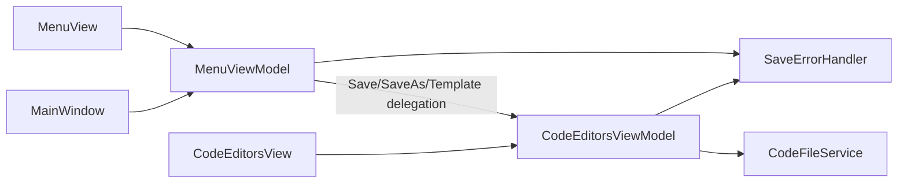

# План реализации: единый контур сохранения и ошибок

## 1. Анализ требований

### 1.1. Описание функции и цель

- Убрать дублирование логики сохранения между `MenuViewModel` и `CodeEditorsViewModel`.
- Сделать `MenuViewModel` тонким оркестратором: для `Save/SaveAs/SaveAndSetAsTemplate` использовать API `CodeEditorsViewModel`.
- Централизовать строку фильтра файлов в `CodeFileService`.
- Унифицировать обработку ошибок сохранения через отдельный сервис (по паттерну текущего `ExecuteAsync` в `MenuViewModel`).

### 1.2. Целевая аудитория и сценарии

- Пользователь IDE (меню, горячие клавиши, контекст вкладок).
- Сценарии:
  - `Ctrl+S` / пункт меню Save.
  - `Ctrl+Shift+S` / пункт меню SaveAs.
  - Save/SaveAs/SaveAndSetAsTemplate из контекстного меню вкладки.
  - Ошибка сохранения (должен показываться единый MessageBox с локализацией).

### 1.3. Входные и выходные данные

- Вход: текущая вкладка (`CurrentFileTab`) или вкладка из `CommandParameter`.
- Выход: сохранённый путь, обновлённый `SavedContent`, синхронизированное состояние `IsModified`, корректное `CanExecute` команд.

### 1.4. Ограничения и требования

- Архитектура: MVVM + DI, WPF, .NET 8, C#.
- Undo/Redo оставить без функциональных изменений.
- Все пользовательские строки через локализацию.
- Не ломать текущие привязки в меню и горячих клавишах `MainWindow`.
- Не добавлять во ViewModel новые методы и свойства, если это прямо не указано в данном плане.

## 2. Архитектурный анализ

### 2.1. Затрагиваемые подсистемы

- ViewModels: меню и редакторы.
- Сервисы файлов и сервисы ошибок.
- DI-регистрация.
- Документация подсистем.

### 2.2. Новые компоненты

- `ISaveOperationErrorHandler` (или `IAsyncOperationErrorHandler`) для стандартной обработки исключений async-операций сохранения.
- Реализация сервиса в слое `Services` (с `ILocalizationService`, показом MessageBox через Dispatcher).

### 2.3. Изменяемые компоненты

- `MenuViewModel` — убрать собственную реализацию Save/SaveAs/SaveAndSetAsTemplate, оставить делегирование.
- `ICodeEditorsViewModel` / `CodeEditorsViewModel` — добавить/экспортировать API для использования из меню (операции текущей вкладки и признак возможности Save).
- `ICodeFileService` / `CodeFileService` — добавить единый источник `FileFilter`.

### 2.4. Зависимости между компонентами

- `MenuViewModel` -> `ICodeEditorsViewModel` (делегирование сохранения и признаков CanSave).
- `CodeEditorsViewModel` -> `ICodeFileService` (включая `FileFilter`) + `ISaveOperationErrorHandler`.
- `MenuViewModel` -> `ISaveOperationErrorHandler` (для Open/Run и прочих async-операций, если применимо по месту).

## 3. Список задач

### 3.1. Изменение контрактов

- Обновить интерфейс `[d:\Visual Studio Projects\KID\KID.WPF.IDE\ViewModels\Interfaces\ICodeEditorsViewModel.cs](d:\Visual Studio Projects\KID\KID.WPF.IDE\ViewModels\Interfaces\ICodeEditorsViewModel.cs)`:
  - добавить публичные члены для меню-делегирования (например: `CanSaveCurrentFile`, `SaveCurrentFileCommand`, `SaveAsCurrentFileCommand`, при необходимости `SaveAndSetAsTemplateCurrentCommand` или методы `SaveCurrentFileAsync/SaveAsCurrentFileAsync`).
- Обновить интерфейс `[d:\Visual Studio Projects\KID\KID.WPF.IDE\Services\Files\Interfaces\ICodeFileService.cs](d:\Visual Studio Projects\KID\KID.WPF.IDE\Services\Files\Interfaces\ICodeFileService.cs)`:
  - добавить свойство/метод для FileFilter (например `string CSharpFileFilter { get; }` или `string GetCodeFileFilter()`).

### 3.2. Вынос FileFilter в сервис файлов

- Реализовать новый контракт в `[d:\Visual Studio Projects\KID\KID.WPF.IDE\Services\Files\CodeFileService.cs](d:\Visual Studio Projects\KID\KID.WPF.IDE\Services\Files\CodeFileService.cs)`.
- Обеспечить единый fallback и единый источник строки фильтра.

### 3.3. Новый сервис обработки ошибок сохранения

- Создать:
  - `[d:\Visual Studio Projects\KID\KID.WPF.IDE\Services\Errors\Interfaces\ISaveOperationErrorHandler.cs](d:\Visual Studio Projects\KID\KID.WPF.IDE\Services\Errors\Interfaces\ISaveOperationErrorHandler.cs)`
  - `[d:\Visual Studio Projects\KID\KID.WPF.IDE\Services\Errors\SaveOperationErrorHandler.cs](d:\Visual Studio Projects\KID\KID.WPF.IDE\Services\Errors\SaveOperationErrorHandler.cs)`
- Логика: выполнить async-действие, поймать исключение, показать локализованный MessageBox с ключом ошибки.

### 3.4. Рефакторинг CodeEditorsViewModel

- Обновить `[d:\Visual Studio Projects\KID\KID.WPF.IDE\ViewModels\CodeEditorsViewModel.cs](d:\Visual Studio Projects\KID\KID.WPF.IDE\ViewModels\CodeEditorsViewModel.cs)`:
  - использовать FileFilter из `ICodeFileService`;
  - использовать `ISaveOperationErrorHandler` вместо локального `ShowSaveError`/дублирующего try-catch;
  - предоставить API для сохранения текущей вкладки, чтобы им пользовался `MenuViewModel`;
  - оставить Undo/Redo без изменения поведения.

### 3.5. Рефакторинг MenuViewModel

- Обновить `[d:\Visual Studio Projects\KID\KID.WPF.IDE\ViewModels\MenuViewModel.cs](d:\Visual Studio Projects\KID\KID.WPF.IDE\ViewModels\MenuViewModel.cs)`:
  - для `Save/SaveAs/SaveAndSetAsTemplate` делегировать в `ICodeEditorsViewModel`;
  - `CanSaveFile` заменить на признак/свойство из `ICodeEditorsViewModel`;
  - убрать локальный `FileFilter`;
  - при необходимости использовать `ISaveOperationErrorHandler` для единообразного поведения async-ошибок.

### 3.6. DI и документация

- Обновить DI-регистрации в `[d:\Visual Studio Projects\KID\KID.WPF.IDE\Services\DI\ServiceCollectionExtensions.cs](d:\Visual Studio Projects\KID\KID.WPF.IDE\Services\DI\ServiceCollectionExtensions.cs)`.
- Обновить документацию:
  - `[d:\Visual Studio Projects\KID\docs\ARCHITECTURE.md](d:\Visual Studio Projects\KID\docs\ARCHITECTURE.md)`
  - `[d:\Visual Studio Projects\KID\docs\SUBSYSTEMS.md](d:\Visual Studio Projects\KID\docs\SUBSYSTEMS.md)`

### 3.7. Тестирование

- Ручные сценарии:
  - Save/SaveAs из меню.
  - Save/SaveAs/SaveAndSetAsTemplate из контекстного меню вкладки.
  - NewFile + Save (ожидается SaveAs).
  - Ошибки записи (недоступный путь/файл занят) -> единый локализованный MessageBox.
  - Проверка, что Undo/Redo работают как раньше.

## 4. Порядок выполнения

1. Изменить контракты `ICodeEditorsViewModel` и `ICodeFileService`.
2. Добавить и подключить `ISaveOperationErrorHandler`.
3. Обновить `CodeFileService` (единый FileFilter).
4. Рефакторить `CodeEditorsViewModel` (новый API + сервис ошибок + FileFilter из сервиса).
5. Рефакторить `MenuViewModel` на делегирование и использование свойств `CodeEditorsViewModel`.
6. Обновить DI и документацию.
7. Прогнать ручные сценарии и зафиксировать результаты.

## 5. Оценка сложности, времени и рисков

1. Контракты `ICodeEditorsViewModel` и `ICodeFileService`

- Сложность: средняя
- Время: 30-45 мин
- Риски: несовместимость с текущими биндингами/командами

1. Новый сервис обработки ошибок

- Сложность: низкая
- Время: 30-60 мин
- Риски: несоответствие ключей локализации, дублирующиеся MessageBox при двойном оборачивании

1. Вынос FileFilter в `CodeFileService`

- Сложность: низкая
- Время: 20-30 мин
- Риски: временная рассинхронизация fallback-строк до полного перевода вызовов

1. Рефакторинг `CodeEditorsViewModel`

- Сложность: средняя
- Время: 60-90 мин
- Риски: регрессия `CanExecute`, сохранение не той вкладки при делегировании

1. Рефакторинг `MenuViewModel`

- Сложность: средняя
- Время: 45-75 мин
- Риски: `Ctrl+S`/меню могут перестать правильно обновлять состояние доступности

1. DI + документация

- Сложность: низкая
- Время: 20-40 мин
- Риски: забыть регистрацию нового сервиса

1. Интеграционная проверка поведения

- Сложность: средняя
- Время: 45-60 мин
- Риски: не покрыть редкие кейсы ошибок файловой системы

## 6. Критерии готовности (Definition of Done)

- Логика Save/SaveAs/SaveAndSetAsTemplate не дублируется между `MenuViewModel` и `CodeEditorsViewModel`.
- `MenuViewModel` использует API `CodeEditorsViewModel` для операций сохранения и признака возможности Save.
- `FileFilter` берётся из `CodeFileService` в обоих ViewModel.
- Ошибки сохранения обрабатываются через единый сервис.
- Undo/Redo поведение не изменено.
- Обновлены DI и документация.

