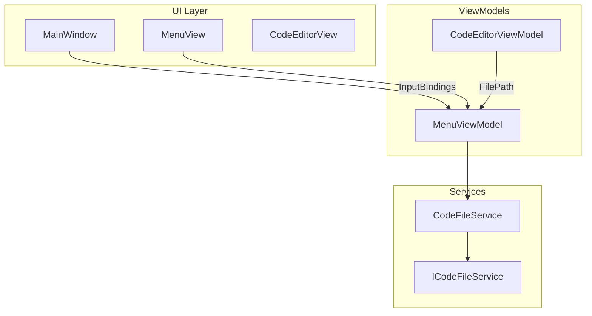

# Рефакторинг файлового меню .KID IDE

## 1. Анализ требований

### Цели

- Добавить горячие клавиши для пунктов меню Файл (Ctrl+O, Ctrl+N, Ctrl+S, Ctrl+Shift+S)
- Разделить «Сохранить» (в текущий файл) и «Сохранить как» (диалог выбора пути)
- Добавить свойство `FilePath` в `CodeEditorViewModel` для отслеживания текущего файла

### Текущее состояние

- [MenuView.xaml](KID.WPF.IDE/Views/MenuView.xaml): один пункт «Сохранить» с `SaveFileCommand` (открывает диалог)
- [MenuViewModel.cs](KID.WPF.IDE/ViewModels/MenuViewModel.cs): `SaveFileCommand` вызывает `ExecuteSaveFile` — всегда показывает диалог
- [CodeFileService](KID.WPF.IDE/Services/Files/CodeFileService.cs): `OpenCodeFileAsync` возвращает только содержимое, не путь; `SaveCodeFileAsync` всегда показывает диалог
- Горячие клавиши для меню Файл отсутствуют

---

## 2. Архитектурный анализ

### Затрагиваемые подсистемы




### Новые компоненты

- Локализация `Menu_SaveAs` (переименование текущего `Menu_Save`)
- Новая локализация `Menu_Save` для пункта «Сохранить»

### Изменения существующих компонентов


| Компонент                     | Изменения                                                                         |
| ----------------------------- | --------------------------------------------------------------------------------- |
| `ICodeFileService`            | Добавить `OpenCodeFileWithPathAsync` и `SaveToPathAsync` (или изменить сигнатуры) |
| `CodeFileService`             | Реализовать возврат пути файла при открытии; сохранение по заданному пути         |
| `ICodeEditorViewModel`        | Добавить свойство `FilePath`                                                      |
| `CodeEditorViewModel`         | Реализовать `FilePath`                                                            |
| `IMenuViewModel`              | Добавить `SaveAsFileCommand`                                                      |
| `MenuViewModel`               | Разделить `SaveFileCommand` и `SaveAsFileCommand`; обновить `FilePath`            |
| `MenuView.xaml`               | Добавить пункт «Сохранить», присвоить «Сохранить как» новой команде               |
| `MainWindow.xaml`             | Добавить `InputBindings` для горячих клавиш                                       |
| `WindowInitializationService` | Установить `FilePath` при инициализации                                           |


---

## 3. Детальный план задач

### Задача 1: Изменение ICodeFileService и CodeFileService

**Файлы:** [ICodeFileService.cs](KID.WPF.IDE/Services/Files/Interfaces/ICodeFileService.cs), [CodeFileService.cs](KID.WPF.IDE/Services/Files/CodeFileService.cs)

- Добавить метод `OpenCodeFileWithPathAsync` → возвращает `(string code, string? filePath)` или модель `OpenFileResult`
- Добавить метод `SaveToPathAsync(string filePath, string code)` — сохранение без диалога
- `SaveCodeFileAsync` оставить для «Сохранить как» (диалог выбора пути)

**Вариант:** модель результата:

```csharp
public record OpenFileResult(string Code, string? FilePath);
```

### Задача 2: Свойство FilePath в CodeEditorViewModel

**Файлы:** [ICodeEditorViewModel.cs](KID.WPF.IDE/ViewModels/Interfaces/ICodeEditorViewModel.cs), [CodeEditorViewModel.cs](KID.WPF.IDE/ViewModels/CodeEditorViewModel.cs)

- Добавить `string FilePath { get; set; }` в интерфейс и реализацию
- Для нового файла: `"/NewFile.cs"` или `"NewFile.cs"`
- Использовать `SetProperty` и `OnPropertyChanged` для `FilePath`

### Задача 3: Разделение команд Save и Save As в MenuViewModel

**Файлы:** [IMenuViewModel.cs](KID.WPF.IDE/ViewModels/Interfaces/IMenuViewModel.cs), [MenuViewModel.cs](KID.WPF.IDE/ViewModels/MenuViewModel.cs)

- `SaveFileCommand` — сохраняет в `codeEditorViewModel.FilePath`; если путь пустой или `NewFile.cs` — вызывать `SaveAsFileCommand`
- `SaveAsFileCommand` — текущая логика `ExecuteSaveFile` (диалог)
- При `ExecuteOpenFile`: получать путь из `OpenCodeFileWithPathAsync` и присваивать `codeEditorViewModel.FilePath`
- При `ExecuteNewFile`: устанавливать `codeEditorViewModel.FilePath = "/NewFile.cs"` (или `"NewFile.cs"`)

### Задача 4: Локализация

**Файлы:** [Strings.en-US.resx](KID.WPF.IDE/Resources/Strings.en-US.resx), [Strings.ru-RU.resx](KID.WPF.IDE/Resources/Strings.ru-RU.resx), [Strings.uk-UA.resx](KID.WPF.IDE/Resources/Strings.uk-UA.resx), [Strings.Designer.cs](KID.WPF.IDE/Resources/Strings.Designer.cs)

- Переименовать `Menu_Save` → `Menu_SaveAs`:
  - en-US: "Save As"
  - ru-RU: "Сохранить как"
  - uk-UA: "Зберегти як"
- Добавить новую строку `Menu_Save`:
  - en-US: "Save"
  - ru-RU: "Сохранить"
  - uk-UA: "Зберегти"

### Задача 5: Обновление MenuView.xaml

**Файл:** [MenuView.xaml](KID.WPF.IDE/Views/MenuView.xaml)

- Добавить пункт «Сохранить» (`Menu_Save`) с `SaveFileCommand` — перед «Сохранить как»
- Переименовать текущий пункт «Сохранить» на «Сохранить как» (`Menu_SaveAs`) с `SaveAsFileCommand`
- Добавить `InputGestureText` для отображения сочетаний в меню (по желанию)

### Задача 6: Горячие клавиши в MainWindow

**Файл:** [MainWindow.xaml](KID.WPF.IDE/MainWindow.xaml)

- Добавить `Window.InputBindings`:
  - `Ctrl+O` → `OpenFileCommand`
  - `Ctrl+N` → `NewFileCommand`
  - `Ctrl+S` → `SaveFileCommand`
  - `Ctrl+Shift+S` → `SaveAsFileCommand`
- Binding: `Command="{Binding DataContext.OpenFileCommand, ElementName=MenuView}"` (и аналогично для остальных)

### Задача 7: Инициализация FilePath при старте

**Файл:** [WindowInitializationService.cs](KID.WPF.IDE/Services/Initialize/WindowInitializationService.cs)

- В `InitializeCodeEditor` после установки `TemplateCode` задать `codeEditorViewModel.FilePath = "/NewFile.cs"`

### Задача 8: Обновление ICodeFileService (уточнение)

Реализация в `CodeFileService`:

- `OpenCodeFileWithPathAsync` — использовать `ShowOpenDialog`, при успехе read file и вернуть `(code, filePath)`
- `SaveToPathAsync(string filePath, string code)` — прямой вызов `fileService.WriteFileAsync` без диалога
- Для Save As — вызывать `ShowSaveDialog` с `Path.GetFileName(codeEditorViewModel.FilePath)` в качестве имени по умолчанию (если не NewFile)

---

## 4. Порядок выполнения

1. Локализация (Menu_SaveAs, Menu_Save)
2. ICodeFileService + CodeFileService (OpenFileResult, SaveToPathAsync)
3. ICodeEditorViewModel + CodeEditorViewModel (FilePath)
4. IMenuViewModel + MenuViewModel (SaveAsFileCommand, логика Save)
5. MenuView.xaml (пункты меню)
6. MainWindow.xaml (InputBindings)
7. WindowInitializationService (FilePath при старте)

---

## 5. Оценка сложности


| Задача                             | Сложность | Время  | Риски                                      |
| ---------------------------------- | --------- | ------ | ------------------------------------------ |
| Локализация                        | Низкая    | 10 мин | Нет                                        |
| ICodeFileService + CodeFileService | Средняя   | 20 мин | Решение по типу возврата (record vs tuple) |
| FilePath в CodeEditor              | Низкая    | 10 мин | Нет                                        |
| MenuViewModel (Save/SaveAs)        | Средняя   | 25 мин | Согласование с новым ICodeFileService      |
| MenuView.xaml                      | Низкая    | 5 мин  | Нет                                        |
| InputBindings                      | Низкая    | 15 мин | Проверка работы с AvalonEdit               |
| WindowInitializationService        | Низкая    | 5 мин  | Нет                                        |


**Общая оценка:** ~1.5 часа.

---

## 6. Ключевые фрагменты кода

### OpenFileResult (новый тип)

```csharp
// KID.Models или KID.Services.Files
public record OpenFileResult(string Code, string? FilePath);
```

### Условие для Save (если NewFile — показать Save As)

```csharp
private bool CanSaveFile => !string.IsNullOrEmpty(codeEditorViewModel.FilePath) 
    && !IsNewFile(codeEditorViewModel.FilePath);

private static bool IsNewFile(string path) => 
    path.EndsWith("NewFile.cs", StringComparison.OrdinalIgnoreCase) 
    || path == "/NewFile.cs";
```

### DefaultFileName для Save As

Использовать `Path.GetFileName(codeEditorViewModel.FilePath)` или `"Program.cs"`, если FilePath — NewFile.