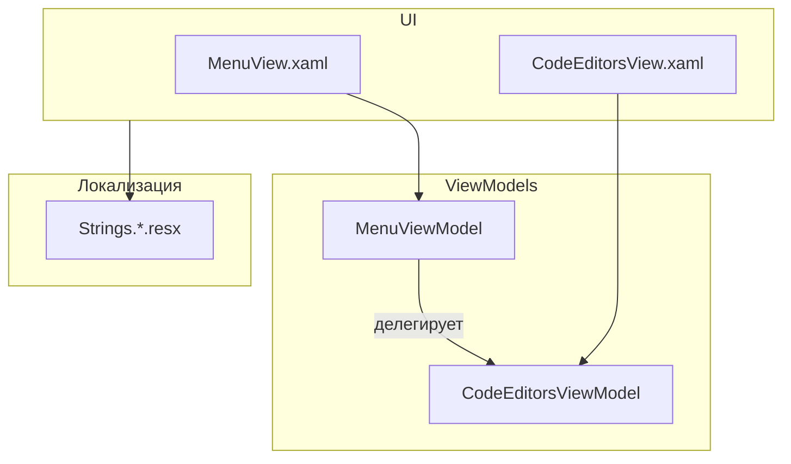

# Рефакторинг: переименование и добавление пункта «Назначить шаблоном по умолчанию (и сохранить)»

## 1. Анализ требований

### Описание

- **Переименование:** текст «Сохранить и назначить шаблоном» → «Назначить шаблоном по умолчанию (и сохранить)» во всех локалях
- **Новый пункт меню:** добавить такой же пункт в общее меню **Меню → Файл** (рядом с «Сохранить» и «Сохранить как»)
- **Документация:** отразить новое название и новое расположение пункта

### Целевые сценарии

- Пользователь вызывает действие из контекстного меню вкладки (как сейчас)
- Пользователь вызывает действие из меню **Файл** (новое поведение)

### Ограничения

- Поведение команды не меняется: сохраняется текущий файл и назначается шаблоном
- Логика в `CodeEditorsViewModel.ExecuteSaveAndSetAsTemplate` остаётся без изменений

---

## 2. Архитектурный анализ

### Затронутые подсистемы




### Существующая реализация

- **Команда:** `SaveAndSetAsTemplateCommand` в [CodeEditorsViewModel.cs](KID.WPF.IDE/ViewModels/CodeEditorsViewModel.cs) — `RelayCommand<OpenedFileTab>`
- **Контекстное меню:** [CodeEditorsView.xaml](KID.WPF.IDE/Views/CodeEditorsView.xaml) (стр. 88–89), привязка к `TabContext_SaveAndSetAsTemplate`
- **Локализация:** ключ `TabContext_SaveAndSetAsTemplate` в [Strings.ru-RU.resx](KID.WPF.IDE/Resources/Strings.ru-RU.resx), [Strings.en-US.resx](KID.WPF.IDE/Resources/Strings.en-US.resx), [Strings.uk-UA.resx](KID.WPF.IDE/Resources/Strings.uk-UA.resx)

### Необходимые изменения


| Компонент        | Действие                                                        |
| ---------------- | --------------------------------------------------------------- |
| `Strings.*.resx` | Обновить значения `TabContext_SaveAndSetAsTemplate`             |
| `MenuViewModel`  | Добавить `SaveAndSetAsTemplateCommand` как делегирующую команду |
| `IMenuViewModel` | Добавить `SaveAndSetAsTemplateCommand` в интерфейс              |
| `MenuView.xaml`  | Добавить пункт в меню «Файл»                                    |
| Документация     | Обновить README, FEATURES, SUBSYSTEMS, DEVELOPMENT              |


---

## 3. Список задач

### 3.1. Локализация

- **Файлы:** [Strings.ru-RU.resx](KID.WPF.IDE/Resources/Strings.ru-RU.resx), [Strings.en-US.resx](KID.WPF.IDE/Resources/Strings.en-US.resx), [Strings.uk-UA.resx](KID.WPF.IDE/Resources/Strings.uk-UA.resx)
- **Задача:** изменить значения ключа `TabContext_SaveAndSetAsTemplate`:
  - ru-RU: `Назначить шаблоном по умолчанию (и сохранить)`
  - en-US: `Set as default template (and save)`
  - uk-UA: `Призначити шаблоном за замовчуванням (і зберегти)`
- **Примечание:** в resx используется `&#10;` для переноса строки; при длинном тексте можно оставить одну строку или разбить по смыслу.

### 3.2. MenuViewModel

- **Файл:** [MenuViewModel.cs](KID.WPF.IDE/ViewModels/MenuViewModel.cs)
- **Задача:** добавить `SaveAndSetAsTemplateCommand` — обёртку над `codeEditorsViewModel.SaveAndSetAsTemplateCommand`:
  - `Execute`: вызов `SaveAndSetAsTemplateCommand.Execute(codeEditorsViewModel.ActiveFile)`
  - `CanExecute`: `codeEditorsViewModel.SaveAndSetAsTemplateCommand.CanExecute(codeEditorsViewModel.ActiveFile)`
- **Примечание:** `CommandManager.InvalidateRequerySuggested()` уже вызывается при смене `ActiveFile` в `CodeEditorViewModel_PropertyChanged`, поэтому доступность команды будет обновляться автоматически.

### 3.3. IMenuViewModel

- **Файл:** [IMenuViewModel.cs](KID.WPF.IDE/ViewModels/Interfaces/IMenuViewModel.cs)
- **Задача:** добавить `ICommand SaveAndSetAsTemplateCommand { get; }`

### 3.4. MenuView — пункт в меню «Файл»

- **Файл:** [MenuView.xaml](KID.WPF.IDE/Views/MenuView.xaml)
- **Задача:** в меню «Файл» (после «Сохранить как») добавить:
  ```xml
  <MenuItem Header="{localization:Localization TabContext_SaveAndSetAsTemplate}"
            Command="{Binding SaveAndSetAsTemplateCommand}" />
  ```

### 3.5. Документация

- **[README.md](docs/README.md)**, стр. 71: заменить «Сохранить и назначить шаблоном» на «Назначить шаблоном по умолчанию (и сохранить)», указать доступность из меню Файл и контекстного меню вкладки.
- **[FEATURES.md](docs/FEATURES.md):**
  - стр. 40: обновить название пункта
  - стр. 320–322: переименовать заголовок и добавить упоминание меню «Файл»
  - стр. 405: обновить описание
- **[SUBSYSTEMS.md](docs/SUBSYSTEMS.md)**, стр. 256: обновить список пунктов контекстного меню и добавить пункт меню «Файл».
- **[DEVELOPMENT.md](docs/DEVELOPMENT.md)**, стр. 362: обновить название пункта.
- **[ARCHITECTURE.md](docs/ARCHITECTURE.md)** (если есть упоминание): обновить при необходимости.

---

## 4. Порядок выполнения

1. Локализация (resx) — влияет на отображение во всех местах
2. `IMenuViewModel` — объявление интерфейса
3. `MenuViewModel` — реализация команды
4. `MenuView.xaml` — новый пункт меню
5. Документация — README, FEATURES, SUBSYSTEMS, DEVELOPMENT (и ARCHITECTURE при наличии)

---

## 5. Оценка сложности


| Задача         | Сложность | Время   | Риски                            |
| -------------- | --------- | ------- | -------------------------------- |
| Локализация    | Низкая    | ~5 мин  | Опечатки в переводе              |
| IMenuViewModel | Низкая    | ~2 мин  | —                                |
| MenuViewModel  | Низкая    | ~10 мин | Корректная передача `ActiveFile` |
| MenuView.xaml  | Низкая    | ~3 мин  | —                                |
| Документация   | Низкая    | ~15 мин | Пропуск одного из документов     |


**Общая оценка:** низкая сложность, ~35 минут.