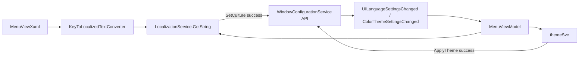

# Рефакторинг языков и тем через ключи, конвертеры и централизованные события настроек

## 1. Анализ требований

### 1.1. Цель

Сделать систему языков и тем проще и устойчивее:

- хранить в меню только универсальные строковые ключи;
- локализованное отображение получать через конвертеры в XAML;
- переносить сохранение `UILanguage`/`ColorTheme` в `WindowConfigurationService`;
- использовать централизованные события настроек из `WindowConfigurationService`.

### 1.2. Сценарии использования

- Пользователь выбирает язык: культура переключается, настройка `UILanguage` сохраняется, меню обновляется.
- Пользователь выбирает тему: тема применяется, `ColorTheme` сохраняется, состояние меню синхронизируется.
- При смене культуры подписи языков/тем в меню автоматически пересчитываются через конвертер.

### 1.3. Входные/выходные данные

- **Вход (языки):** строковые ключи вида `Language_*`.
- **Вход (темы):** строковые ключи вида `Theme_*`.
- **Выход:** локализованные строки интерфейса через конвертер `key -> localized text`.
- **Состояние:** актуальные значения в `WindowConfigurationService.Settings`.

### 1.4. Важное архитектурное правило (зафиксировано)

- `UILanguageSettingsChanged` и `ColorThemeSettingsChanged` **объявлены в `WindowConfigurationService**`.
- `LocalizationService` и `ThemeService` **инициируют изменение настроек через API `WindowConfigurationService**`, что приводит к поднятию этих событий в `WindowConfigurationService`.

## 2. Архитектурный анализ

### 2.1. Затронутые подсистемы

- Локализация: `[d:/Visual Studio Projects/KID/KID.WPF.IDE/Services/Localization/LocalizationService.cs](d:/Visual%20Studio%20Projects/KID/KID.WPF.IDE/Services/Localization/LocalizationService.cs)`, `[d:/Visual Studio Projects/KID/KID.WPF.IDE/Services/Localization/Interfaces/ILocalizationService.cs](d:/Visual%20Studio%20Projects/KID/KID.WPF.IDE/Services/Localization/Interfaces/ILocalizationService.cs)`
- Темы: `[d:/Visual Studio Projects/KID/KID.WPF.IDE/Services/Themes/ThemeService.cs](d:/Visual%20Studio%20Projects/KID/KID.WPF.IDE/Services/Themes/ThemeService.cs)`, интерфейс `IThemeService`
- Конфигурация: `[d:/Visual Studio Projects/KID/KID.WPF.IDE/Services/Initialize/WindowConfigurationService.cs](d:/Visual%20Studio%20Projects/KID/KID.WPF.IDE/Services/Initialize/WindowConfigurationService.cs)`, `[d:/Visual Studio Projects/KID/KID.WPF.IDE/Models/WindowConfigurationData.cs](d:/Visual%20Studio%20Projects/KID/KID.WPF.IDE/Models/WindowConfigurationData.cs)`
- UI/VM: `[d:/Visual Studio Projects/KID/KID.WPF.IDE/ViewModels/MenuViewModel.cs](d:/Visual%20Studio%20Projects/KID/KID.WPF.IDE/ViewModels/MenuViewModel.cs)`, `[d:/Visual Studio Projects/KID/KID.WPF.IDE/Views/MenuView.xaml](d:/Visual%20Studio%20Projects/KID/KID.WPF.IDE/Views/MenuView.xaml)`
- Конвертеры: `[d:/Visual Studio Projects/KID/KID.WPF.IDE/Converters/](d:/Visual%20Studio%20Projects/KID/KID.WPF.IDE/Converters/)`

### 2.2. Новые/изменённые компоненты

1. `WindowConfigurationService`:
  - добавить (или унифицировать) API для изменения `UILanguage` и `ColorTheme`;
  - гарантировать поднятие `UILanguageSettingsChanged`/`ColorThemeSettingsChanged`.
2. `LocalizationService`:
  - вернуть список ключей языков (`IEnumerable<string>`);
  - в `SetCulture(...)` после успешной установки культуры вызвать API `WindowConfigurationService` для `UILanguage`.
3. `ThemeService`:
  - вернуть список ключей тем (`IEnumerable<string>`);
  - в `ApplyTheme(...)` после применения темы вызвать API `WindowConfigurationService` для `ColorTheme`.
4. Конвертер(ы) ключей в локализованный текст для меню.
5. `MenuViewModel`:
  - `AvailableLanguages`/`AvailableThemes` как `ObservableCollection<string>`;
  - подписка на события `WindowConfigurationService`.

### 2.3. Поток данных (целевая схема)

## 3. Список задач

### 3.1. Контракты и API конфигурации

1. Обновить `WindowConfigurationService`:
  - добавить/уточнить методы наподобие `SetUILanguage(string cultureCode)` и `SetColorTheme(string themeKey)`;
  - внутри методов: обновление `Settings`, `SaveSettings()`, поднятие соответствующего события.
2. Обновить интерфейс `IWindowConfigurationService` под эти методы/события.

### 3.2. Сервисы локализации и тем

1. В `ILocalizationService` изменить `GetAvailableLanguages()` на `IEnumerable<string>` (ключи).
2. В `LocalizationService.GetAvailableLanguages()` возвращать только универсальные ключи для меню.
3. В `LocalizationService.SetCulture(...)`:
  - установить культуру;
  - вызвать API `WindowConfigurationService` для `UILanguage`.
4. В `IThemeService` изменить `GetAvailableThemes()` на `IEnumerable<string>` (ключи).
5. В `ThemeService.GetAvailableThemes()` возвращать ключи тем.
6. В `ThemeService.ApplyTheme(...)` после применения темы вызвать API `WindowConfigurationService` для `ColorTheme`.

### 3.3. Конвертеры и XAML

1. Добавить конвертер `string key -> localized text` в `[d:/Visual Studio Projects/KID/KID.WPF.IDE/Converters/](d:/Visual%20Studio%20Projects/KID/KID.WPF.IDE/Converters/)`.
2. Подключить конвертер в `MenuView.xaml` и перевести `Header` языков/тем на него.
3. Убедиться, что обновление интерфейса при смене культуры работает (через событие + переоценку биндинга).

### 3.4. MenuViewModel

1. Изменить типы коллекций:
  - `AvailableLanguages: ObservableCollection<string>`
  - `AvailableThemes: ObservableCollection<string>`
2. Удалить `UpdateLanguageDisplayNames()` и `UpdateThemeDisplayNames()`.
3. Адаптировать команды `ChangeLanguageCommand` и `ChangeThemeCommand` под строковые ключи.
4. Подписаться на `WindowConfigurationService.UILanguageSettingsChanged` и `ColorThemeSettingsChanged`, обновлять `SelectedCultureCode`/`SelectedThemeKey`.

### 3.5. Удаление legacy и документация

1. Исключить из потока меню старые модели `AvailableLanguage`/`AvailableTheme` (или оставить как deprecated, если используются вне меню).
2. Обновить `[d:/Visual Studio Projects/KID/docs/ARCHITECTURE.md](d:/Visual%20Studio%20Projects/KID/docs/ARCHITECTURE.md)`: новая зона ответственности сервисов и конфигурации.

### 3.6. Тестирование

1. Проверить сценарии:
  - смена языка -> сохранение `UILanguage` -> событие из `WindowConfigurationService` -> корректные галочки и подписи;
  - смена темы -> сохранение `ColorTheme` -> событие из `WindowConfigurationService` -> корректные галочки;
  - перезапуск приложения и восстановление выбранных значений.

## 4. Порядок выполнения

1. Изменить `IWindowConfigurationService` и `WindowConfigurationService` (методы + события).
2. Изменить `ILocalizationService`/`LocalizationService` на ключи и вызов API конфигурации.
3. Изменить `IThemeService`/`ThemeService` на ключи и вызов API конфигурации.
4. Добавить конвертер(ы) и обновить `MenuView.xaml`.
5. Переписать `MenuViewModel` под строковые коллекции и новые события конфигурации.
6. Почистить legacy-структуры и обновить документацию.
7. Прогнать ручные проверки и исправить регрессии.

## 5. Оценка сложности

1. `WindowConfigurationService` API + события
  - Сложность: средняя
  - Время: 1-1.5 ч
  - Риск: некорректный порядок `SaveSettings`/событий
2. Рефакторинг локализации (ключи + вызов конфигурации)
  - Сложность: высокая
  - Время: 2-3 ч
  - Риск: регрессия смены культуры и обновления UI
3. Рефакторинг тем (ключи + вызов конфигурации)
  - Сложность: средняя
  - Время: 1.5-2 ч
  - Риск: рассинхрон `CurrentTheme` и `Settings.ColorTheme`
4. Конвертеры + XAML биндинги
  - Сложность: средняя
  - Время: 1-2 ч
  - Риск: биндинг не переоценивается при смене культуры
5. `MenuViewModel` и команды
  - Сложность: средняя
  - Время: 1.5-2.5 ч
  - Риск: ошибки в маппинге ключа в код культуры/ключ темы
6. Документация и smoke-тесты
  - Сложность: низкая
  - Время: 0.5-1 ч
  - Риск: пропуск edge-case при быстрой серии переключений

## 6. Критерии готовности

- Языки и темы в меню хранятся как коллекции строковых ключей.
- UI-имена строятся только через конвертер(ы), без ручных циклов обновления в `MenuViewModel`.
- `LocalizationService` и `ThemeService` изменяют настройки через API `WindowConfigurationService`.
- События `UILanguageSettingsChanged`/`ColorThemeSettingsChanged` исходят из `WindowConfigurationService` и корректно обрабатываются `MenuViewModel`.
- Выбор языка/темы корректно сохраняется и восстанавливается после перезапуска.

