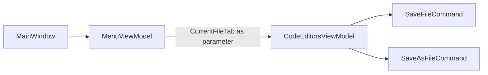

# План реализации: убрать SaveCurrentFile API и вызывать операции на CurrentFileTab

## 1. Анализ требований

### 1.1. Цель
- Упростить `CodeEditorsViewModel`: убрать дополнительные обёртки для сохранения текущей вкладки.
- Оставить единый подход: вызовы сохранения через существующие команды, принимающие `OpenedFileTab`.
- В `MenuViewModel` использовать `CurrentFileTab` как `CommandParameter` для `SaveFileCommand` и `SaveAsFileCommand`.

### 1.2. Сценарии использования
- `Ctrl+S` и пункт меню `Save` должны сохранять текущую вкладку.
- `Ctrl+Shift+S` и пункт меню `Save As` должны открывать сохранение как для текущей вкладки.
- Контекстное меню вкладки (`CodeEditorsView`) продолжает работать без изменений.
- Для `NewFile` при `Save` должен отработать текущий редирект в `SaveAs` (уже реализован в табовой логике).

### 1.3. Ограничения
- Не добавлять новых методов/свойств во ViewModel сверх явной необходимости этого изменения.
- Undo/Redo не менять функционально.
- Не менять архитектуру DI и сервис ошибок, кроме требуемой адаптации вызовов.

## 2. Архитектурный анализ

### 2.1. Что меняется
- Удаляются дублирующие public-члены из `[d:\Visual Studio Projects\KID\KID.WPF.IDE\ViewModels\Interfaces\ICodeEditorsViewModel.cs](d:\Visual Studio Projects\KID\KID.WPF.IDE\ViewModels\Interfaces\ICodeEditorsViewModel.cs)`.
- В `[d:\Visual Studio Projects\KID\KID.WPF.IDE\ViewModels\CodeEditorsViewModel.cs](d:\Visual Studio Projects\KID\KID.WPF.IDE\ViewModels\CodeEditorsViewModel.cs)` остаются только табовые команды `SaveFileCommand`, `SaveAsFileCommand`.
- В `[d:\Visual Studio Projects\KID\KID.WPF.IDE\ViewModels\MenuViewModel.cs](d:\Visual Studio Projects\KID\KID.WPF.IDE\ViewModels\MenuViewModel.cs)` команды меню будут вызывать табовые команды для `CurrentFileTab`.

### 2.2. Поток вызова после рефакторинга

## 3. Список задач

### 3.1. Удалить API текущей вкладки из интерфейса
- Из `[d:\Visual Studio Projects\KID\KID.WPF.IDE\ViewModels\Interfaces\ICodeEditorsViewModel.cs](d:\Visual Studio Projects\KID\KID.WPF.IDE\ViewModels\Interfaces\ICodeEditorsViewModel.cs)` удалить:
  - `CanSaveCurrentFile`
  - `SaveCurrentFileCommand`
  - `SaveAsCurrentFileCommand`

### 3.2. Упростить CodeEditorsViewModel
- В `[d:\Visual Studio Projects\KID\KID.WPF.IDE\ViewModels\CodeEditorsViewModel.cs](d:\Visual Studio Projects\KID\KID.WPF.IDE\ViewModels\CodeEditorsViewModel.cs)` удалить:
  - свойства/команды и private-методы, обслуживающие текущую вкладку (`ExecuteSaveCurrentFile`, `ExecuteSaveAsCurrentFile`, `CanSaveAsCurrentFile`);
  - лишние `OnPropertyChanged(nameof(CanSaveCurrentFile))`;
  - лишние `RaiseCanExecuteChanged` для удалённых команд.
- Сохранить существующую логику `ExecuteSaveFile(OpenedFileTab tab)` и `ExecuteSaveAsFile(OpenedFileTab tab)` без изменений поведения.

### 3.3. Переключить MenuViewModel на вызовы с CurrentFileTab
- В `[d:\Visual Studio Projects\KID\KID.WPF.IDE\ViewModels\MenuViewModel.cs](d:\Visual Studio Projects\KID\KID.WPF.IDE\ViewModels\MenuViewModel.cs)`:
  - вместо прямого присваивания `SaveFileCommand = codeEditorsViewModel.SaveCurrentFileCommand` создать локальные команды меню;
  - `ExecuteSaveFile` и `ExecuteSaveAsFile` должны брать `codeEditorsViewModel.CurrentFileTab` и вызывать:
    - `codeEditorsViewModel.SaveFileCommand.Execute(currentTab)`
    - `codeEditorsViewModel.SaveAsFileCommand.Execute(currentTab)`
  - `CanExecute` для Save привязать к `SaveFileCommand.CanExecute(currentTab)`;
  - при `PropertyChanged(CurrentFileTab)` вызывать `SaveFileCommand.RaiseCanExecuteChanged()` (и при необходимости `SaveAsFileCommand`).

### 3.4. Проверить совместимость биндингов
- Убедиться, что биндинги меню/горячих клавиш (`MainWindow` + `MenuView`) продолжают работать через `IMenuViewModel` без XAML-изменений.

### 3.5. Обновить документацию
- Внести правки в:
  - `[d:\Visual Studio Projects\KID\docs\ARCHITECTURE.md](d:\Visual Studio Projects\KID\docs\ARCHITECTURE.md)`
  - `[d:\Visual Studio Projects\KID\docs\SUBSYSTEMS.md](d:\Visual Studio Projects\KID\docs\SUBSYSTEMS.md)`
- Зафиксировать, что меню сохраняет через табовые команды с `CurrentFileTab`, а отдельного SaveCurrentFile API больше нет.

## 4. Порядок выполнения
1. Обновить `ICodeEditorsViewModel`.
2. Упростить `CodeEditorsViewModel` (удалить лишние обёртки).
3. Переделать `MenuViewModel` на вызовы табовых команд с `CurrentFileTab`.
4. Проверить `CanExecute` и `PropertyChanged`-сигналы.
5. Обновить документацию.
6. Прогнать сборку и ручные сценарии.

## 5. Оценка сложности

1. Изменение контракта `ICodeEditorsViewModel`
- Сложность: низкая
- Время: 10-20 мин
- Риски: несовпадение с текущими реализациями интерфейса

2. Очистка `CodeEditorsViewModel`
- Сложность: низкая
- Время: 20-40 мин
- Риски: оставить «висячие» `RaiseCanExecuteChanged`/`OnPropertyChanged`

3. Рефакторинг `MenuViewModel` под `CurrentFileTab`
- Сложность: средняя
- Время: 40-70 мин
- Риски: некорректный `CanExecute` у Save при смене вкладки

4. Документация
- Сложность: низкая
- Время: 15-30 мин
- Риски: рассинхрон описания и реализации

5. Проверка
- Сложность: средняя
- Время: 20-40 мин
- Риски: пропуск edge-case (например, `CurrentFileTab == null`)

## 6. Критерии готовности
- В `ICodeEditorsViewModel` и `CodeEditorsViewModel` отсутствуют `SaveCurrentFile`, `SaveAsCurrentFile`, `CanSaveCurrentFile`.
- `MenuViewModel` выполняет Save/SaveAs через `CurrentFileTab` и существующие табовые команды.
- Поведение Save/SaveAs из меню, hotkeys и контекстного меню вкладки сохраняется.
- Сборка проходит, документация обновлена.