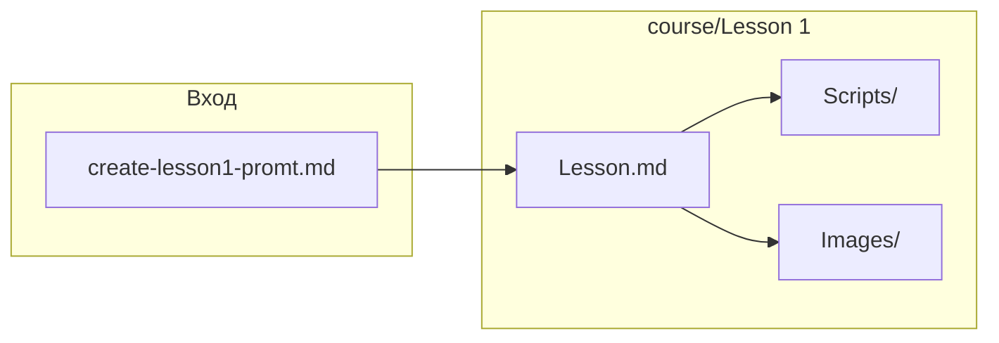

## 1. Анализ требований

### 1.1. Описание функции и цель

Нужно добавить в репозиторий учебный материал: первый урок курса по C# для младших школьников, рассчитанный на работу в .KID IDE и с библиотекой `KIDLibrary` (простое Graphics/Console API).

Урок должен:

- заинтересовать ребёнка программированием (публицистический «учебник-глава», яркий язык);
- познакомить с интерфейсом .KID IDE и «первым действием» (запуск программы);
- дать первую программу `Hello World` + простая графика;
- разобрать базовые команды консоли (`Console.Write`, `Console.WriteLine`) и графики (круг, прямоугольник, текст), цвета и роль `using`.

### 1.2. Целевая аудитория и сценарии использования

- Младшие школьники, первый контакт с C#.
- Урок читается как «глава учебника» и сразу повторяется в IDE: ребёнок копирует/набирает код, запускает, видит результат в консоли и на холсте.

### 1.3. Входные/выходные данные

- **Вход**: требования из промта + существующие возможности проекта (.KID IDE, `KID.Library`).
- **Выход**:
  - `course/Lesson 1/Lesson.md` — полностью готовый текст урока.
  - `course/Lesson 1/Scripts/*.cs` — все программы/сниппеты, встречающиеся в уроке.
  - `course/Lesson 1/Images/` — папка под иллюстрации; в `Lesson.md` должны быть плейсхолдеры и промты для генерации.

### 1.4. Ограничения и требования

- Язык урока: русский, стиль: публицистический учебник.
- Любые фрагменты кода, вставленные в `Lesson.md` код-блоками, должны иметь соответствующий `.cs` файл в `Scripts`.
- Любые иллюстрации в тексте должны сопровождаться промтами (для генеративных моделей) и иметь место хранения в `Images`.
- Техническая точность по текущей реализации:
  - Запуск: `Ctrl+F5`, стоп: `Shift+F5`.
  - Раскладка: редактор слева; справа — консоль сверху и графика (Canvas) снизу, панели разделяются сплиттерами.
  - `Graphics.Circle(x,y,radius)` — (x,y) центр; `Graphics.Rectangle(x,y,w,h)` — (x,y) левый верхний угол; `Graphics.Text(x,y,...)` — позиция левым верхним углом.
  - Цвет в уроке: пока только строковыми ключами (`"Red"`, `"Blue"`, `"White"`), с упоминанием, что позже будут другие форматы.

## 2. Архитектурный анализ

### 2.1. Какие подсистемы затронуты

- Только контент-слой репозитория: папка курса `course/`.
- Код приложения/библиотеки не меняется.

### 2.2. Какие новые компоненты нужно создать

- Директории:
  - `course/Lesson 1/`
  - `course/Lesson 1/Scripts/`
  - `course/Lesson 1/Images/`
- Файлы:
  - `course/Lesson 1/Lesson.md`
  - `.cs` файлы в `Scripts` (см. список задач).

### 2.3. Какие существующие компоненты нужно изменить

- Ничего обязательного. (Опционально позже можно добавить «оглавление курса», но это вне текущего запроса.)

### 2.4. Зависимости между компонентами

- `Lesson.md` ссылается на:
  - картинки в `Images/` (пока как плейсхолдеры);
  - скрипты в `Scripts/` (как «исходники урока», которые можно открыть/скопировать).

---

## 2. Архитектура и затронутые компоненты

Используется только содержимое курса; приложение (WPF, MVVM, DI) не меняется.

**Новые артефакты:**

| Компонент | Путь | Назначение |
|-----------|------|------------|
| Урок | `course/Lesson 1/Lesson.md` | Полный текст урока по плану 1–1.3, с блоками кода и местами для картинок. |
| Скрипт 1 | `course/Lesson 1/Scripts/01_HelloGraphics.cs` | Hello World с Graphics: круг, прямоугольник, текст. |
| Скрипт 2 | `course/Lesson 1/Scripts/02_ConsoleWriteVsWriteLine.cs` | Демонстрация `Console.Write` vs `Console.WriteLine`. |
| Скрипт 3 | `course/Lesson 1/Scripts/03_GraphicsShapesBasics.cs` | Круг, прямоугольник, текст с комментариями по координатам. |
| Скрипт 4 | `course/Lesson 1/Scripts/04_WithoutUsing.cs` | Тот же Hello World без `using` (полные имена `System.*`, `KID.Graphics.*`). |
| Иллюстрации | `course/Lesson 1/Images/` | Папка для PNG; README с перечнем файлов и отсылкой к промтам в `Lesson.md`. |

**Зависимости:** `Lesson.md` ссылается на имена файлов в `Scripts/` (01_HelloGraphics.cs и т.д.) и на пути/подписи картинок в `Images/`. Скрипты не зависят друг от друга и от других частей репозитория.

---

## 3. Список задач (конкретные шаги)

### 3.1. Структура папок
- Создать папку `course/Lesson 1` (если её нет).  
- Создать `course/Lesson 1/Scripts`.  
- Создать `course/Lesson 1/Images`.

### 3.2. Файл урока Lesson.md
- Создать [course/Lesson 1/Lesson.md](course/Lesson 1/Lesson.md).
- Заголовок и краткое введение (программирование как команды машине, первый шаг на C#).
- Блок «Что ты научишься» (пункты из плана: C#, IDE, первая программа, круг/прямоугольник/текст, Console.Write/WriteLine).
- **Раздел 1** — введение в C# и .KID (зачем C#, что такое .KID IDE, консоль и холст).
- **Раздел 1.1** — знакомство со средой: меню, кнопка «Запустить», редактор, консоль, графика; первое действие (клик в редактор → Запустить); место для скриншота с промтом и подписью (например, «Окно .KID IDE: редактор кода, консоль и графический холст»), путь вида `Lesson 1/Images/...` или аналог.
- **Раздел 1.2** — первая программа: вставить код Hello World с графикой (как в промте); описать результат в консоли и на холсте (красный круг, синий прямоугольник, белый текст); мини-эксперимент (изменить радиус круга). Ссылка на файл `01_HelloGraphics.cs`.
- **Раздел 1.3** — разбор кода:  
  - Подраздел про `Console.Write()` и `Console.WriteLine()`: краткое объяснение + код примера, ссылка на `02_ConsoleWriteVsWriteLine.cs`.  
  - Подраздел про графику: `Graphics.Circle`, `Graphics.Rectangle`, `Graphics.Text`; пояснить разницу точек отсчёта (центр у круга, угол у прямоугольника/текста); код примера, ссылка на `03_GraphicsShapesBasics.cs`.  
  - Подраздел про цвет: `Graphics.Color = "Red"` и т.д., только текстовые названия; упомянуть, что позже будут другие способы.  
  - Подраздел про `using`: зачем нужен, как выглядит код без `using` (полные имена); код примера, ссылка на `04_WithoutUsing.cs`.
- В конце: блок «Маленькие миссии» (или аналог) — 3–4 задания (поменять цвета, сдвинуть фигуру, изменить текст, изменить радиус); блок «Следующий урок» (кратко, что будет дальше).
- Стиль: публицистический, яркий, с пояснениями; все вставки кода в markdown-блоках `csharp`; для каждой картинки — явный промт и подпись/путь в `Images`.

### 3.3. Скрипты в Scripts
- **01_HelloGraphics.cs** — содержимое как в промте: `using System; using KID;` + `Console.WriteLine("Hello World!");` + красный круг, синий прямоугольник, белый текст.
- **02_ConsoleWriteVsWriteLine.cs** — пример с `Console.Write` (несколько подряд в одну строку) и `Console.WriteLine` (переносы); при необходимости краткие комментарии.
- **03_GraphicsShapesBasics.cs** — круг, прямоугольник, текст с разными цветами и координатами; комментарии про центр/угол/текст.
- **04_WithoutUsing.cs** — тот же сценарий, что 01_HelloGraphics, но с полными именами `System.Console.*` и `KID.Graphics.*`, без `using`.

### 3.4. Иллюстрации и Images
- Добавить в [course/Lesson 1/Images/README.md](course/Lesson 1/Images/README.md) описание: папка для иллюстраций к уроку 1; перечень ожидаемых файлов (например, обзор IDE, результат Hello World); указание, что промты для генерации лежат в `Lesson.md` рядом с местами вставки.
- В `Lesson.md` у каждого места для картинки: текст промта для генерации + подпись + путь к файлу в `Images` (например, `01_kid-ide-overview.png`, `02_hello-world-result.png` или по соглашению проекта).

### 3.5. Согласованность
- Проверить, что имена файлов в `Lesson.md` (01_HelloGraphics.cs, …) совпадают с именами в `Scripts/`.
- Проверить, что все четыре программы из текста имеют соответствующие .cs в `Scripts/` и что код в .md и в .cs совпадает (с учётом комментариев в .cs).

---

## 4. Порядок выполнения

1. Создать структуру папок: `Lesson 1`, `Lesson 1/Scripts`, `Lesson 1/Images`.  
2. Написать полный текст `Lesson.md` (все разделы и подразделы, блоки кода, места для картинок с промтами).  
3. Создать четыре .cs-файла в `Scripts/` в порядке 01 → 04, сверяя код с блоками в `Lesson.md`.  
4. Создать или обновить `Images/README.md`.  
5. Финальная проверка: ссылки на скрипты и картинки, соответствие промту и текущему формату урока.

---

## 5. Оценка сложности по задачам

| Задача | Сложность | Время | Риски |
|--------|-----------|--------|--------|
| Структура папок | Низкая | 2 мин | Нет. |
| Написание Lesson.md | Высокая | 45–90 мин | Объём текста; единообразие стиля и нумерации; точное соответствие промту. |
| Создание 01_HelloGraphics.cs | Низкая | 5 мин | Совпадение с промтом и с блоком в Lesson.md. |
| Создание 02_ConsoleWriteVsWriteLine.cs | Низкая | 5 мин | — |
| Создание 03_GraphicsShapesBasics.cs | Низкая | 5 мин | Координаты и комментарии как в уроке. |
| Создание 04_WithoutUsing.cs | Низкая | 5 мин | Полные имена без опечаток. |
| Images/README и промты в Lesson.md | Средняя | 15 мин | Согласование имён файлов и путей между README и Lesson.md. |
| Проверка согласованности | Низкая | 10 мин | Пропуск ссылки или расхождение кода. |

**Итого:** ориентировочно 1,5–2,5 часа; основная нагрузка — написание и вычитку `Lesson.md`.

---

## Результат для /execute-plan-for-new-feature

После выполнения плана в `course/Lesson 1` будут:
- один файл [Lesson.md](course/Lesson 1/Lesson.md) с полным текстом урока по промту;
- папка [Scripts](course/Lesson 1/Scripts) с [01_HelloGraphics.cs](course/Lesson 1/Scripts/01_HelloGraphics.cs), [02_ConsoleWriteVsWriteLine.cs](course/Lesson 1/Scripts/02_ConsoleWriteVsWriteLine.cs), [03_GraphicsShapesBasics.cs](course/Lesson 1/Scripts/03_GraphicsShapesBasics.cs), [04_WithoutUsing.cs](course/Lesson 1/Scripts/04_WithoutUsing.cs);
- папка [Images](course/Lesson 1/Images) с README и указанием ожидаемых иллюстраций; в `Lesson.md` — промты и подписи для генерации картинок в этих местах.

Это соответствует современному виду урока 1 в репозитории.