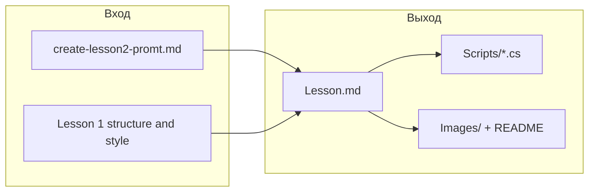

# План реализации: Урок 2 — «Продолжаем разбираться с графикой»

## 1. Анализ требований

### 1.1. Описание функции и цель

Добавить **второй урок** образовательного курса по C# для младших школьников в среде .KID. Урок продолжает тему графики: новые фигуры, способы задания цвета, шрифт текста, многоугольники и практические задания (смайлик, домик, машина, человечек).

Цель: единый контент в виде `Lesson.md`, исполняемых скриптов в `Scripts/` и заготовок под иллюстрации в `Images/`, в том же стиле, что и [course/Lesson 1/Lesson.md](course/Lesson 1/Lesson.md).

### 1.2. Целевая аудитория и сценарии использования

- Младшие школьники, уже прошедшие Урок 1 (Hello World, круг/прямоугольник/текст, цвет строкой, `using`).
- Чтение урока как главы учебника и выполнение примеров в .KID IDE: запуск скриптов, изменение параметров, выполнение практических заданий.

### 1.3. Входные и выходные данные

- **Вход:** [course/Lesson 2/create-lesson2-promt.md](course/Lesson 2/create-lesson2-promt.md) (план урока, стиль, требования к Scripts/Images).
- **Выход:**
  - `course/Lesson 2/Lesson.md` — полный текст урока (публицистический стиль, русский язык).
  - `course/Lesson 2/Scripts/*.cs` — все программы, встречающиеся в уроке.
  - `course/Lesson 2/Images/` — папка для иллюстраций; в `Lesson.md` — промты для генерации и пути к файлам.

### 1.4. Ограничения и требования

- Стиль и тон как в Уроке 1: яркий, познавательный, с пояснениями.
- Каждый фрагмент кода в `Lesson.md` должен иметь соответствующий файл в `Scripts/`.
- Иллюстрации — промты в тексте + папка `Images` (как в [course/Lesson 1/Images/README.md](course/Lesson 1/Images/README.md)).
- API брать только из текущей KID.Library (без выдуманных методов).

**Подтверждённый API KID.Library для урока:**

| Тема          | Метод/свойство                                                                                                                                              | Файл в репозитории                                                                                                                                         |
| ------------- | ----------------------------------------------------------------------------------------------------------------------------------------------------------- | ---------------------------------------------------------------------------------------------------------------------------------------------------------- |
| Линия         | `Graphics.Line(x1, y1, x2, y2)`                                                                                                                             | [KID.Library/Graphics/Graphics.SimpleFigures.cs](KID.Library/Graphics/Graphics.SimpleFigures.cs)                                                           |
| Эллипс        | `Graphics.Ellipse(x, y, radiusX, radiusY)`                                                                                                                  | там же                                                                                                                                                     |
| «Точка»       | Отдельного метода нет — рисовать маленький круг `Graphics.Circle(x, y, 1)` или 2                                                                            | —                                                                                                                                                          |
| Многоугольник | `Graphics.Polygon(Point[] points)` или `Graphics.Polygon((double x, double y)[] points)`                                                                    | там же                                                                                                                                                     |
| Цвет          | `Graphics.Color` принимает: `string`, `(byte r, byte g, byte b)`, `int` (0xRRGGBB); для строки WPF BrushConverter поддерживает также `"#RRGGBB"` и `"#RGB"` | [KID.Library/Graphics/Graphics.Colors.cs](KID.Library/Graphics/Graphics.Colors.cs), [KID.Library/Graphics/ColorType.cs](KID.Library/Graphics/ColorType.cs) |
| Шрифт         | `Graphics.SetFont(string fontName, double fontSize)`                                                                                                        | [KID.Library/Graphics/Graphics.Text.cs](KID.Library/Graphics/Graphics.Text.cs)                                                                             |

---

## 2. Архитектурный анализ

### 2.1. Затронутые подсистемы

- Только контент курса: `course/Lesson 2/`. Код приложения (WPF, MVVM, DI) и KID.Library не меняются.

### 2.2. Новые компоненты

- **Папки:** `course/Lesson 2/Scripts/`, `course/Lesson 2/Images/` (папка Lesson 2 уже есть).
- **Файлы:**
  - `course/Lesson 2/Lesson.md`
  - Несколько `.cs` в `Scripts/` (см. список задач)
  - `course/Lesson 2/Images/README.md` (описание ожидаемых картинок и промтов)

### 2.3. Изменения существующих компонентов

- Не требуются. Опционально позже — оглавление курса или ссылка на Урок 2 из Урока 1 (в Уроке 1 уже есть блок «Следующий урок»).

### 2.4. Зависимости

- `Lesson.md` ссылается на файлы в `Scripts/` по имени (например, `05_LinesAndEllipses.cs`) и на изображения в `Images/`.
- Скрипты должны компилироваться в среде .KID (using KID; доступ к Graphics, Console).

---

## 3. Список задач и порядок выполнения

### 3.1. Структура папок и README для изображений

- Создать `course/Lesson 2/Scripts/` и `course/Lesson 2/Images/`.
- Создать `course/Lesson 2/Images/README.md`: перечень ожидаемых иллюстраций и указание, что промты лежат в `Lesson.md`.

### 3.2. Текст урока `Lesson.md`

Написать полный текст по плану из промта:

- **2.** Продолжаем разбираться с графикой  
  - **2.1** Новые фигуры: линии, точки (малый круг), эллипсы — с примерами кода.  
  - **2.2** Несколько способов задать цвет: строка с названием, кортеж `(R, G, B)`, HEX `0xRRGGBB`, строки `"#RRGGBB"` / `"#RGB"`.  
  - **2.3** Как задать шрифт текста — `Graphics.SetFont(...)`.  
  - **2.4** Для любознательных: как рисовать многоугольники — `Graphics.Polygon(...)`.  
  - **2.5** Практика (нарисуй программно): смайлик, домик, машина, человечек.

Стиль: публицистический, как в Уроке 1. Для каждого примера кода — ссылка на файл в `Scripts/`. Для каждой иллюстрации — путь в `Images/` и промт для генерации.

### 3.3. Скрипты в `Scripts/`

Добавить по одному `.cs` файлу под каждый уникальный пример кода из урока, с именами в духе Урока 1 (нумерация/короткое имя):

- Линии и эллипсы (и при необходимости «точка» = малый круг).
- Примеры цветов: строка, кортеж, 0x..., "#RRGGBB".
- Пример шрифта: `SetFont` + `Text`.
- Пример многоугольника: `Polygon` с массивом точек.
- Практика: 4 скрипта — смайлик, домик, машина, человечек (или один комбинированный файл с несколькими «сценами» — на выбор автора урока, но в плане заложить отдельные файлы для ясности).

Имена файлов согласовать с упоминаниями в `Lesson.md` (например, `05_LinesAndEllipses.cs`, `06_ColorsFormats.cs`, `07_FontDemo.cs`, `08_PolygonDemo.cs`, `09_Smiley.cs`, `10_House.cs`, `11_Car.cs`, `12_StickFigure.cs` или аналог).

### 3.4. Согласованность и проверка

- Проверить, что каждый код-блок в `Lesson.md` имеет соответствующий файл в `Scripts/`.
- Проверить, что все иллюстрации имеют путь в `Images/` и промт в тексте.
- Проверить, что примеры используют только существующий API (Line, Ellipse, Circle, Polygon, Color, SetFont, Text и т.д.).

---

## 4. Порядок выполнения

1. Создать папки `Scripts/` и `Images/`, файл `Images/README.md`.
2. Написать `Lesson.md` (полная структура и текст с промтами и именами скриптов).
3. Создать все `.cs` файлы в `Scripts/` по примерам из урока.
4. Финальная проверка соответствия кода в `Lesson.md` и файлов в `Scripts/`, путей к изображениям в `Images/`.

---

## 5. Оценка сложности

| Задача                       | Сложность | Время     | Риски                                                                   |
| ---------------------------- | --------- | --------- | ----------------------------------------------------------------------- |
| Папки + Images/README        | Низкая    | 5–10 мин  | Нет                                                                     |
| Написание Lesson.md          | Средняя   | 1–2 ч     | Сохранить единый тон с Уроком 1; не выйти за рамки API                  |
| Скрипты (примеры + практика) | Средняя   | 30–60 мин | Кортеж цвета: в C# для byte это `(byte, byte, byte)` — проверить в коде |
| Проверка согласованности     | Низкая    | 15–20 мин | Пропуск скрипта или неверное имя файла                                  |

**Примечание по цвету:** в [ColorType.cs](KID.Library/Graphics/ColorType.cs) кортеж — `(byte r, byte g, byte b)`. В примерах для детей можно использовать литералы вроде `(255, 0, 0)`; при необходимости в уроке кратко пояснить, что числа от 0 до 255.

---

## 6. Диаграмма зависимостей контента

План готов к выполнению через команду execute-plan-for-new-feature или ручную реализацию по шагам выше.