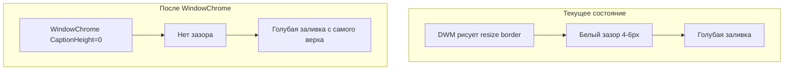

# План: устранение белого зазора в верхней части окна KID

## 1. Анализ проблемы

### Описание

В окне приложения KID (MainWindow) наблюдается тонкий белый зазор между верхней границей окна и началом голубой заливки (заголовка/контента). Голубая заливка идёт не сразу от верха окна.

### Корневая причина

Проблема вызвана **Desktop Window Manager (DWM)** в Windows 10/11. При комбинации:

- `WindowStyle="None"` — убирается стандартная рамка окна
- `ResizeMode="CanResize"` — окно остаётся изменяемым по размеру

DWM по умолчанию рисует **невидимую область изменения размера (resize border)** в верхней части окна. Эта область отображается как тонкая (~4–6 px) белая или светло-серая полоса, так как DWM использует свои отступы для non-client area.

### Текущая конфигурация окна

[MainWindow.xaml](KID.WPF.IDE/MainWindow.xaml) (строки 14–17):

```xml
WindowStyle="None"
AllowsTransparency="False"
ResizeMode="CanResize"
Background="{DynamicResource SpecialElementsBrush}"
```

### Затрагиваемые компоненты

- [MainWindow.xaml](KID.WPF.IDE/MainWindow.xaml) — разметка окна
- [MainWindow.xaml.cs](KID.WPF.IDE/MainWindow.xaml.cs) — при необходимости (только для альтернативных решений)

---

## 2. Варианты решения

### Вариант A: WindowChrome (рекомендуемый)

**Суть:** Явно задать `WindowChrome` с `CaptionHeight="0"`, чтобы WPF корректно обрабатывал non-client area и убрал артефакт DWM.

**Плюсы:**

- Малое изменение кода (добавление нескольких строк XAML)
- Сохраняется тень окна (в отличие от AllowsTransparency)
- Официальный механизм WPF
- Сохраняется `ResizeMode="CanResize"` по периметру
- Совместимо с существующим WM_GETMINMAXINFO для максимизации

**Минусы:**

- Нужно указать `ResizeBorderThickness` для корректного поведения
- При `CaptionHeight="0"` область перетаскивания остаётся только в зоне кастомного заголовка (как сейчас)

**Реализация:** Добавить в MainWindow.xaml вложенный `WindowChrome` через `WindowChrome.IsAttached` или задать стиль с `shell:WindowChrome.CaptionHeight="0"`.

### Вариант B: AllowsTransparency + CanResizeWithGrip

**Суть:** `ResizeMode="CanResizeWithGrip"` и `AllowsTransparency="True"` убирают стандартную рамку.

**Плюсы:** Простая настройка  
**Минусы:** Теряется тень окна; изменение размера только из правого нижнего угла; ухудшение производительности; возможные проблемы с WinForms-контролами (если будут использоваться)

### Вариант C: обработка WM_NCCALCSIZE

**Суть:** Через P/Invoke обрабатывать `WM_NCCALCSIZE` и задавать client area равной всему окну.

**Плюсы:** Низкоуровневый контроль  
**Минусы:** Сложнее реализация, больше P/Invoke, требуется поддержка на разных версиях Windows

---

## 3. Рекомендуемая реализация (Вариант A)

### Архитектура




### Изменения в MainWindow.xaml

1. Добавить namespace:

```xml
xmlns:shell="http://schemas.microsoft.com/winfx/2006/xaml/presentation"
```

Для .NET 8.0 `WindowChrome` находится в `System.Windows.Shell` (PresentationFramework.dll). В XAML используется атрибутная привязка.

1. Добавить стиль окна с `WindowChrome`:

```xml
<Window.Style>
    <Style TargetType="Window">
        <Setter Property="shell:WindowChrome.WindowChrome">
            <Setter.Value>
                <shell:WindowChrome CaptionHeight="0" 
                                   ResizeBorderThickness="5"
                                   GlassFrameThickness="0,0,0,0"/>
            </Setter.Value>
        </Setter>
    </Style>
</Window.Style>
```

**Важно:** `shell` должен ссылаться на `System.Windows.Shell` из PresentationFramework. В WPF для WindowChrome используется:

```xml
xmlns:shell="clr-namespace:Microsoft.Windows.Shell;assembly=PresentationFramework"
```

Проверка: в .NET Framework и .NET Core/WPF `WindowChrome` объявлен в `Microsoft.Windows.Shell` (PresentationFramework.dll). Для .NET 8.0-Windows актуально то же самое.

### Зависимости

- Никаких новых NuGet-пакетов не требуется
- `PresentationFramework` уже подключается через `UseWPF`

### Взаимодействие с WM_GETMINMAXINFO

Текущая логика в [MainWindow.xaml.cs](KID.WPF.IDE/MainWindow.xaml.cs) (WM_GETMINMAXINFO) не затрагивается. WindowChrome меняет только отрисовку non-client area; максимизация остаётся прежней.

---

## 4. Список задач


| #   | Задача                              | Файл            | Действие                                                                                                   |
| --- | ----------------------------------- | --------------- | ---------------------------------------------------------------------------------------------------------- |
| 1   | Добавить namespace для WindowChrome | MainWindow.xaml | `xmlns:shell="clr-namespace:Microsoft.Windows.Shell;assembly=PresentationFramework"`                       |
| 2   | Задать WindowChrome для Window      | MainWindow.xaml | Добавить `Window.Style` с `WindowChrome` (CaptionHeight=0, ResizeBorderThickness=5, GlassFrameThickness=0) |
| 3   | Проверка                            | —               | Запуск приложения, визуальная проверка отсутствия белого зазора при разных размерах/максимизации           |


---

## 5. Порядок выполнения

1. Добавить namespace `shell` в MainWindow.xaml
2. Добавить `Window.Style` с `WindowChrome`
3. Собрать и запустить приложение
4. Проверить в разных режимах (обычное окно, максимизация, изменение размера)

---

## 6. Оценка


| Задача                 | Сложность  | Время       | Риски                                                          |
| ---------------------- | ---------- | ----------- | -------------------------------------------------------------- |
| Добавление namespace   | Низкая     | 1 мин       | Нет                                                            |
| Настройка WindowChrome | Низкая     | 5 мин       | Возможна неверная сборка namespace                             |
| Проверка               | Низкая     | 5 мин       | Регрессия максимизации (маловероятно при корректной настройке) |
| **Итого**              | **Низкая** | **~15 мин** |                                                                |


---

## 7. Альтернатива: GlassFrameThickness

Если зазор сохранится, можно дополнительно задать `GlassFrameThickness="0,0,0,0"` (уже включено в план). В некоторых конфигурациях помогает комбинация `GlassFrameThickness="0"` и `ResizeBorderThickness` для тонкой, но видимой области resize.

---

## 8. Дополнительная проверка: зазор между меню и контентом

По скриншотам возможен ещё один зазор — между панелью меню и рабочей областью. В [MenuView.xaml](KID.WPF.IDE/Views/MenuView.xaml) используется `Margin="0,0,0,10"` у `Menu`. Этот отступ даёт 10 px снизу меню; фон под ним — от родительского Grid/Window. Если при проверке будет виден лишний зазор, его можно уменьшить или убрать, изменив `Margin` меню.